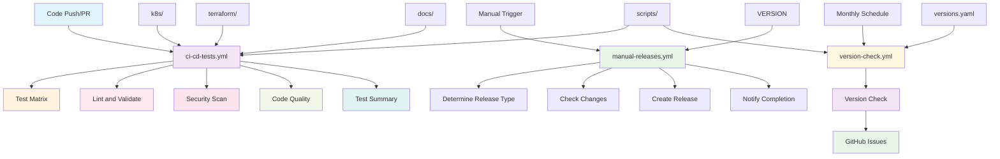

# GitHub Directory

This directory contains GitHub Actions workflows and configuration for the OpenEMR on EKS deployment project. The workflows provide automated testing, security scanning, and release management capabilities.

## 📋 Table of Contents

### **Repository Configuration**
- [Branch Rulesets (Recommended)](#branch-rulesets-recommended)
  - [Required Settings for Main Branch](#required-settings-for-main-branch)
  - [Benefits of Branch Rulesets](#benefits-of-branch-rulesets)
  - [Workflow After Configuration](#workflow-after-configuration)

### **Workflow Overview**
- [Directory Structure](#directory-structure)
- [Workflow Dependency Graph](#workflow-dependency-graph)

### **CI/CD Testing Pipeline**
- [CI/CD Testing Pipeline (`ci-cd-tests.yml`)](#cicd-testing-pipeline-ci-cd-testsyml)
  - [Purpose](#purpose)
  - [Triggers](#triggers)
  - [Key Features](#key-features)
  - [Jobs and Dependencies](#jobs-and-dependencies)
    - [Test Matrix](#1-test-matrix-test)
    - [Lint and Validate](#2-lint-and-validate-lint-and-validate)
    - [Security Scan](#3-security-scan-security-scan)
    - [Code Quality](#4-code-quality-code-quality)
    - [Test Summary](#5-test-summary-summary)
  - [Environment Configuration](#environment-configuration)
  - [Permissions](#permissions)

### **Manual Release Pipeline**
- [Manual Release Pipeline (`manual-releases.yml`)](#manual-release-pipeline-manual-releasesyml)
  - [Purpose](#purpose-1)
  - [Triggers](#triggers-1)
  - [Key Features](#key-features-1)
  - [Jobs and Dependencies](#jobs-and-dependencies-1)
    - [Determine Release Type](#1-determine-release-type-determine-release-type)
    - [Check Changes](#2-check-changes-check-changes)
    - [Create Release](#3-create-release-create-release)
    - [Notify Completion](#4-notify-completion-notify-completion)
  - [Environment Configuration](#environment-configuration-1)
  - [Permissions](#permissions-1)

### **Version Awareness Pipeline**
- [Version Check Pipeline (`version-check.yml`)](#version-check-pipeline-version-checkyml)
  - [Purpose](#purpose-2)
  - [Triggers](#triggers-2)
  - [Key Features](#key-features-2)
  - [Jobs and Dependencies](#jobs-and-dependencies-2)
    - [Version Check](#1-version-check-version-check)
    - [Create Issues](#2-create-issues-create-issues)
  - [Environment Configuration](#environment-configuration-2)
  - [Permissions](#permissions-2)
  - [Configuration Dependencies](#configuration-dependencies)

### **Maintenance & Operations**
- [Maintenance Guidelines](#maintenance-guidelines)
  - [Adding New Workflows](#adding-new-workflows)
  - [Updating Existing Workflows](#updating-existing-workflows)
  - [Workflow Quality Standards](#workflow-quality-standards)

### **Reference & Support**
- [Cross-References](#cross-references)
  - [Related Directories](#related-directories)
  - [External Dependencies](#external-dependencies)
- [Best Practices](#best-practices)
  - [For Developers](#for-developers)
  - [For Maintainers](#for-maintainers)
  - [For Operators](#for-operators)
- [Troubleshooting](#troubleshooting)
  - [Common Issues](#common-issues)
  - [Debug Mode](#debug-mode)
- [Support and Contributing](#support-and-contributing)
  - [Getting Help](#getting-help)
  - [Contributing](#contributing)

---

## Directory Structure

### Workflow Files

- **`workflows/ci-cd-tests.yml`** - Comprehensive CI/CD testing and validation pipeline
- **`workflows/manual-releases.yml`** - Manual release management and version control
- **`workflows/version-check.yml`** - Automated version awareness checking and GitHub issue creation

## Workflow Dependency Graph



## Repository Configuration

### **Branch Rulesets (Recommended)**

To ensure code quality and enable proper code review, configure your GitHub repository with **branch rulesets**, which provide more granular control and better organization than traditional branch protection rules:

#### **Required Settings for Main Branch**

1. **Navigate to Repository Settings:**
   - Go to your GitHub repository
   - Click on **Settings** tab
   - Under **Code and automation**, click on **Rules**
   - Select **Rulesets**

2. **Create New Branch Ruleset:**
   - Click **New ruleset**
   - Choose **New branch ruleset**
   - Name: `Main Branch Protection`
   - Target: `main` branch

3. **Configure Branch Protections:**
   - ✅ **Block force pushes**
   - ✅ **Require linear history** (keeps git history clean)

4. **Save the Ruleset:**
   - Click **Create** to activate the ruleset

#### **Benefits of Branch Rulesets**

- **Modern Approach**: More flexible and comprehensive than traditional branch protection rules
- **Granular Control**: Define detailed rules for different branches with specific conditions
- **Layered Enforcement**: Multiple rulesets can apply simultaneously with automatic conflict resolution
- **Bypass Permissions**: Grant specific users, teams, or GitHub Apps the ability to bypass certain rules
- **Better Organization**: Centralized management of all branch protection policies
- **Code Quality**: Ensures all changes are reviewed before merging
- **Testing**: Requires all tests to pass before merging
- **Security**: Prevents accidental pushes and maintains audit trail
- **Collaboration**: Enables team members to review and discuss changes
- **Compliance**: Meets enterprise security and governance requirements

#### **Workflow After Configuration**

```bash
# Create feature branch
git checkout -b feature/your-feature-name

# Make changes and commit
git add .
git commit -m "feat: add your feature"
git push origin feature/your-feature-name

# Create pull request on GitHub
# Wait for required checks to pass
# Get required approvals
# Merge after approval
```

## Workflow Descriptions

### CI/CD Testing Pipeline (`ci-cd-tests.yml`)

#### **Purpose**

Comprehensive automated testing and validation pipeline that runs on every push and pull request to ensure code quality and system integrity.

#### **Triggers**

- **Push** to `main` or `develop` branches
- **Pull requests** to `main` or `develop` branches
- **Manual dispatch** with optional test suite selection

#### **Key Features**

- **Matrix Testing**: Parallel execution of multiple test suites
- **Security Scanning**: Comprehensive vulnerability scanning with Trivy
- **Code Quality**: Automated code quality checks and validation
- **Artifact Management**: Test results stored as GitHub artifacts
- **Comprehensive Reporting**: Detailed test summaries and status reports

#### **Jobs and Dependencies**

##### 1. **Test Matrix** (`test`)

- **Purpose**: Run all test suites in parallel for maximum efficiency
- **Test Suites**:
  - `code_quality` - Shell script syntax, YAML validation, Terraform validation
  - `kubernetes_manifests` - Kubernetes manifest validation and best practices
  - `script_validation` - Script functionality and error handling
  - `documentation` - Documentation quality and consistency
- **Dependencies**: `scripts/run-test-suite.sh`, `scripts/test-config.yaml`
- **Outputs**: Test results artifacts for each suite

##### 2. **Lint and Validate** (`lint-and-validate`)

- **Purpose**: Additional validation and linting beyond test matrix
- **Dependencies**: `test` job completion
- **Validations**:
  - Terraform configuration validation
  - Kubernetes manifest YAML syntax validation
  - Shell script syntax checking with ShellCheck
  - YAML file validation across all directories
- **Dependencies**: `terraform/`, `k8s/`, `monitoring/`, `scripts/`

##### 3. **Security Scan** (`security-scan`)

- **Purpose**: Comprehensive security vulnerability scanning
- **Dependencies**: `test` job completion
- **Scanners**:
  - **Vulnerability Scanner**: Detects known vulnerabilities in dependencies
  - **Secret Scanner**: Identifies hardcoded secrets and credentials
  - **Configuration Scanner**: Validates security configurations
- **Outputs**: SARIF format for GitHub Security tab integration (only if paid integration is active). Otherwise, results available in table printed out in GitHub Actions logs.
- **Dependencies**: All repository files

##### 4. **Code Quality** (`code-quality`)

- **Purpose**: Additional code quality checks and common issue detection
- **Dependencies**: `test` job completion
- **Checks**:
  - Hardcoded secrets detection
  - TODO/FIXME comment identification
  - File permission validation
  - Common code quality issues
- **Dependencies**: All repository files

##### 5. **Test Summary** (`summary`)

- **Purpose**: Comprehensive test results summary and reporting
- **Dependencies**: All previous jobs completion
- **Features**:
  - Aggregated test results from all suites
  - Security scan status reporting
  - Overall pipeline status determination
  - Artifact collection and presentation
- **Dependencies**: All test result artifacts

#### **Environment Configuration**

- **Python**: 3.13.7
- **Terraform**: 1.13.3
- **Kubectl**: v1.34.1
- **Operating System**: Ubuntu 24.04

#### **Permissions**

- `contents: read` - Read repository contents
- `security-events: write` - Upload security scan results
- `actions: read` - Read workflow information

### Manual Release Pipeline (`manual-releases.yml`)

#### **Purpose**

Controlled release management system that allows manual version bumping and release creation with comprehensive validation and documentation.

#### **Triggers**

- **Manual dispatch only** - No automatic triggers
- **Required inputs**: Release type, release notes, optional dry run

#### **Key Features**

- **Manual Control**: All releases are manually initiated
- **Version Management**: Automatic semantic version bumping
- **Change Detection**: Prevents releases without actual changes
- **Comprehensive Documentation**: Automatic release notes generation
- **Safety Features**: Dry run mode and validation checks

#### **Jobs and Dependencies**

##### 1. **Determine Release Type** (`determine-release-type`)

- **Purpose**: Process manual input and determine version bump type
- **Inputs**:
  - `release_type`: major, minor, or patch
  - `release_notes`: Required release notes
  - `dry_run`: Optional dry run mode
- **Outputs**:
  - `release-type`: Selected release type
  - `bump-version`: Version bump strategy
  - `triggered-by`: User who triggered the release
- **Dependencies**: Manual user input

##### 2. **Check Changes** (`check-changes`)

- **Purpose**: Verify that there are actual changes since the last release
- **Dependencies**: `determine-release-type` job completion
- **Features**:
  - Git history analysis since last tag
  - Change detection and validation
  - First-time release handling
  - Prevents unnecessary releases
- **Dependencies**: Git repository, `VERSION` file

##### 3. **Create Release** (`create-release`)

- **Purpose**: Create the actual release with version bumping and documentation
- **Dependencies**: `determine-release-type` and `check-changes` jobs
- **Features**:
  - Semantic version calculation using Python semver library
  - VERSION file updates
  - Git tag creation and pushing
  - GitHub release creation
  - Comprehensive release notes generation
  - Dry run mode support
- **Dependencies**: `VERSION` file, Git repository, Python semver library

##### 4. **Notify Completion** (`notify-completion`)

- **Purpose**: Provide final status notification and summary
- **Dependencies**: All previous jobs completion
- **Features**:
  - Workflow summary generation
  - Success/failure status reporting
  - Debug information for failures
  - Release URL and version information
- **Dependencies**: All previous job outputs

#### **Environment Configuration**

- **Python**: 3.13.7
- **Semver Package**: 3.0.4
- **Operating System**: Ubuntu 24.04

#### **Permissions**

- `contents: write` - Update VERSION file and create tags
- `pull-requests: write` - Update pull request information
- `issues: write` - Create issues if needed

### Version Check Pipeline (`version-check.yml`)

#### **Purpose**

Automated version awareness system that monitors all project dependencies and creates GitHub issues when updates are available, ensuring maintainers stay informed about new versions without performing automatic updates.

#### **Triggers**

- **monthly schedule** - Runs every 30 days at 9:00 AM UTC
- **Manual dispatch** - Can be triggered manually for immediate checks
- **Workflow dispatch** - Can be triggered by other workflows

#### **Key Features**

- **Comprehensive Monitoring**: Tracks all project dependencies including applications, infrastructure, Terraform modules, GitHub Actions, pre-commit hooks, and all other semver packages (i.e. anything with a version in the GitHub actions workflows that's not a GitHub action.)
- **GitHub Issue Creation**: Automatically creates detailed GitHub issues for available updates
- **No Automatic Updates**: Awareness-only system that never performs automatic updates
- **Centralized Configuration**: Uses `versions.yaml` for all version tracking configuration
- **Smart Notifications**: Only creates issues for components with `notify_on_update: true`

#### **Jobs and Dependencies**

##### 1. **Version Check** (`version-check`)

- **Purpose**: Check all configured components for available updates
- **Dependencies**: `scripts/version-manager.sh`, `versions.yaml`
- **Features**:
  - Checks Docker images (OpenEMR, Fluent Bit)
  - Monitors Kubernetes versions
  - Tracks Terraform modules and AWS provider versions
  - Monitors GitHub Actions and pre-commit hook versions
  - Checks semver packages (Python, Terraform CLI, kubectl)
  - Validates AWS service versions (RDS, ElastiCache)
  - Monitors monitoring stack versions (Prometheus, Loki, Jaeger)
- **Outputs**: Update information for all components

##### 2. **Create Issues** (`create-issues`)

- **Purpose**: Create GitHub issues for available updates
- **Dependencies**: `version-check` job completion
- **Features**:
  - Groups updates by component type
  - Creates detailed issue descriptions with current and latest versions
  - Applies appropriate labels (`version-update`, `maintenance`, `dependencies`)
  - Includes priority information based on update type
  - Provides clear action items for maintainers
- **Dependencies**: GitHub API, issue creation permissions

#### **Environment Configuration**

- **Terraform**: 1.13.3
- **Kubectl**: v1.33.0
- **Operating System**: Ubuntu 24.04
- **Tools**: `yq`, `jq`, `curl` for API interactions

#### **Permissions**

- `contents: read` - Read repository contents and configuration
- `actions: read` - Read Github actions contents and configuration
- `issues: write` - Create GitHub issues for updates
- `pull-requests: read` - Read pull request information if needed

#### **Configuration Dependencies**

- **`versions.yaml`** - Central configuration for all tracked versions
- **`scripts/version-manager.sh`** - Core version checking logic
- **`docs/VERSION_MANAGEMENT.md`** - Documentation for the system

## Maintenance Guidelines

### Adding New Workflows

1. **Follow the established structure**:
   - Use descriptive workflow names
   - Include comprehensive job descriptions
   - Add proper permissions and environment variables
   - Include error handling and notifications

2. **Update dependencies**:
   - Add new workflows to this README
   - Update the dependency graph
   - Cross-reference related workflows
   - Update the main project README

3. **Include maintenance information**:
   - Document what needs to be updated when
   - Include version references
   - Specify dependencies on other files
   - Provide clear update procedures

### Updating Existing Workflows

1. **Version references**:
   - Update tool versions (Python, Terraform, kubectl, etc.)
   - Update action versions (checkout, setup-python, etc.)
   - Update package versions (semver, pyyaml, etc.)
   - Update operating system versions

2. **Configuration changes**:
   - Update environment variables when needed
   - Modify job dependencies if workflow changes
   - Update permissions if new capabilities are needed
   - Modify triggers if workflow behavior changes

3. **Feature updates**:
   - Add new test suites to the matrix
   - Include new validation steps
   - Add new security scanners
   - Update release procedures

### Workflow Quality Standards

1. **Reliability**:
   - Test all workflows before committing
   - Include proper error handling
   - Use appropriate timeouts and retries
   - Validate all inputs and outputs

2. **Security**:
   - Use minimal required permissions
   - Avoid hardcoded secrets
   - Use secure action versions
   - Validate all inputs

3. **Performance**:
   - Use parallel execution where possible
   - Optimize job dependencies
   - Use appropriate runner types
   - Monitor execution times

## Cross-References

### Related Directories

- **`scripts/`** - Test scripts, validation tools, and version management scripts
- **`k8s/`** - Kubernetes manifests tested by workflows
- **`terraform/`** - Infrastructure code validated by workflows
- **`docs/`** - Documentation validated by workflows
- **`versions.yaml`** - Version management configuration for awareness system

### External Dependencies

- **GitHub Actions** - Workflow execution platform
- **Python Packages** - semver, pyyaml for version management
- **Security Tools** - Trivy for vulnerability scanning
- **Validation Tools** - ShellCheck, Terraform, kubectl
- **Version Management Tools** - yq, jq, curl for API interactions and version checking

## Best Practices

### For Developers

1. **Test locally first** before pushing changes
2. **Use the test matrix** to validate all changes
3. **Check security scan results** for vulnerabilities
4. **Follow the release process** for version management

### For Maintainers

1. **Keep workflows current** with latest action versions
2. **Monitor workflow performance** and optimize as needed
3. **Update tool versions** regularly
4. **Review security scan results** and address issues

### For Operators

1. **Use the CI/CD pipeline** for all changes
2. **Follow the release process** for version management
3. **Monitor workflow status** for issues
4. **Use dry run mode** for testing releases

## Troubleshooting

### Common Issues

#### Workflow Failures

- **Check logs** in the GitHub Actions tab
- **Verify dependencies** are available
- **Check permissions** for required actions
- **Validate inputs** and environment variables

#### Test Failures

- **Run tests locally** using `scripts/run-test-suite.sh`
- **Check file permissions** for shell scripts
- **Validate YAML syntax** for manifest files
- **Review Terraform configuration** for errors

#### Release Issues

- **Verify VERSION file** format and content
- **Check for changes** since last release
- **Validate release notes** are provided
- **Use dry run mode** for testing

### Debug Mode

- **Enable debug logging** in workflow steps
- **Check artifact contents** for detailed results
- **Review job dependencies** and execution order
- **Validate environment variables** and inputs

## Support and Contributing

### Getting Help

- Check workflow logs in GitHub Actions
- Review this documentation for guidance
- Consult the troubleshooting section
- Use the test scripts locally for validation

### Contributing

- Follow the established workflow structure
- Include proper error handling and validation
- Test workflows before submitting changes
- Update documentation for new workflows

---

This GitHub directory provides comprehensive automation for testing, validation, and release management. Each workflow is designed to be reliable, secure, and maintainable while providing clear feedback and documentation for all operations.
