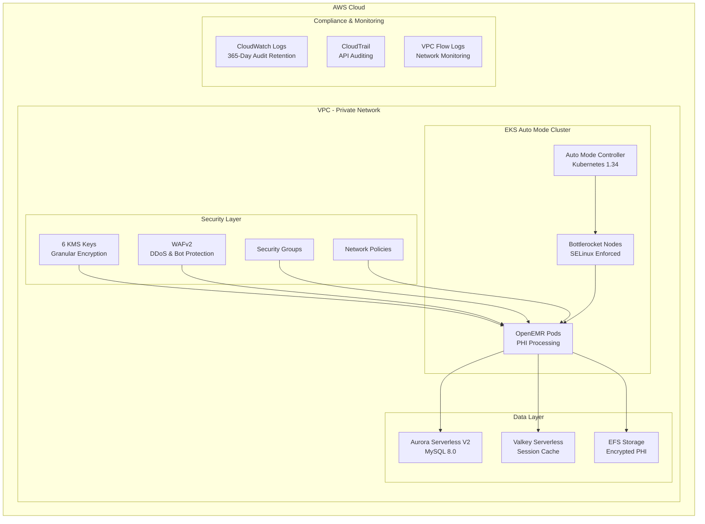

<div align="center">


<!-- Status Badges -->
[](../../actions/workflows/ci-cd-tests.yml)
[](../../blob/main/LICENSE)
[](../../releases)

*This deployment provides a production-ready OpenEMR system on Amazon EKS with **EKS Auto Mode** for fully managed EC2 infrastructure with automatic provisioning, configurable autoscaling and a production-ready alerting, monitoring and observability stack.*

</div>

> **⚠️ HIPAA Compliance Notice**: No matter what you're deploying to AWS full HIPAA compliance requires ...
>
> - Executed Business Associate Agreement (BAA) with AWS
> - Organizational policies and procedures
> - Staff training and access controls
> - Regular security audits and risk assessments

> **⚠️ End-to-End Test Warning**: The end-to-end test script (`scripts/test-end-to-end-backup-restore.sh`) will create and delete AWS resources (including backup buckets and RDS snapshots) and automatically reset Kubernetes manifests to their default state. **Only run in development AWS accounts** and commit/stash any uncommitted changes to `k8s/` manifests before testing.
---

<div align="center">

# 🚀 ⚡ Quick Start ⚡ 🚀

*Deploy OpenEMR on EKS in minutes*

</div> 

## 📊 Deploy OpenEMR with monitoring (~45-60 min.)

```bash
./scripts/quick-deploy.sh
```

<details>
<summary><strong>What you get</strong></summary>

- 🌐 OpenEMR URL and admin credentials
- 📊 Grafana URL and admin credentials  
- 📈 Full observability stack ready to use

</details>

<details>
<summary><strong>Terminal Output</strong></summary>


</details>

<details>
<summary><strong>Access OpenEMR</strong></summary>


</details>

<details>
<summary><strong>OpenEMR Admin Dashboard</strong></summary>


</details>

<details>
<summary><strong>Access Grafana</strong></summary>


</details>

<details>
<summary><strong>Monitor OpenEMR in Grafana</strong></summary>


</details>

<details>
<summary><strong>5 Integrated Datasources for Dashboarding/Alerting</strong></summary>


</details>

## 👥 Deploy OpenEMR with 100 synthetic patients (~35-50 min.)

```bash
./scripts/deploy-training-openemr-setup.sh --use-default-dataset --max-records 100
```

<details>
<summary><strong>What you get</strong></summary>

- 🌐 OpenEMR URL and admin credentials
- 👥 Number of synthetic patients equal to the argument to "--max-records" (example above would upload 100 synthetic patients)
- 🛜 Setup populated by synthetic patient data stored in an S3 bucket in OMOP format (default is https://registry.opendata.aws/cmsdesynpuf-omop/)

</details>

<details>
<summary><strong>Warp Uploads 100 Synthetic Patients in <1 minute</strong></summary>


</details>

<details>
<summary><strong>Terminal Output</strong></summary>


</details>

<details>
<summary><strong>Access OpenEMR</strong></summary>


</details>

<details>
<summary><strong>Navigate to "Finder" → "Patient Finder" to see uploaded synthetic patients</strong></summary>


</details>

## 🧹 Cleanup all deployed resources (~15-20 min.)

```bash
./scripts/destroy.sh
```

<details>
<summary><strong>Terminal Output</strong></summary>


</details>

---

## 📋 Table of Contents

### **🚀 Getting Started**

- [Architecture Overview](#architecture-overview)
- [Prerequisites](#prerequisites)
- [Quick Start (Manual Deployment)](#-quick-start-1)
- [Directory Structure](#directory-structure)

### **💰 Cost Analysis**

- [EKS Auto Mode Pricing](#-eks-auto-mode-pricing-structure)
- [Why Auto Mode is Worth the 12% Markup](#why-auto-mode-is-worth-the-12-markup)
- [Cost Optimization Strategies](#cost-optimization-strategies)
- [Monthly Cost Breakdown by Organization Size](#monthly-cost-breakdown-by-organization-size)

### **🔒 Security & Compliance**

- [Production Best Practice - Jumpbox Architecture](#%E2%80%8D-production-best-practice---jumpbox-architecture)
- [Operational Scripts](#%EF%B8%8F-operational-scripts)

### **📚 Infrastructure**

- [Terraform Organization](#%EF%B8%8F-terraform-infrastructure-organization)
- [Kubernetes Manifests](#-working-with-kubernetes-manifests)
- [Deployment Workflow](#-deployment-workflow)
- [Backup & Restore System](#-backup--restore-system)

### **⚙️  Workflows & Operations**
- [Monitoring & Observability](#-monitoring--observability)
- [Disaster Recovery](#disaster-recovery-procedures)
- [Troubleshooting](#-troubleshooting-guide)
- [Common Workflows](#-common-workflows)
- [Manual Release System](#-manual-release-system)

### **🧪 Testing & Quality**

- [Testing Framework](#-testing-framework)
- [CI/CD Pipeline](#-cicd-pipeline)
- [Version Awareness](#-version-awareness)

### **📚 Additional Resources**

- [Additional Resources](#-additional-resources-1)
- [License and Compliance](#license-and-compliance)

---

## Architecture Overview



### **EKS Auto Mode Architecture**

- Features
  - **Fully Managed Compute**:
    - [AWS EKS Auto Mode Documentation](https://docs.aws.amazon.com/eks/latest/userguide/automode.html)
    - EC2 instances provisioned automatically with 12% management fee
  - **Kubernetes 1.34**:
    - [Kubernetes v1.34 "Of Wind & Will" Release Blog](https://kubernetes.io/blog/2025/08/27/kubernetes-v1-34-release/)
    - Latest stable version with Auto Mode support
  - **Bottlerocket OS**:
    - [Bottlerocket OS Github](https://github.com/bottlerocket-os/bottlerocket)
    - Rust-based, immutable, security-hardened Linux with SELinux enforcement and no SSH access

## Prerequisites

### **Required Tools and Versions**

#### **Terraform Installation (Required: v1.13.4)**

```bash
# Option 1: Install via Homebrew (macOS/Linux)
brew tap hashicorp/tap
brew install hashicorp/tap/terraform

# Option 2: Download directly from HashiCorp (All platforms)
# Visit: https://releases.hashicorp.com/terraform/1.13.4/
# Download the appropriate binary for your OS and architecture
# Extract and add to your PATH

# Option 3: Use tfenv for version management (Recommended)
brew install tfenv
tfenv install 1.13.4
tfenv use 1.13.4

# Verify installation
terraform --version  # Should show v1.13.4
```

#### **Other Required Tools**

```bash
# Install via Homebrew (macOS/Linux)
brew install awscli helm jq kubectl

# Verify installations
kubectl version --client
helm version
aws --version  # Must be 2.15.0 or higher
jq --version
```

### **Required AWS Configuration**

```bash
# Minimum AWS CLI version
aws --version  # Must be 2.15.0 or higher

# Required IAM permissions
- ec2:CreateVpc (with required CIDR blocks)
- eks:CreateCluster (with Kubernetes 1.29+)
- iam:CreateRole (with specific Auto Mode trust policies)
- kms:CreateKey (for encryption requirements)

# EKS Auto Mode specific requirements
- Authentication mode: API or API_AND_CONFIG_MAP
- Kubernetes version: 1.29 or higher (1.34 configured)
```

**(Recommended) Configure GitHub OIDC → AWS IAM role for CI/CD.** See `docs/GITHUB_AWS_CREDENTIALS.md`.

### **Repository Configuration (Recommended)**

For production deployments, configure **branch rulesets** to ensure code quality and enable proper code review:

#### **Configure Branch Rulesets**

1. **Navigate to Repository Settings:**
   - Go to your GitHub repository → **Settings** → **Rules** → **Rulesets**

2. **Create New Branch Ruleset:**
   - Click **New ruleset** → **New branch ruleset**
   - Name: `Main Branch Protection`
   - Target: `main` branch
   - Enable: **Block force pushes**
   - Enable: **Require linear history**
   - **Important**: Add **Repository admin Role** to bypass list (allows automated workflows)
   - Click **Create** to activate

3. **Benefits of Rulesets:**
   - **Modern Approach**: More flexible than traditional branch protection
   - **Granular Control**: Define specific rules for different branches
   - **Bypass Permissions**: Grant trusted users ability to bypass rules
   - **Code Quality**: All changes reviewed before merging
   - **Testing**: Required tests must pass before merge
   - **Security**: Prevents accidental pushes to main
   - **Compliance**: Meets enterprise security requirements

#### **Workflow After Configuration**

```bash
# Create feature branch
git checkout -b feature/your-feature-name

# Make changes and commit
git add .
git commit -m "feat: add your feature"
git push origin feature/your-feature-name

# Create pull request on GitHub
# Wait for reviews and status checks
# Merge after approval
```

## 🚀 Quick Start

### **1. Pre-Deployment Validation**

```bash
# Clone repository
git clone <repository-url>
cd openemr-on-eks

# Install Homebrew (https://brew.sh/) on MacOS if necessary
/bin/bash -c "$(curl -fsSL https://raw.githubusercontent.com/Homebrew/install/HEAD/install.sh)"

# Install required tools on macOS
brew install awscli helm jq kubectl terraform
# install docker if running pre-commit hooks locally by following instructions here: https://docs.docker.com/engine/install/

# Alternative: Install latest Terraform directly from HashiCorp
# Download from: https://releases.hashicorp.com/terraform/1.13.4/
# Or use tfenv for version management:
# brew install tfenv
# tfenv install 1.13.4
# tfenv use 1.13.4

# Configure AWS credentials
aws configure

# Verify installations
terraform --version
kubectl version --client
helm version
aws --version

# Run comprehensive pre-flight checks
cd scripts
./validate-deployment.sh

# Expected output:
🔍 OpenEMR Deployment Validation
================================
1. Checking prerequisites...
✅ kubectl is installed
✅ aws is installed
✅ helm is installed
✅ jq is installed

2. Checking AWS credentials...
Checking AWS credential sources...
✅ AWS credentials valid
   Account ID: <AWS_ACCOUNT_NUMBER>
   User/Role: arn:aws:sts::<AWS_ACCOUNT_NUMBER>:assumed-role/<ROLE_NAME>/<USER_NAME>
   📍 Source: Environment variables
   📍 Source: Credentials file found at /path/to/.aws/credentials
   📋 Available profiles: default,
   🎯 Current profile: default
   📍 Config file found at path/to/.aws/config
   🌍 Current region: us-west-2
   ✅ Credential sources detected: 2

3. Checking Terraform state...
✅ Terraform state file exists
ℹ️  Terraform state exists but no resources deployed
💡 This indicates a clean slate for deployment
💡 This is normal for first-time deployments

4. Checking cluster access...
ℹ️  EKS cluster 'openemr-eks' not found
💡 This is expected for first-time deployments
💡 This is normal for first-time deployments

5. Checking AWS resources...
Checking AWS resources...
ℹ️  VPC not found
💡 This is expected for first-time deployments
ℹ️  RDS Aurora cluster not found
💡 This is expected for first-time deployments
ℹ️  ElastiCache Valkey cluster not found
💡 This is expected for first-time deployments
ℹ️  EFS file system not found
💡 This is expected for first-time deployments
💡 This is normal for first-time deployments

6. Checking Kubernetes resources...
Checking Kubernetes resources...
⚠️  Namespace 'openemr' not found
💡 Will be created during deployment
✅ OpenEMR not yet deployed (clean deployment)
✅ EKS Auto Mode handles compute automatically
💡 No Karpenter needed - Auto Mode manages all compute
💡 This is normal for first-time deployments

7. Checking security configuration...
Checking security configuration...
ℹ️  EKS cluster not found - security configuration will be applied during deployment
📋 Planned deployment features:
   • OpenEMR 7.0.4 with HTTPS-only access (port 443)
   • EKS Auto Mode for managed EC2 compute
   • Aurora Serverless V2 MySQL database
   • Valkey Serverless cache (Redis-compatible)
   • IP-restricted cluster endpoint access
   • Private subnet deployment
   • 6 dedicated KMS keys (EKS, EFS, RDS, ElastiCache, S3, CloudWatch)
   • Network policies and Pod Security Standards

🎉 First-time deployment validation completed!
✅ Prerequisites and AWS credentials are ready
📋 You're all set for your first deployment!

Next steps for first-time deployment:
   1. cd /path/to/openemr-on-eks/terraform
   2. terraform init
   3. terraform plan
   4. terraform apply
   5. cd /path/to/GitHub/openemr-on-eks/k8s
   6. ./deploy.sh

⏱️  Expected deployment time: 40-45 minutes total
   • Infrastructure (Terraform): 30-32 minutes
   • Application (Kubernetes): 7-11 minutes

📋 Deployment Recommendations
=============================
🔒 Security Best Practices:
   • HTTPS-only access (port 443) - HTTP traffic is refused
   • Disable public access after deployment
   • Use strong passwords for all services
   • Enable AWS WAF for production
   • Regularly update container images
   • Monitor audit logs for compliance

💰 Cost Optimization:
   • Aurora Serverless V2 scales automatically
   • EKS Auto Mode: EC2 costs + management fee for full automation
   • Valkey Serverless provides cost-effective caching
   • Monitor usage with CloudWatch dashboards
   • Set up cost alerts and budgets

📊 Monitoring Setup:
   • CloudWatch logging with Fluent Bit sidecar (included in OpenEMR deployment)
• Basic deployment: CloudWatch logs only
• **✅ Logging Status**: Fully functional with test logs, Apache logs, and forward protocol support
   • Optional: Enhanced monitoring stack: cd /path/to/openemr-on-eks/monitoring && ./install-monitoring.sh
   • Enhanced stack includes:
     - Prometheus v79.1.0 (metrics & alerting)
     - Grafana (dashboards with auto-discovery)
     - Loki v6.45.2 (log aggregation with S3 storage)
     - Jaeger v3.4.1 (distributed tracing)
     - AlertManager (Slack integration support)
     - OpenEMR-specific monitoring (ServiceMonitor, PrometheusRule)
   • **Loki S3 Storage**: Loki uses AWS S3 for production-grade log storage. As [recommended by Grafana](https://grafana.com/docs/loki/latest/setup/install/helm/configure-storage/), we configure object storage via cloud provider for production deployments. This provides better durability, scalability, and cost-effectiveness compared to filesystem storage.
   • Configure alerting for critical issues
   • Regular backup testing
```

### **2. Configure Infrastructure**

```bash
cd ../terraform

# Copy and customize variables
cp terraform.tfvars.example terraform.tfvars

# Edit terraform.tfvars with healthcare-specific settings:
cat > terraform.tfvars <<EOF
# Cluster Configuration
cluster_name = "openemr-eks"
kubernetes_version = "1.34"  # Latest stable with Auto Mode
aws_region = "us-west-2"

# OpenEMR Application Configuration
openemr_version = "7.0.4"    # Latest stable OpenEMR version

# Compliance Settings
backup_retention_days = 30
audit_logs_retention_days = 365
enable_waf = true

# Healthcare Workload Scaling
aurora_min_capacity = 0.5  # Always-on minimum
aurora_max_capacity = 16   # Peak capacity
redis_max_data_storage = 20
redis_max_ecpu_per_second = 5000

# Network Configuration
vpc_cidr = "10.0.0.0/16"
private_subnets = ["10.0.1.0/24", "10.0.2.0/24", "10.0.103.0/24"]
public_subnets = ["10.0.101.0/24", "10.0.102.0/24", "10.0.103.0/24"]

# Security Configuration
rds_deletion_protection = false  # Set to false for testing, true for production
enable_waf = true                # Enable AWS WAF for additional security (recommended for production)
EOF
```

### **🔒 WAF (Web Application Firewall) Configuration**

The `enable_waf` parameter controls AWS WAFv2 deployment for enhanced security:

#### **WAF Features When Enabled:**

- **AWS Managed Rules**: Core Rule Set (CRS), SQL Injection protection, Known Bad Inputs
- **Rate Limiting**: Blocks excessive requests (2000 requests per 5 minutes per IP)
- **Bot Protection**: Blocks suspicious User-Agent patterns (bot, scraper, crawler, spider)
- **Comprehensive Logging**: WAF logs stored in S3 with 90-day retention
- **CloudWatch Metrics**: Real-time monitoring and alerting capabilities

#### **WAF Configuration Options:**

```bash
# Enable WAF (recommended for production)
enable_waf = true

# Disable WAF (for testing/development)
enable_waf = false
```

#### **WAF Integration:**

- **Automatic ALB Association**: WAF automatically associates with Application Load Balancer
- **Kubernetes Integration**: WAF ACL ARN automatically injected into ingress configuration
- **Security Headers**: Enhanced security headers and DDoS protection

#### **WAF Architecture:**

The WAF configuration is defined in `terraform/waf.tf` and includes:

- **Web ACL**: Regional WAFv2 Web ACL with multiple security rules
- **S3 Logging**: Direct WAF logs to S3 bucket with lifecycle policies
- **Security Rules**:
  - AWS Managed Rules for common attack patterns
  - Rate limiting to prevent DDoS attacks
  - User-Agent filtering for bot protection
- **Conditional Deployment**: All WAF resources are created only when `enable_waf = true`

#### **WAF Logs and Monitoring:**

- **Log Destination**: S3 bucket with 90-day retention
- **CloudWatch Metrics**: Real-time monitoring for all WAF rules
- **Log Analysis**: WAF logs can be analyzed for security insights and threat detection

### **3. Deploy Infrastructure**

```bash
# Initialize Terraform
terraform init -upgrade

# Validate configuration
terraform validate

# Review deployment plan
terraform plan -out=tfplan

# Deploy infrastructure (~30-32 minutes)
terraform apply tfplan

# (OPTIONAL) Deploy infrastructure and measure the time it takes
time terraform apply --auto-approve tfplan
```

### **💡 Working with Modular Terraform Structure**

The modular structure allows for **targeted deployments** and **efficient development**:

#### **🎯 Targeted Planning**

```bash
# Plan changes for specific services
terraform plan -target=module.vpc                   # VPC changes only
terraform plan -target=aws_rds_cluster.openemr      # Database changes only
terraform plan -target=aws_eks_cluster.openemr      # EKS changes only
```

#### **🔧 Selective Deployment**

```bash
# Apply changes to specific resources
terraform apply -target=aws_kms_key.rds             # Update RDS encryption
terraform apply -target=aws_efs_file_system.openemr # Update EFS configuration
```

#### **📊 Resource Inspection**

```bash
# View resources by file/service
terraform state list | grep rds                      # All RDS resources
terraform state list | grep kms                      # All KMS resources
```

#### **🔍 Validation by Service**

```bash
# Validate specific configurations
terraform validate                                   # Validate all files
terraform fmt -check                                 # Check formatting
terraform fmt -recursive                             # Format all files
```

#### **🎭 Environment-Specific Configurations**

```bash
# Testing deployment (deletion protection disabled)
terraform apply -var-file="terraform-testing.tfvars"

# Custom configuration
terraform apply -var="rds_deletion_protection=false"
```

### **4. Deploy OpenEMR Application**

```bash
cd ../k8s

# Update kubeconfig
aws eks update-kubeconfig --region us-west-2 --name openemr-eks

# For testing deployments (~7-11 minutes) (uses self-signed certificates)
./deploy.sh

# To time run for testing deployments (uses self-signed certificates)
time ./deploy.sh

# For production deployments (recommended: ACM certificate with auto-renewal)
./ssl-cert-manager.sh request openemr.yourdomain.com
./ssl-cert-manager.sh deploy <certificate-arn>

# Verify deployment
kubectl get pods -n openemr -o wide
kubectl get nodeclaim

# Verify WAF integration (if enabled)
kubectl get ingress -n openemr -o yaml | grep wafv2-acl-arn
```

### **5. Access Your System**

```bash
# Get LoadBalancer URL (HTTPS-only so add "https://" to the beginning to make it work in the browser)
kubectl get svc openemr-service -n openemr

# Get admin credentials
cat openemr-credentials.txt
```

**🔒 Security Note**: The load balancer only listens on port 443 (HTTPS). HTTP traffic on port 80 will be refused by the load balancer for maximum security. All access must use HTTPS.

### **6. Secure Your Deployment**

```bash
# Option A: Temporary security (can toggle access as needed)
cd ../scripts
./cluster-security-manager.sh disable

# Option B: Production security (recommended)
# Deploy jumpbox in private subnet and permanently disable public access
# See "Production Best Practice: Jumpbox Architecture" section below
```

### **7. Set Up Advanced Monitoring (Optional)**

**Note**: The core OpenEMR deployment includes CloudWatch logging only. This optional step installs the Prometheus/Grafana observability stack for monitoring, dashboards, and alerting.

```bash
# ⚠️ IMPORTANT: If using jumpbox architecture (recommended for production):
# SSH to your jumpbox and run monitoring installation from there

# If not using jumpbox, re-enable cluster access temporarily:
cd ../scripts
./cluster-security-manager.sh enable

# Install comprehensive monitoring stack (~8 minutes)
cd ../monitoring
./install-monitoring.sh

# Optional: Install with Slack alerts
export SLACK_WEBHOOK_URL="https://hooks.slack.com/services/..."
export SLACK_CHANNEL="#openemr-alerts"
./install-monitoring.sh

# Access monitoring stack via port-forwarding:
# kubectl port-forward -n monitoring svc/prometheus-stack-grafana 3000:80

# If not using jumpbox, disable access again after monitoring installation
cd ../scripts
./cluster-security-manager.sh disable
```

**What's included by default in OpenEMR deployment:**

- ✅ CloudWatch log forwarding via Fluent Bit
- ✅ CloudWatch metrics (AWS infrastructure metrics)

**What this optional monitoring stack adds:**

- 📊 **Prometheus**: kube-prometheus-stack v79.1.0 (metrics collection & alerting)
- 📈 **Grafana**: 20+ pre-built Kubernetes dashboards with auto-discovery and secure credentials
- 📝 **Loki**: v6.45.2 single-binary (log aggregation with S3 storage and 720h retention)
  - **Production-Grade Storage**: Uses AWS S3 for log storage (as [recommended by Grafana](https://grafana.com/docs/loki/latest/setup/install/helm/configure-storage/)) instead of filesystem storage
  - **Benefits**: Better durability, scalability, cost-effectiveness, and lifecycle management compared to filesystem storage
  - **IAM Integration**: Uses IRSA (IAM Roles for Service Accounts) for secure, credential-free S3 access
- 🔍 **Jaeger**: v3.4.1 (distributed tracing)
- 🚨 **AlertManager**: Slack integration support with customizable notifications
- 🎯 **OpenEMR Integration**: Automatically and continually collects a broad set of metrics from the OpenEMR namespace where your application is running so you can precisely monitor the health and performance of your OpenEMR deployment in real-time. (see [monitoring documentation](./monitoring/README.md) guidance for creating custom dashboards)
- 💾 **Optimized Storage**: GP3 with 3000 IOPS for time-series data performance
- 🔒 **Enhanced Security**: RBAC, network policies, security contexts, encrypted storage, WAFv2 protection
- 🚀 **Parallel Installation**: Components install simultaneously for faster deployment
- 🌐 **Port-Forwarding Access**: Secure local access via kubectl port-forward
- 📋 **Audit Logging**: Audit trails for all monitoring operations
- ⚙️ **Intelligent Autoscaling**: HPA for all components integrated with EKS Auto Mode

## Directory Structure

```
openemr-on-eks/
├── .github/                               # GitHub Actions and workflows
│   ├── README.md                          # Comprehensive GitHub workflows documentation
│   └── workflows/                         # CI/CD automation workflows
│       ├── ci-cd-tests.yml                # Automated testing and quality assurance (includes Warp CI/CD)
│       ├── manual-releases.yml            # Manual release workflow for version management
│       └── monthly-version-check.yml      # Automated version awareness checking
├── terraform/                             # Infrastructure as Code (Modular Structure)
│   ├── README.md                          # Complete Terraform infrastructure documentation
│   ├── main.tf                            # Terraform providers and data sources
│   ├── variables.tf                       # Input variables and defaults (including autoscaling)
│   ├── outputs.tf                         # Output values for other components
│   ├── vpc.tf                             # VPC and networking resources
│   ├── eks.tf                             # EKS cluster with Auto Mode
│   ├── kms.tf                             # KMS keys and encryption
│   ├── rds.tf                             # Aurora Serverless V2 database
│   ├── elasticache.tf                     # Valkey Serverless cache
│   ├── efs.tf                             # EFS file system with elastic performance
│   ├── waf.tf                             # WAFv2 security configuration
│   ├── s3.tf                              # S3 buckets and policies
│   ├── cloudwatch.tf                      # CloudWatch log groups
│   ├── iam.tf                             # IAM roles and policies
│   ├── cloudtrail.tf                      # CloudTrail logging
│   ├── terraform.tfvars.example           # Example variable values with autoscaling configs
│   ├── terraform-testing.tfvars           # Testing configuration (deletion protection disabled)
│   └── terraform-production.tfvars        # Production configuration reference (deletion protection enabled)
├── oidc_provider/                         # Terraform + scripts for GitHub → AWS OIDC (preferred)
│   ├── README.md                          # OIDC provider setup and configuration guide
│   ├── main.tf                            # GitHub OIDC provider and IAM role definitions
│   ├── variables.tf                       # OIDC provider input variables (repository, branch, etc.)
│   ├── outputs.tf                         # OIDC provider outputs (role ARN, provider ARN)
│   └── scripts/                           # OIDC provider management scripts
│       ├── deploy.sh                      # Deploy OIDC provider and IAM roles
│       ├── destroy.sh                     # Destroy OIDC provider and IAM roles
│       └── validate.sh                    # Validate OIDC provider configuration
├── k8s/                                   # Kubernetes manifests
│   ├── README.md                          # Complete Kubernetes manifests documentation
│   ├── deploy.sh                          # Main deployment script (deploys OpenEMR to the EKS cluster)
│   ├── namespace.yaml                     # Namespace definitions with Pod Security Standards
│   ├── storage.yaml                       # Storage classes (EFS for OpenEMR, optimized EBS for monitoring)
│   ├── security.yaml                      # RBAC, service accounts, and security policies
│   ├── network-policies.yaml              # Network policies for our deployment
│   ├── secrets.yaml                       # OpenEMR Admin, Database and Valkey credential templates
│   ├── deployment.yaml                    # OpenEMR application deployment with MYSQL_DATABASE env var
│   ├── service.yaml                       # Defines OpenEMR service and load balancer configuration
│   ├── hpa.yaml                           # Horizontal Pod Autoscaler configuration
│   ├── ingress.yaml                       # Ingress controller configuration
│   ├── ssl-renewal.yaml                   # SSL certificate renewal automation
│   ├── logging.yaml                       # Fluent Bit sidecar configuration for log collection
│   └── openemr-credentials.txt            # OpenEMR admin credentials (created during deployment)
├── monitoring/                            # Advanced observability stack (optional)
│   ├── install-monitoring.sh              # Main installation script
│   ├── README.md                          # Comprehensive monitoring documentation
│   ├── openemr-monitoring.conf.example    # Configuration template (manual creation)
│   ├── openemr-monitoring.conf            # Configuration file (optional, manual creation)
│   ├── prometheus-values.yaml             # Generated Helm values (created during installation)
│   ├── prometheus-values.yaml.bak         # Backup of values file (created during installation)
│   ├── openemr-monitoring.log             # Installation log (created during installation)
│   ├── openemr-monitoring-audit.log       # Audit trail (created during installation)
│   ├── helm-install-kps.log               # Prometheus stack install log (created during installation)
│   ├── helm-install-loki.log              # Loki install log (created during installation)
│   ├── debug-YYYYMMDD_HHMMSS.log          # Debug info on errors (created on installation errors)
│   ├── credentials/                       # Secure credentials directory (created during installation)
│   │   ├── monitoring-credentials.txt     # Access credentials for all services (created during installation)
│   │   └── grafana-admin-password         # Grafana admin password only (created during installation)
│   └── backups/                           # Configuration backups directory (created during installation, future use)
├── scripts/                               # Operational and deployment scripts
│   ├── README.md                          # Complete scripts documentation and maintenance guide
│   ├── check-openemr-versions.sh          # OpenEMR version discovery and management
│   ├── version-manager.sh                 # Comprehensive version awareness checking
│   ├── get-python-image-version.sh        # Python Docker image version retrieval and auto-detection
│   ├── validate-deployment.sh             # Pre-deployment validation and health checks
│   ├── validate-efs-csi.sh                # EFS CSI driver validation and troubleshooting
│   ├── clean-deployment.sh                # Enhanced deployment cleanup (deletes PVCs and stale configs)
│   ├── restore-defaults.sh                # Restore deployment files to default template state
│   ├── openemr-feature-manager.sh         # OpenEMR feature configuration management
│   ├── ssl-cert-manager.sh                # SSL certificate management (ACM integration)
│   ├── ssl-renewal-manager.sh             # Self-signed certificate renewal automation
│   ├── cluster-security-manager.sh        # Cluster access security management
│   ├── backup.sh                          # Cross-region backup procedures
│   ├── restore.sh                         # Cross-region disaster recovery (with DB reconfiguration)
│   ├── destroy.sh                         # Complete infrastructure destruction (bulletproof cleanup)
│   ├── test-end-to-end-backup-restore.sh  # End-to-end backup/restore testing
│   ├── test-warp-end-to-end.sh            # Warp end-to-end test with automatic cleanup
│   ├── deploy-training-openemr-setup.sh   # Training setup deployment with synthetic patient data
│   ├── quick-deploy.sh                    # Quick deployment with monitoring stack
│   ├── run-test-suite.sh                  # CI/CD test suite runner
│   └── test-config.yaml                   # Test configuration for CI/CD framework
├── docs/                                  # Complete documentation
│   ├── README.md                          # Complete documentation index and maintenance guide
│   ├── DEPLOYMENT_GUIDE.md                # Step-by-step deployment guide
│   ├── DEPLOYMENT_TIMINGS.md              # Measured timing data for all operations (based on E2E test runs)
│   ├── AUTOSCALING_GUIDE.md               # Autoscaling configuration and optimization
│   ├── MANUAL_RELEASES.md                 # Guide to the OpenEMR on EKS release system
│   ├── VERSION_MANAGEMENT.md              # Version awareness and dependency management
│   ├── TROUBLESHOOTING.md                 # Troubleshooting and solutions
│   ├── BACKUP_RESTORE_GUIDE.md            # Comprehensive backup and restore guide
│   ├── LOGGING_GUIDE.md                   # OpenEMR 7.0.4 Enhanced Logging
│   ├── TESTING_GUIDE.md                   # Comprehensive CI/CD testing framework
│   ├── END_TO_END_TESTING_REQUIREMENTS.md # Mandatory testing procedure
│   └── GITHUB_AWS_CREDENTIALS.md          # GitHub → AWS OIDC setup and credential management
├── warp/                                  # Warp - OpenEMR Data Upload Accelerator
│   ├── README.md                          # Warp project documentation
│   ├── DEVELOPER.md                       # Warp developer guide and architecture
│   ├── setup.py                           # Python package configuration
│   ├── requirements.txt                   # Python dependencies
│   ├── pytest.ini                         # Pytest configuration
│   ├── Makefile                           # Build and test commands
│   ├── Dockerfile                         # Container image definition
│   ├── .flake8                            # Flake8 linting configuration
│   ├── config.example.yaml                # Example configuration file
│   ├── k8s-job.yaml                       # Kubernetes job manifest (custom image)
│   ├── k8s-job-test.yaml                  # Kubernetes job manifest (build-inside-pod)
│   ├── k8s-job-benchmark.yaml             # Kubernetes job manifest for performance benchmarking
│   ├── logo/                              # Warp project logo and branding
│   │   └── warp_logo.png                  # Warp project logo
│   ├── images/                            # Warp visual assets
│   │   └── warp-imports-in-openemr.png    # Screenshot showing Warp imports in OpenEMR
│   ├── benchmark-data/                    # Benchmark dataset verification tools
│   │   ├── README.md                      # Documentation for downloading and verifying dataset counts
│   │   └── verify-counts.sh               # Script to verify OMOP dataset record counts
│   ├── warp/                              # Warp Python package source
│   │   ├── cli.py                         # Command-line interface
│   │   ├── commands/                      # Command implementations
│   │   └── core/                          # Core functionality modules
│   └── tests/                             # Test suite
├── images/                                # Visual assets and branding materials
│   ├── README.md                          # Complete images documentation and usage guidelines
│   ├── openemr_on_eks_logo.png            # Main project logo for documentation and branding (optimized for web)
│   └── openemr_on_eks_github_banner.png   # GitHub repository banner for social media display
├── .pre-commit-config.yaml                # Pre-commit hooks configuration
├── .yamllint                              # YAML linting configuration (relaxed rules)
├── .markdownlint.json                     # Markdown linting configuration (relaxed rules)
├── VERSION                                # Current project version
├── versions.yaml                          # Version awareness configuration
└── LICENSE                                # Project license
```

## 💰 EKS Auto Mode Pricing Structure

### **Understanding the Cost Model**

EKS Auto Mode adds a **12% management fee** on top of standard EC2 costs:

```
Total Cost = EC2 Instance Cost + (EC2 Instance Cost × 0.12) + EKS Control Plane ($73/month)
```

---

## **Why Auto Mode is Worth the 12% Markup**

EKS Auto Mode’s 12% compute markup isn’t just for convenience — it’s for eliminating entire categories of operational overhead, reducing downtime risk, and often lowering *total* cost when factoring in efficiency gains.

### **1. Operational Burden Elimination**

- **No node group management** — AWS provisions, right-sizes, and manages the lifecycle of compute nodes automatically.
- **Automatic OS updates and patching** — Security patches and kernel upgrades without downtime.
- **No AMI selection/maintenance** — AWS handles image selection and maintenance.
- **Zero capacity planning** — Workload requirements drive provisioning; no need to over/under-provision.

This replaces the ongoing SRE/DevOps effort for node management, saving both headcount and operational complexity.

### **2. Built-in Right-Sizing and Cost Efficiency**

While per-vCPU costs are higher, Auto Mode can *reduce* total monthly spend by aligning compute supply closely with demand:

- **Bin-packing efficiency** — Pods are scheduled onto right-sized nodes automatically, minimizing waste from underutilized instances.
- **Automatic Node Optimization with Karpenter** — Karpenter dynamically launches the most efficient instance types based on pod resource requests, workload mix, and availability zone capacity. This means fewer idle resources, better spot usage (if enabled), and optimal balance between price and performance without manual tuning.
- **Ephemeral on-demand nodes** — Compute is provisioned only for the duration of workload execution, then scaled down immediately when idle, eliminating costs from long-lived, underutilized nodes.
- **No need for capacity planning** — Teams don’t need to guess at cluster sizing or maintain large safety buffers. Auto Mode reacts in real time to workloads, reducing both operational overhead and cost.
- **Workload-driven elasticity** — The system can scale up quickly for bursty traffic (e.g., peak patient visits in OpenEMR) and scale back down after demand subsides, ensuring spend closely tracks actual usage.

> **💡 Example:**
> A medium-sized OpenEMR deployment with hundreds of concurrent users might require **6 m5.large nodes** under static provisioning (~$420/month). With EKS Auto Mode and Karpenter, the same workload could run on a mix of **a few optimized Graviton instances** that scale down after hours, cutting costs to ~$320/month. Savings come from eliminating idle nodes, continuously resizing compute to actual demand and whenever possible trying to use the most cost-efficient nodes to run a workload.

For spiky or unpredictable workloads, this often offsets the markup entirely.

### **3. Reduced Risk and Downtime**

- **Managed upgrades** — Node fleets are always kept compatible with the control plane.
- **Zero-downtime replacements** — AWS handles cordoning, draining, and re-scheduling pods.
- **Built-in fault tolerance** — Automatic AZ balancing and replacement.

These guardrails reduce the risk of human error and outages.

### **4. Strategic Focus**

- **Developer focus** — Teams spend more time on application reliability and performance tuning.
- **Faster delivery** — No delays from infra maintenance or capacity planning.
- **No deep infra expertise required** — Avoids the need for Karpenter/EC2/AMI operational knowledge.

The real return on investment often comes from time gains and the reliability of the system.

### **When the Markup Makes the Most Sense**

- **Small/medium teams** without dedicated infra staff.
- **Highly variable workloads** (batch jobs, CI/CD runners, ML training).
- **Security/compliance-critical environments** where timely patching is non-negotiable.
- **Workloads with frequent idle time** — You only pay for actual usage.

---

### **Cost Optimization Strategies**

#### **Production Environment Optimization**

- **Compute Savings Plans**: Commit to 1-3 year terms for 72% savings
- **Graviton Instances**: ARM-based instances with 20% cost reduction
- **Spot Instances**: Offers substantial discount versus on-demand instances

## Monthly Cost Breakdown by Organization Size

### **Small Clinic (average 10s of users concurrently) (hundreds of patients served)**

| Component | Configuration | Monthly Cost | Auto Mode Fee |
|-----------|--------------|--------------|---------------|
| EKS Control Plane | 1 cluster | $73          | N/A |
| EC2 Compute (Auto Mode) | Average ~2 t3.medium equiv. ($0.0416/hr) | $60          | $7.20 |
| Aurora Serverless V2 | 0.5-4 ACUs (AVG of 1 ACU) | $87          | N/A |
| Valkey Serverless | 0.25GB (AVG data stored; mostly user sessions), 1500 ECPUs | $19          | N/A |
| EFS Storage | 100GB | $30          | N/A |
| NAT Gateway | 3 gateway (static cost; add $0.045 price per GB processed) | $99          | N/A |
| WAFv2 | 5 rules + 1 ACL | $10          | N/A |
| AWS Backup | 200 GB backup size (first month) | $18          | N/A |
| KMS Keys | 7 keys (EKS, EFS, RDS, ElastiCache, S3, CloudWatch, Backup) | $7          | N/A |
| **Total** | | **$410**     | |

### **Mid-Size Hospital (average 100s of users concurrently) (thousands of patients served)**

| Component | Configuration | Monthly Cost | Auto Mode Fee |
|-----------|--------------|--------------|---------------|
| EKS Control Plane | 1 cluster | $73          | N/A |
| EC2 Compute (Auto Mode) | Average ~4 t3.large equiv. ($0.0832/hr) | $243         | $29.16 |
| Aurora Serverless V2 | 0.5-8 ACUs (AVG of 2 ACU) | $174         | N/A |
| Valkey Serverless | 0.5GB (AVG data stored; mostly user sessions), 3000 ECPUs | $38          | N/A |
| EFS Storage | 500GB | $150         | N/A |
| NAT Gateway | 3 gateway (static cost; add $0.045 price per GB processed) | $99          | N/A |
| WAFv2 | 5 rules + 1 ACL | $10          | N/A |
| AWS Backup | 500 GB backup size (first month) | $40          | N/A |
| KMS Keys | 7 keys (EKS, EFS, RDS, ElastiCache, S3, CloudWatch, Backup) | $7          | N/A |
| **Total** | | **$863**     | |

### **Large Hospital (average 1000s of users concurrently) (millions of patients served)**

| Component | Configuration | Monthly Cost | Auto Mode Fee |
|-----------|--------------|--------------|---------------|
| EKS Control Plane | 1 cluster | $73          | N/A |
| EC2 Compute (Auto Mode) | ~8 m5.xlarge equiv. ($0.192/hr) | $1,121       | $135 |
| Aurora Serverless V2 | 0.5-16 ACUs (AVG of 6 ACU) | $522         | N/A |
| Valkey Serverless | 1GB (AVG data stored; mostly user sessions), 6000 ECPUs | $76          | N/A |
| EFS Storage | 2TB | $600         | N/A |
| NAT Gateway | 3 gateways (static cost; add $0.045 price per GB processed) | $99          | N/A |
| WAFv2 | 5 rules + 1 ACL | $10          | N/A |
| AWS Backup | 900 GB backup size (first month) | $75          | N/A |
| KMS Keys | 7 keys (EKS, EFS, RDS, ElastiCache, S3, CloudWatch, Backup) | $7           | N/A |
| **Total** | | **$2718**    | |

### Pricing Documentation

- Backup & Recovery Pricing
  - [AWS Backup Pricing](https://aws.amazon.com/backup/pricing/)
- Compute Orchestration Pricing
  - [Amazon EKS Pricing](https://aws.amazon.com/eks/pricing/)
- Compute Pricing
  - [Amazon EC2 On-Demand Pricing](https://aws.amazon.com/ec2/pricing/on-demand/)
  - [Amazon EC2 Spot Pricing](https://aws.amazon.com/ec2/spot/pricing/)
- Data Storage Pricing
  - [Amazon EFS Pricing](https://aws.amazon.com/efs/pricing/)
- Database Pricing
  - [Amazon Aurora Pricing (see section on Aurora Serverless v2 MySQL compatible pricing specifically)](https://aws.amazon.com/rds/aurora/pricing/)
- Network Infrastructure Pricing
  - [Amazon VPC/NAT Gateway Pricing](https://aws.amazon.com/vpc/pricing/)
- Web Application Security Pricing
  - [AWS WAF Pricing](https://aws.amazon.com/waf/pricing/)
- Web-Caching Pricing
  - [Amazon Elasticache Pricing (see section on Valkey Serverless pricing specifically)](https://aws.amazon.com/elasticache/pricing/)

### **🔒 WAFv2 Pricing Breakdown**

WAFv2 fixed pricing is based on **Web ACL** and **rule processing** (you will also pay $0.60 per 1 million requests):

#### **Monthly WAF Static Cost Calculation**

```bash
# Note for detailed WAF pricing see here: https://aws.amazon.com/waf/pricing/
# Note you will also pay $0.60 per 1 million requests
# - 1 Web ACL: $5.00/month
# - 5 Rules: 5 × $1.00 = $5.00/month
# Total: $5.00 + $5.00 = $10.00/month
```

#### **WAF Cost Optimization**

- **Rule Efficiency**: Minimize the number of rules while maintaining security
- **Rule Consolidation**: Combine similar rules to reduce rule count
- **AWS Managed Rules**: Use AWS Managed Rules when possible for cost-effectiveness
- **Log Retention**: S3 lifecycle policies for cost-effective log storage

### **👨🏼‍💻 Production Best Practice - Jumpbox Architecture**

**After initial setup is complete**, the recommended production security architecture is to:

1. **Permanently disable public endpoint access** to the EKS cluster
2. **Deploy a jumpbox (bastion host)** in the same private subnet as the EKS cluster
3. **Access the cluster only through the jumpbox** for all management tasks

#### **Jumpbox Setup Benefits**

- **Zero external attack surface** - EKS API server not accessible from internet
- **Centralized access control** - All cluster access goes through one secure point
- **Audit trail** - All administrative actions logged through jumpbox
- **Network isolation** - Jumpbox in same VPC/subnet as EKS nodes
- **Cost effective** - Minimal resources needed (1 vCPU, 1GB RAM) for kubectl access

#### **Recommended Jumpbox Configuration**

```bash
# Create jumpbox in private subnet with EKS cluster access
# - Minimum requirements: 1 vCPU, 1GB RAM (sufficient for kubectl/helm operations)
# - Subnet: Same private subnet as EKS worker nodes
# - Security group: Allow SSH from your IP, allow HTTPS to EKS API
# - IAM role: EKS cluster access permissions
# - Tools: kubectl, helm, aws-cli pre-installed
```

#### **Access Pattern for Production**

```bash
# 1. SSH to jumpbox (only entry point)
ssh -i your-key.pem ec2-user@jumpbox-private-ip

# 2. From jumpbox, manage EKS cluster
kubectl get nodes
helm list -A
terraform plan  # If Terraform state accessible from jumpbox
```

#### **🔐 Secure Access to Private Jumpbox**

Since the jumpbox is in a private subnet (no direct internet access), you need secure methods to reach it:

##### **Option 1: AWS Systems Manager Session Manager (Recommended)**

**Most secure - no SSH keys, no open ports, full audit logging**

```bash
# Prerequisites: Jumpbox needs SSM agent and IAM role with SSM permissions

# Connect to jumpbox via AWS console or CLI
aws ssm start-session --target i-1234567890abcdef0

# From Session Manager session, use kubectl normally
kubectl get nodes
helm list -A
```

**Benefits:**

- ✅ No SSH keys to manage or rotate
- ✅ No inbound ports open on jumpbox
- ✅ Full session logging to CloudWatch
- ✅ Multi-factor authentication via AWS IAM
- ✅ Works from anywhere with AWS CLI access

##### **Option 2: AWS Client VPN (Hospital/Remote Access)**

**For teams needing persistent VPN access**

```bash
# Set up AWS Client VPN endpoint in same VPC
# Download VPN client configuration
# Connect via OpenVPN client, then SSH to jumpbox

# After VPN connection:
ssh -i your-key.pem ec2-user@jumpbox-private-ip
```

**Benefits:**

- ✅ Secure tunnel into private network
- ✅ Multiple users can access simultaneously
- ✅ Works with hospital VPN policies
- ✅ Can access multiple private resources

##### **Option 3: Site-to-Site VPN (Hospital Network Integration)**

**For permanent hospital network connection**

```bash
# AWS Site-to-Site VPN connects hospital network to AWS VPC
# Hospital staff access jumpbox as if it's on local network
ssh -i your-key.pem ec2-user@jumpbox-private-ip
```

**Benefits:**

- ✅ Seamless integration with hospital network
- ✅ No additional client software needed
- ✅ Consistent with existing IT policies
- ✅ High bandwidth for large operations

##### **Option 4: Public Bastion + Private Jumpbox (Layered Security)**

**Two-hop architecture for maximum security**

```bash
# Public bastion (minimal, hardened) -> Private jumpbox -> EKS cluster
ssh -i bastion-key.pem ec2-user@bastion-public-ip
# From bastion:
ssh -i jumpbox-key.pem ec2-user@jumpbox-private-ip
```

**Benefits:**

- ✅ Defense in depth
- ✅ Public bastion can be heavily monitored
- ✅ Private jumpbox completely isolated
- ✅ Can implement different security policies per layer

#### **🏥 Compliance Recommendations**

**🔒 RDS Deletion Protection**: For production deployments, ensure `rds_deletion_protection = true` in your Terraform variables to prevent accidental data loss.

#### **🔒 Security Best Practices for Jumpbox Access**

```bash
# 1. Multi-Factor Authentication
# Configure MFA for all AWS IAM users accessing jumpbox
# https://docs.aws.amazon.com/IAM/latest/UserGuide/id_credentials_mfa.html

# 2. Time-based Access Controls
# Use IAM policies with time conditions
# https://docs.aws.amazon.com/IAM/latest/UserGuide/reference_policies_examples_aws-dates.html
{
  "Version": "2012-10-17",
  "Statement": [
    {
      "Effect": "Allow",
      "Action": "ssm:StartSession",
      "Resource": "arn:aws:ec2:*:*:instance/i-jumpbox-instance-id",
      "Condition": {
        "DateGreaterThan": {"aws:CurrentTime": "2020-04-01T00:00:00Z"},
        "DateLessThan": {"aws:CurrentTime": "2020-06-30T23:59:59Z"},
      }
    }
  ]
}

# 3. IP Restrictions (if using SSH)
# Restrict SSH access to known hospital/office IPs
# Other good guidance can be found here: https://docs.aws.amazon.com/prescriptive-guidance/latest/patterns/access-a-bastion-host-by-using-session-manager-and-amazon-ec2-instance-connect.html

# 4. Session Monitoring
# Set up CloudWatch alarms for suspicious activity
aws cloudwatch put-metric-alarm \
  --alarm-name "Jumpbox-Unusual-Access" \
  --alarm-description "Alert on unusual jumpbox access patterns" \
  --metric-name SessionCount \
  --namespace AWS/SSM \
  --statistic Sum \
  --evaluation-periods 288 \
  --period 300 \
  --threshold 5 \
  --comparison-operator GreaterThanThreshold
```

#### **Security Implementation**

```bash
# Step 1: After initial deployment, permanently disable public access
aws eks update-cluster-config \
  --region ${var.aws_region} \
  --name ${var.cluster_name} \
  --resources-vpc-config endpointConfigPublicAccess=false,endpointConfigPrivateAccess=true

# Step 2: Deploy jumpbox in same private subnet (via Terraform or console)
# Step 3: Configure secure access method (SSM Session Manager recommended)
# Step 4: Set up comprehensive logging and monitoring
# Step 5: All future cluster management through jumpbox only
```

### **⚠️ Important Notes**

- **Cluster updates take 2-3 minutes** to apply
- **Applications continue running** when public access is disabled
- **Internal communication unaffected** - only external kubectl/API access is blocked
- **Always re-enable before running Terraform** or kubectl commands (unless using jumpbox)
- **Jumpbox approach eliminates need** to toggle public access for routine operations

## 🛠️ **Operational Scripts**

The `scripts/` directory contains essential operational tools for managing your OpenEMR deployment:

### **Application Management Scripts**

#### **`check-openemr-versions.sh`** - OpenEMR Version Discovery

```bash
cd scripts && ./check-openemr-versions.sh [--latest|--count N|--search PATTERN]
```

**Purpose:** Discover available OpenEMR Docker image versions from Docker Hub
**Features:** Latest version check, version search, current deployment version display, OpenEMR versioning pattern awareness
**When to use:** Before version upgrades, checking for new releases, version planning

#### **`openemr-feature-manager.sh`** - OpenEMR Feature Configuration

```bash
cd scripts && ./openemr-feature-manager.sh {enable|disable|status} {api|portal|all}
```

**Purpose:** Manage OpenEMR API and Patient Portal features with database-level enforcement
**Features:** Runtime feature toggling, database configuration, network policy updates, security validation
**When to use:** Enabling/disabling features post-deployment, security hardening, compliance requirements

### **Validation & Troubleshooting Scripts**

#### **`validate-deployment.sh`** - Pre-deployment Validation

```bash
cd scripts && ./validate-deployment.sh
```

**Purpose:** Comprehensive health check for the entire OpenEMR deployment
**Checks:** Cluster connectivity, infrastructure status, application health, SSL certificates
**When to use:** Before deployments, during troubleshooting, routine health checks

#### **`validate-efs-csi.sh`** - EFS CSI Driver Validation

```bash
cd scripts && ./validate-efs-csi.sh
```

**Purpose:** Specialized validation for EFS CSI driver and storage issues
**Checks:** EFS CSI controller status, IAM permissions, PVC provisioning, storage accessibility
**When to use:** When pods are stuck in Pending, storage issues, after infrastructure changes

### **Deployment Management Scripts**

#### **`clean-deployment.sh`** - Safe Deployment Cleanup

```bash
cd scripts && ./clean-deployment.sh [OPTIONS]
```

**Purpose:** Clean OpenEMR deployment while preserving infrastructure
**Actions:** Removes namespace, cleans PVCs/PVs, restarts EFS CSI controller, cleans backup files
**When to use:** Before fresh deployments, when deployment is corrupted, testing scenarios
**Safety:** Preserves EKS cluster, RDS database, and all infrastructure - only removes application layer

**Options:**

- `--force` or `-f`: Skip confirmation prompts (great for automated testing)
- `--help` or `-h`: Show usage information

**Examples:**

```bash
./clean-deployment.sh              # Interactive cleanup with prompts
./clean-deployment.sh --force      # Force cleanup without prompts
./clean-deployment.sh -f           # Force cleanup without prompts (short form)
```

#### **`restore-defaults.sh`** - Restore Files to Default Template State

```bash
cd scripts && ./restore-defaults.sh [--backup] [--force]
```

**Purpose:** Restore all deployment files to their default template state for clean git tracking
**Actions:** Resets YAML files to templates, removes .bak files, cleans generated files, preserves configuration
**When to use:** Before git commits, after deployments, when preparing for configuration changes, team collaboration
**Safety:** Preserves terraform.tfvars, infrastructure state, and all documentation
**Requirements:** Git repository (uses git checkout to restore original files)
**⚠️ Developer Warning:** Will erase structural changes to YAML files - only use for cleaning deployment artifacts

#### **`destroy.sh`** - Complete Infrastructure Destruction

```bash
cd scripts && ./destroy.sh [--force]
```

**Purpose:** Complete and bulletproof destruction of all OpenEMR infrastructure
**Features:** 
- Disables RDS deletion protection automatically
- Deletes all snapshots to prevent automatic restoration
- Cleans up orphaned resources (security groups, load balancers, WAF)
- Comprehensive AWS resource cleanup
- Terraform destroy with retry logic
- Verification of complete cleanup

**When to use:** 
- Complete infrastructure teardown
- Development environment cleanup
- End-to-end testing preparation
- Disaster recovery scenarios
- Cost optimization (removing unused resources)

**Safety Features:**
- Interactive confirmation prompts (unless `--force` used)
- AWS credentials validation before execution
- Prerequisites checking (terraform, aws, kubectl)
- Retry logic for AWS API calls
- Comprehensive verification of cleanup completion

**Options:**

- `--force`: Skip confirmation prompts and use force mode

**Examples:**

```bash
./destroy.sh                              # Interactive destruction with prompts
./destroy.sh --force                      # Automated destruction (CI/CD) - no prompts
```

**⚠️ Important Notes:**
- **Irreversible**: This action completely destroys all infrastructure and cannot be undone
- **Comprehensive**: Removes ALL resources including Terraform state, RDS clusters, snapshots, S3 buckets
- **Bulletproof**: Handles edge cases like deletion protection, orphaned resources, and AWS API rate limits
- **Verification**: Confirms complete cleanup before declaring success

### **Security Management Scripts**

#### **`cluster-security-manager.sh`** - Cluster Access Control

```bash
cd scripts && ./cluster-security-manager.sh {enable|disable|status|auto-disable|check-ip}
```

**Purpose:** Manage EKS cluster public access for security
**Features:** IP-based access control, auto-disable scheduling, security status monitoring
**When to use:** Before cluster management, security hardening, IP address changes

### **SSL Certificate Management Scripts**

#### **`ssl-cert-manager.sh`** - AWS Certificate Manager Integration

```bash
cd scripts && ./ssl-cert-manager.sh {request|validate|deploy|status|cleanup}
```

**Purpose:** Manage SSL certificates with automatic DNS validation
**Features:** ACM certificate requests, DNS validation, deployment automation
**When to use:** Setting up production SSL, certificate renewals, domain changes

#### **`ssl-renewal-manager.sh`** - Self-signed Certificate Automation

```bash
cd scripts && ./ssl-renewal-manager.sh {deploy|status|run-now|logs|cleanup}
```

**Purpose:** Automate self-signed certificate renewal for development environments
**Features:** Kubernetes CronJob management, certificate rotation, renewal monitoring
**When to use:** Development environments, testing, when ACM certificates aren't needed

### **Backup & Recovery Scripts**

#### **`backup.sh`** - Cross-Region Backup Procedures

```bash
cd scripts && ./backup.sh
```

**Purpose:** Create comprehensive cross-region backups of all OpenEMR components
**Features:** Aurora snapshots, EFS backups, K8s configs, application data, rich metadata
**Cross-Region:** Automatic backup to different AWS regions for disaster recovery
**When to use:** Before major changes, routine backup schedules, disaster recovery preparation

**🆕 Smart Polling & Timeout Management**

- **Intelligent Waiting**: Automatically waits for RDS clusters and snapshots to be available
- **Configurable Timeouts**: Set custom timeouts via environment variables for different environments
- **Real-Time Updates**: Status updates every 30 seconds with remaining time estimates
- **Production Ready**: Handles large databases and busy clusters with appropriate waiting periods

**Environment Variables:**

```bash
export CLUSTER_AVAILABILITY_TIMEOUT=1800   # 30 min default
export SNAPSHOT_AVAILABILITY_TIMEOUT=1800  # 30 min default
export POLLING_INTERVAL=30                 # 30 sec default
```

#### **`restore.sh`** - Simple, Reliable Disaster Recovery

```bash
cd scripts && ./restore.sh <backup-bucket> <snapshot-id> [backup-region]
```

**Purpose:** Simple, reliable restore from cross-region backups during disaster recovery
**Features:**
- **One-command restore** with auto-detection
- **Cross-region snapshot handling** with automatic copying
- **Auto-reconfiguration** of database and Redis connections
- **Manual fallback instructions** if automated process fails

**🆕 Key Improvements**

- **Simplified Usage**: Only requires backup bucket and snapshot ID
- **Auto-Detection**: Automatically detects EKS cluster from Terraform
- **Faster Execution**: Uses existing OpenEMR pods (no temporary resources)
- **Smart Reconfiguration**: Automatically updates database and Redis settings
- **Manual Fallback**: Built-in step-by-step manual restore instructions

**When to use:** Disaster recovery, data corruption recovery, environment migration, testing

**Environment Variables:**

```bash
export CLUSTER_AVAILABILITY_TIMEOUT=1800   # 30 min default
export SNAPSHOT_AVAILABILITY_TIMEOUT=1800  # 30 min default
export POLLING_INTERVAL=30                 # 30 sec default
```

### **Script Usage Patterns**

#### **Daily Operations**

```bash
# Health check
./validate-deployment.sh

# Security status
./cluster-security-manager.sh status
```

#### **Troubleshooting Workflow**

```bash
# 1. General validation
./validate-deployment.sh

# 2. Storage-specific issues
./validate-efs-csi.sh
```

## 🏗️ Terraform Infrastructure Organization

The infrastructure is organized into **modular Terraform files** for better maintainability:

### **Compute & Storage**

- **`efs.tf`** - EFS file system with elastic performance mode
- **`eks.tf`** - EKS cluster with Auto Mode configuration
- **`s3.tf`** - S3 buckets for ALB logs with lifecycle policies

### **Core Configuration**

- **`backup.tf`** - AWS Backup configuration for S3 buckets, EKS, RDS and EFS
- **`main.tf`** - Terraform providers, required versions, and data sources
- **`outputs.tf`** - Resource outputs for integration with Kubernetes
- **`variables.tf`** - All input variables with descriptions and defaults

### **Database and Caching Services**

- **`elasticache.tf`** - Valkey Serverless cache
- **`rds.tf`** - Aurora Serverless V2 MySQL with encryption

### **Observability & Compliance**

- **`cloudtrail.tf`** - CloudTrail logging with encrypted S3 storage
- **`cloudwatch.tf`** - Log groups with retention settings

### **Networking & Security**

- **`iam.tf`** - Service account roles with Auto Mode trust policies
- **`kms.tf`** - 6 dedicated KMS keys for granular encryption
- **`vpc.tf`** - VPC, subnets, NAT gateways, and flow logs for regulatory compliance
- **`waf.tf`** - Configures WAFv2 for our ingress to our application

## ⚙️ Kubernetes Manifests Organization

The Kubernetes manifests are organized for clear separation of concerns:

### **Application Deployment**

- **`deployment.yaml`** - OpenEMR application with Auto Mode optimization (version: `${OPENEMR_VERSION}`)
- **`secrets.yaml`** - Database credentials and Redis authentication
- **`service.yaml`** - Defines OpenEMR service and the load balancer configuration (including optional AWS Certificate Manager and AWS WAF v2 integrations)

> **📝 Version Management**: OpenEMR version is always specified as `${OPENEMR_VERSION}` in manifests and substituted during deployment from Terraform configuration.

### **Observability & Operations**

- **`hpa.yaml`** - Horizontal Pod Autoscaler configuration
- **`logging.yaml`** - Fluent Bit sidecar configuration for log collection
- **`ssl-renewal.yaml`** - Automated SSL certificate renewal

### **Security & Access Control**

- **`ingress.yaml`** - Ingress controller configuration
- **`network-policies.yaml`** - Networking policies for our deployment
- **`security.yaml`** - RBAC, service accounts, Pod Disruption Budget

### **Storage & Persistence**

- **`namespace.yaml`** - Namespace with Pod Security Standards
- **`storage.yaml`** - EFS storage classes and PVCs

### **🔧 Working with Kubernetes Manifests**

#### **🎯 Targeted Deployments**

```bash
# Deploy specific components
kubectl apply -f namespace.yaml                    # Namespaces only
kubectl apply -f storage.yaml                      # Storage resources
kubectl apply -f security.yaml                     # Security policies
kubectl apply -f network-policies.yaml             # Network policies for our deployment
kubectl apply -f deployment.yaml                   # Application only
```

#### **📊 Resource Management**

```bash
# Check resource status by type
kubectl get all -n openemr                         # All resources
kubectl get pvc -n openemr                         # Storage claims
kubectl get secrets -n openemr                     # Secret resources
```

#### **🔍 Debugging & Troubleshooting**

```bash
# Application debugging
kubectl describe deployment openemr -n openemr            # Deployment status
kubectl logs -f deployment/openemr -n openemr             # Application logs
kubectl get events -n openemr --sort-by='.lastTimestamp'  # Recent events

# Storage debugging
kubectl describe pvc openemr-sites-pvc -n openemr  # Storage status
kubectl get storageclass                           # Available storage

# Security debugging
kubectl auth can-i --list --as=system:serviceaccount:openemr:openemr-sa  # Permissions
kubectl get rolebindings -n openemr                                      # RBAC bindings

# Network policy debugging
kubectl get networkpolicies -n openemr                         # Network policies
kubectl describe networkpolicy openemr-base-access -n openemr  # Policy details

# WAF debugging
kubectl get ingress -n openemr -o yaml | grep wafv2-acl-arn  # WAF association
terraform output waf_enabled                                 # WAF deployment status
terraform output waf_web_acl_arn                             # WAF ACL ARN
```

### **🔄 Resilient Deployment Architecture**

The deployment system includes **automatic OpenEMR initialization** that provides resilience and recovery capabilities:

- **Automatic Setup**: OpenEMR containers handle their own initialization automatically
- **State Persistence**: Application state is preserved across container restarts
- **Fault Tolerance**: Built-in retry mechanisms for database and service connections
- **Health Monitoring**: Comprehensive health checks and readiness probes
- **Automatic Recovery**: Failed containers are automatically restarted
- **Resource Management**: Efficient resource allocation and autoscaling

### **🚀 Deployment Workflow**

The `deploy.sh` script orchestrates the deployment in the correct order:

```bash
1. Prerequisites Check
   ├── kubectl, aws, helm availability
   ├── AWS credentials validation
   └── Cluster connectivity test

2. Namespace Creation
   ├── Create openemr namespace
   └── Apply Pod Security Standards

3. Storage Setup
   ├── Create EFS storage classes
   └── Provision persistent volume claims

4. Security Configuration
   ├── Apply RBAC policies
   ├── Create service accounts
   ├── Configure Pod Disruption Budget
   ├── Apply network policies for our deployment
   └── Configure WAFv2 protection (if enabled)

5. Application Deployment
   ├── Deploy OpenEMR application (config via env vars)
   └── Create services

6. Observability Setup
   ├── Deploy Fluent Bit sidecar for logging
   └── Set up CloudWatch log forwarding

7. Ingress Configuration
   ├── Configure ingress controller
   └── Set up SSL termination
```

## 🔄 Backup & Restore System

The OpenEMR deployment includes a **comprehensive backup and restore system** with enhanced cross-region and cross-account capabilities designed for enterprise disaster recovery:

### **🚀 Key Features**

- **✅ Multiple Backup Strategies**: Same-region, cross-region, and cross-account backup options
- **✅ Enhanced RDS Capabilities**: Leverages new Amazon RDS cross-Region/cross-account snapshot copy
- **✅ Comprehensive Coverage**: Database, EFS, Kubernetes configs, and application data
- **✅ Automated Metadata**: Rich backup metadata for tracking and restoration
- **✅ Cost Optimization**: Single-step operations eliminate intermediate snapshots
- **✅ Disaster Recovery**: Full infrastructure restoration capabilities
- **✅ Strategy Auto-Detection**: Automatically detects restore strategy from backup metadata

### **🌍 Enhanced Backup Strategies**

- **📍 Same-Region**: Fastest backup, lowest cost (development/testing)
- **🌍 Cross-Region**: Disaster recovery with new RDS single-step copy
- **🏢 Cross-Account**: Compliance and data sharing between organizations
- **🚀 Auto-Detection**: Intelligent restore strategy detection from metadata

### **📋 What Gets Backed Up**

1. **Aurora Database**: RDS cluster snapshots with enhanced cross-region/cross-account copy
2. **Kubernetes Configs**: All K8s resources (deployments, services, PVCs, configmaps)
3. **Application Data**: OpenEMR sites directory with compression
4. **Backup Metadata**: JSON and human-readable reports with strategy tracking

### **⏱️ Smart Polling & Timeout Management**

The backup and restore scripts include **intelligent polling** to handle AWS resource availability timing:

#### **Environment Variables for Customization**

```bash
# RDS Cluster Availability Timeout (default: 30 minutes)
export CLUSTER_AVAILABILITY_TIMEOUT=1800

# RDS Snapshot Availability Timeout (default: 30 minutes)
export SNAPSHOT_AVAILABILITY_TIMEOUT=1800

# Polling Interval in Seconds (default: 30 seconds)
export POLLING_INTERVAL=30

# Example: Set longer timeouts for large databases
export CLUSTER_AVAILABILITY_TIMEOUT=3600   # 1 hour
export SNAPSHOT_AVAILABILITY_TIMEOUT=3600  # 1 hour
export POLLING_INTERVAL=60                 # 1 minute updates
```

#### **What the Polling Does**

- **RDS Cluster Status**: Waits for cluster to be "available" before creating snapshots
- **Snapshot Creation**: Monitors snapshot creation progress with real-time status updates
- **Cross-Region Copy**: Tracks snapshot copy progress between regions
- **User Feedback**: Provides status updates every 30 seconds (configurable) with remaining time estimates

#### **When You Need Longer Timeouts**

- **Large Databases**: Multi-TB Aurora clusters may need 1-2 hours
- **Busy Clusters**: High-traffic databases during backup operations
- **Cross-Region**: Inter-region transfers can take longer depending on data size
- **Network Conditions**: Slower network connections between regions

#### **Example: Production Environment Setup**

```bash
# Set in your environment or .bashrc for production
export CLUSTER_AVAILABILITY_TIMEOUT=7200   # 2 hours for large clusters
export SNAPSHOT_AVAILABILITY_TIMEOUT=7200  # 2 hours for large snapshots
export POLLING_INTERVAL=60                 # 1 minute updates for production

# Run backup with custom timeouts
BACKUP_REGION=us-east-1 ./scripts/backup.sh
```

### **🔄 Simplified Restore Functionality**

The restore script has been significantly simplified and made more reliable:

#### 🎯 Key Improvements

- **One-command restore** - Only requires backup bucket and snapshot ID
- **Auto-detection** - Automatically detects EKS cluster from Terraform output
- **Faster execution** - Uses existing OpenEMR pods instead of creating temporary ones
- **Auto-reconfiguration** - Automatically updates database and Redis connections
- **Manual fallback** - Built-in step-by-step manual restore instructions

#### 🧩 Modular Restore Options

- **Database Restore**: Restore Aurora RDS from snapshots with cross-region support
- **Application Data Restore**: Download and extract app data from S3 to EFS
- **Auto-Reconfiguration**: Automatically update database and Redis connections
- **Manual Instructions**: Get step-by-step manual restore guide if needed

#### Usage Examples

```bash
# Basic restore (most common)
./restore.sh my-backup-bucket my-snapshot-id

# Cross-region restore
./restore.sh my-backup-bucket my-snapshot-id us-east-1

# Automated restore (skip confirmations)
./restore.sh my-backup-bucket my-snapshot-id --force

# Selective restore
RESTORE_APP_DATA=false ./restore.sh my-backup-bucket my-snapshot-id

# Get manual instructions
./restore.sh --manual-instructions
```

### **🧪 End-to-End Testing**

The project includes a comprehensive **automated end-to-end backup/restore test script** that validates the entire process:

#### **Complete Test Coverage**

```bash
# Run the full end-to-end test
./scripts/test-end-to-end-backup-restore.sh

# Custom test configuration
./scripts/test-end-to-end-backup-restore.sh \
  --cluster-name openemr-eks-test \
  --aws-region us-west-2
```

#### **What the Test Validates**

1. **Infrastructure Deployment** - Complete EKS cluster creation
2. **OpenEMR Installation** - Full application deployment
3. **Test Data Creation** - Timestamped proof files for verification
4. **Backup Creation** - Complete backup of the installation
5. **Monitoring Stack Test** - Validates monitoring stack installation and uninstallation
6. **Infrastructure Destruction** - Complete resource cleanup
7. **Infrastructure Recreation** - Rebuild from scratch
8. **Backup Restoration** - Restore from backup
9. **Verification** - Confirm data integrity and connectivity
10. **Final Cleanup** - Remove all test resources

#### **Test Benefits**

- **Pre-production Validation** - Verify backup/restore before going live
- **Disaster Recovery Testing** - Test complete recovery procedures
- **Infrastructure Validation** - Ensure Terraform configurations work
- **Compliance Testing** - Demonstrate capabilities for audits
- **Automated Verification** - No manual intervention required

#### **⚠️ Test Considerations**

- **Resources**: AWS resources will be created and destroyed during testing
- **Duration**: 2.7 hours (160-165 minutes measured in actual test runs)
- **Resources**: Creates and destroys real AWS resources
- **Requirements**: Proper AWS credentials and permissions

### **📚 Documentation**

- **[Complete Backup/Restore Guide](docs/BACKUP_RESTORE_GUIDE.md)** - Comprehensive documentation

## 📊 Monitoring & Observability

### **Core Monitoring (Included)**

- **CloudWatch Logs**: Application, error, and audit logs
- **CloudWatch Metrics**: Infrastructure and application metrics
- **Fluent Bit**: Log collection and forwarding

### **Enhanced Monitoring Stack (Optional)**

```bash
cd monitoring
./install-monitoring.sh

# Includes:
# - Prometheus: Metrics collection and alerting
# - Grafana: Dashboards and visualization
# - Loki: Log aggregation
# - Jaeger: Distributed tracing
# - AlertManager: Alert routing w/ optional Slack integration
```

#### **🔐 Credential Management & Safety**

The monitoring installation script now **automatically backs up existing credentials** instead of overwriting them:

```bash
# Existing credentials are automatically backed up with timestamps
# Example backup files created:
# - grafana-admin-password.backup.20250816-180000
# - monitoring-credentials.txt.backup.20250816-180000

# This prevents accidental loss of:
# - Grafana admin passwords
# - Monitoring access credentials
# - Custom configuration settings
```

**Benefits:**

- **No credential loss**: Existing passwords and settings are preserved
- **Timestamped backups**: Easy to identify when credentials were changed
- **Safe reinstallation**: Can reinstall monitoring without losing access
- **Audit trail**: Track credential changes over time

## 🔄 **Common Workflows**

### **Development Workflow**

```bash
# 1. Make configuration changes
vim terraform/terraform.tfvars

# 2. Deploy changes
cd k8s && ./deploy.sh

# 3. Test and validate
cd ../scripts && ./validate-deployment.sh

# 4. Clean up for git commit (⚠️ See warning below)
./restore-defaults.sh --backup

# 5. Commit clean changes
git add . && git commit -m "Update configuration"
```

**⚠️ Important:** The `restore-defaults.sh` script will erase any structural changes you've made to YAML files. Only use it when you're changing configuration values, not when you're actively developing or modifying the file structure itself.

### **Team Collaboration Workflow**

```bash
# Before sharing code (unless you're trying to make structural changes to to the YAML Kubernetes manifests for development purposes)
cd scripts && ./restore-defaults.sh --force

# After pulling changes
git pull
cd k8s && ./deploy.sh  # Deploy with your terraform.tfvars
```

### **Troubleshooting Workflow**

```bash
# 1. Validate deployment
cd scripts && ./validate-deployment.sh

# 2. Clean and redeploy if needed
./clean-deployment.sh
cd ../k8s && ./deploy.sh

# 3. Restore clean state when done
cd ../scripts && ./restore-defaults.sh
```

### **⚠️ Developer Warnings**

#### **restore-defaults.sh Usage Warning**

The `restore-defaults.sh` script uses `git checkout HEAD --` to restore files to their original repository state. This means:

- ✅ **Safe for configuration changes**: When you only modify values in terraform.tfvars
- ✅ **Safe for deployment cleanup**: Removes deployment artifacts and generated files
- ❌ **DANGEROUS for structural changes**: Will erase modifications to YAML file structure
- ❌ **DANGEROUS during development**: Will lose custom changes to deployment templates

**Use Cases:**

- ✅ After deployments to clean up for git commits
- ✅ When switching between different configurations
- ✅ Before sharing code with team members
- ❌ While actively developing new features in YAML files
- ❌ When you've made custom modifications to deployment structure

## 🔧 Troubleshooting Guide

### **Common Issues**

#### **Cannot Access Cluster**

```bash
# Your IP has likely changed
cd scripts
./cluster-security-manager.sh check-ip
./cluster-security-manager.sh enable
```

#### **Pods Not Starting**

```bash
# Check pod status
kubectl describe pod <pod-name> -n openemr

# Validate EFS CSI driver
cd scripts
./validate-efs-csi.sh
```

#### **Auto Mode Specific Issues**

```bash
# Check Auto Mode status
aws eks describe-cluster --name openemr-eks \
  --query 'cluster.computeConfig'

# View nodeclaims (Auto Mode)
kubectl get nodeclaim

# Debug pod scheduling
kubectl get events -n openemr --sort-by='.lastTimestamp'
```

#### **Pre-commit Hook Issues**

```bash
# If ShellCheck fails with Docker errors, ensure Docker is running
docker --version
docker ps

# If pre-commit is not found, use the full path (example below from MacOS)
/Library/Frameworks/Python.framework/Versions/<python_version>/bin/python3 -m pre_commit run --all-files

# Alternative: Skip ShellCheck if Docker is not available
pre-commit run --all-files --hook shellcheck --verbose

# If yamllint is too strict, check the .yamllint configuration
cat .yamllint
# Modify .yamllint to disable specific rules if needed

# If markdownlint is too strict, check the .markdownlint.json configuration
cat .markdownlint.json
# Modify .markdownlint.json to disable specific rules if needed
```

## Disaster Recovery Procedures

### **🚀 Enhanced Backup & Restore System**

Our enhanced backup and restore system provides **simple, reliable, and comprehensive** data protection with new Amazon RDS capabilities:

#### **Quick Backup**

```bash
# Cross-region backup for disaster recovery (recommended)
./scripts/backup.sh --strategy cross-region --backup-region us-east-1

# Cross-account backup for compliance
./scripts/backup.sh --strategy cross-account --target-account 123456789012 --backup-region us-east-1

# Same-region backup (fastest, lowest cost)
./scripts/backup.sh --strategy same-region
```

#### **Quick Restore**

```bash
# Auto-detect restore strategy (recommended)
./scripts/restore.sh <backup-bucket> <snapshot-id> <backup-region>

# Cross-region restore
./scripts/restore.sh <backup-bucket> <snapshot-id> --strategy cross-region

# Cross-account restore
./scripts/restore.sh <backup-bucket> <snapshot-id> --strategy cross-account --source-account 123456789012

# Example with auto-detection
./scripts/restore.sh openemr-backups-123456789012-openemr-eks-20250815 openemr-eks-aurora-backup-20250815-120000-us-east-1 us-east-1
```

### **What Gets Protected**

- ✅ **RDS Aurora snapshots** - Point-in-time database recovery
- ✅ **Kubernetes configurations** - All resources, secrets, configs
- ✅ **Application data** - Patient data, files, custom configurations
- ✅ **Cross-region support** - Disaster recovery across AWS regions
- ✅ **Comprehensive metadata** - Restore instructions and audit trails

### **Disaster Recovery Process**

1. **Create Regular Backups**

   ```bash
   # Daily automated backup (add to cron)
   0 2 * * * /path/to/scripts/backup.sh --backup-region us-east-1
   ```

2. **In Case of Disaster**

   ```bash
   # Restore to disaster recovery region
   AWS_REGION=us-east-1 ./scripts/restore.sh \
     openemr-backups-123456789012-openemr-eks-20250815 \
     openemr-eks-aurora-backup-20250815-120000 \
     us-east-1
   ```

3. **Verify and Activate**
   - Test application functionality
   - Update DNS records
   - Notify users of recovery

## 🚀 Manual Release System

The project includes a manual release system that manages versions and creates GitHub releases:

#### **📅 Release Schedule**

- **Manual releases only**: Triggered when you want them
- **Full user tracking**: Records who triggered each release
- **Complete audit trail**: All release metadata includes trigger source

#### **🔧 Key Features**

- **Semantic versioning**: Automatic version calculation and file updates
- **Change detection**: Only releases when there are actual changes
- **User accountability**: Every release shows who triggered it
- **Required documentation**: All releases must include meaningful release notes
- **Workflow integration**: Direct links to GitHub Actions runs
- **Dry run mode**: Test releases without creating them

#### **🚀 Quick Start**

```bash
# Create release via GitHub Actions
# Go to Actions > Manual Releases > Run workflow
# Choose type: major (+1.0.0) | minor (+0.1.0) | patch (+0.0.1)
# **Required**: Add release notes describing changes
# Click Run workflow
```

**Note**: Release notes are **required** for all manual releases to ensure proper documentation.

For complete release system documentation, see [Manual Releases Guide](docs/MANUAL_RELEASES.md).

## 🧪 Testing Framework

Our comprehensive testing strategy ensures code quality and reliability without requiring external infrastructure access.

### **Test Suites**

- **🔍 Code Quality Tests** - Syntax validation, best practices, and code standards
- **☸️ Kubernetes Manifest Tests** - K8s syntax validation and security checks
- **📜 Script Validation Tests** - Shell script syntax and logic validation
- **📚 Documentation Tests** - Markdown validation and link checking

### **Running Tests Locally**

```bash
# Run all tests
cd scripts
./run-test-suite.sh

# Run specific test suite
./run-test-suite.sh -s code_quality
./run-test-suite.sh -s kubernetes_manifests
./run-test-suite.sh -s script_validation
./run-test-suite.sh -s documentation
```

### **Pre-commit Hooks**

Automated quality checks run before each commit:

```bash
# Install pre-commit hooks
pip install pre-commit
pre-commit install
pre-commit install --hook-type commit-msg

# Note: Docker is required for ShellCheck pre-commit hooks
# Make sure Docker is running before running pre-commit
```

**Available Hooks:**

- Code formatting (Black, isort, flake8)
- Security scanning (Trivy)
- Validation (YAML with relaxed rules via `.yamllint`, JSON, Terraform, Kubernetes)
- Documentation (Markdown linting with relaxed rules via `.markdownlint.json`)
- Shell scripts (ShellCheck)

> **Note:** Python-specific hooks (Black, isort, flake8, Bandit) are included for future machine learning and analytics capabilities, which will almost certainly be implemented in Python. These hooks ensure Python code quality and security from day one.

### **Test Results**

- **Local Reports** - Stored in `test-results/` directory
- **CI/CD Integration** - Automatic testing on all pull requests
- **Security Scanning** - Vulnerability detection with Trivy
- **Quality Metrics** - Code coverage and best practice compliance

📖 **Detailed Testing Guide**: [Testing Guide](docs/TESTING_GUIDE.md)

## 🔄 CI/CD Pipeline

Automated testing and quality assurance through GitHub Actions.

### **Automated Workflows**

- **🧪 Test Matrix** - Parallel execution of all test suites
- **🔍 Lint & Validate** - Code quality and syntax validation
- **🛡️ Security Scan** - Vulnerability detection and reporting
- **📊 Quality Check** - Common issue detection and prevention
- **📋 Summary Report** - Comprehensive test results and status

### **Trigger Conditions**

- **Push** to `main` or `develop` branches
- **Pull Requests** to `main` or `develop` branches
- **Manual Trigger** via workflow dispatch

### **Quality Gates**

- All tests must pass before merging
- Security vulnerabilities are automatically detected
- Code quality standards are enforced
- Documentation is validated for completeness

### **Artifacts & Reporting**

- **Test Results** - Stored for 7 days with detailed reports
- **Security Reports** - Available in GitHub Security tab
- **Pull Request Comments** - Automatic status updates and summaries
- **Failure Notifications** - Immediate feedback on test failures

## 📚 Additional Resources

### **Comprehensive Documentation**

Each directory now includes detailed README.md files with maintenance guidance for developers and maintainers:

#### **🏗️ Directory Documentation**

- **[Terraform Directory](terraform/README.md)** - Complete infrastructure documentation with dependency graphs
- **[Kubernetes Directory](k8s/README.md)** - Kubernetes manifests documentation with deployment workflows
- **[Scripts Directory](scripts/README.md)** - Operational scripts documentation and maintenance guide
- **[Monitoring Directory](Monitoring/README.md)** - Optional monitoring stack documentation and also a maintenance and configuration guide
- **[Warp Directory](warp/README.md)** - Main readme for the Warp project for rapid data uploads to OpenEMR on EKS
- **[GitHub Directory](.github/workflows/README.md)** - CI/CD workflows and automation documentation
- **[OIDC Provider Directory](oidc_provider/README.md)** - GitHub → AWS OIDC provider setup and configuration
- **[Images Directory](images/README.md)** - Visual assets and branding materials documentation
- **[Documentation Directory](docs/README.md)** - Complete documentation index and maintenance guide

#### **📖 User Documentation**

- [Deployment Guide](docs/DEPLOYMENT_GUIDE.md) - Complete deployment instructions and configuration
- [Deployment Timings Guide](docs/DEPLOYMENT_TIMINGS.md) - Measured timing data for all operations (infrastructure, backup, restore, etc.)
- [Autoscaling Guide](docs/AUTOSCALING_GUIDE.md) - Horizontal Pod Autoscaler configuration and management
- [Version Management Guide](docs/VERSION_MANAGEMENT.md) - Version awareness and dependency management
- [Troubleshooting Guide](docs/TROUBLESHOOTING.md) - Common issues and solutions
- [Backup & Restore Guide](docs/BACKUP_RESTORE_GUIDE.md) - Data backup and recovery procedures
- [Manual Releases Guide](docs/MANUAL_RELEASES.md) - Manual release process and version management
- [Logging Guide](docs/LOGGING_GUIDE.md) - OpenEMR 7.0.4 Enhanced Logging
- [Testing Guide](docs/TESTING_GUIDE.md) - Comprehensive CI/CD testing framework
- [End-to-End Testing Requirements](docs/END_TO_END_TESTING_REQUIREMENTS.md) - **MANDATORY** testing procedures
- [GitHub → AWS Credentials Guide](docs/GITHUB_AWS_CREDENTIALS.md) - GitHub → AWS OIDC setup and credential management
- [Monitoring Setup](monitoring/README.md) - Prometheus, Grafana, and monitoring stack configuration

### **Support**

- [OpenEMR Community Forums Support Section](https://community.open-emr.org/c/support/16)
- [AWS Support (with support plan)](https://aws.amazon.com/contact-us/)
- [GitHub Issues for this deployment](../../issues)

## 🔄 Version Awareness

This project includes comprehensive version management and awareness capabilities to help you stay up-to-date with the latest releases and security updates.

### **Quick Start**
```bash
# Check for available updates
./scripts/version-manager.sh check

# Check specific component types
./scripts/version-manager.sh check --components applications
./scripts/version-manager.sh check --components terraform_modules

# Show current status
./scripts/version-manager.sh status
```

### **Key Features**
- **📢 Awareness Notifications**: Automated monthly checks via GitHub Actions
- **🔍 Comprehensive Monitoring**: All dependencies tracked across the entire stack
- **📝 GitHub Issues**: Automatic issue creation for available updates
- **🎯 Manual Control**: Read-only awareness system - no automatic updates applied
- **🔧 Component Selection**: Choose specific component types for targeted checks

### **Automated Version Checking**

The project features a comprehensive version check system that supports both automated and manual runs:

#### **Monthly Automated Runs**
- **Runs automatically** on the 1st of every month via GitHub Actions
- **Creates monthly issues** titled "Version Check Report for Month of [Current Month]"
- **Prevents duplicates** by checking for existing monthly issues
- **Uses AWS CLI** for definitive version lookups when credentials are available (prefers OIDC authentication)
- **Gracefully handles** missing AWS credentials with fallback mechanisms

#### **Manual On-Demand Runs**
- **Triggered manually** via GitHub Actions workflow dispatch
- **Creates timestamped issues** titled "Manual Version Check Report - [YYYY-MM-DD HH:MM:SS UTC]"
- **Component selection** - Choose specific component types to check
- **Flexible reporting** - Option to run checks without creating issues
- **No duplicate prevention** - Always creates new timestamped issues for manual runs

### **Version Management Components**

The system tracks versions for:

- **Applications**: OpenEMR, Fluent Bit
- **EKS Add-ons**: EFS CSI Driver, Metrics Server
- **GitHub Workflows**: GitHub Actions dependencies and versions
- **Infrastructure**: Kubernetes, Terraform, AWS Provider
- **Monitoring**: Prometheus, Loki, Jaeger
- **Pre-commit Hooks**: Code quality tools and versions
- **Security**: Cert Manager
- **Semver Packages**: The Python package called ["Semver"](https://pypi.org/project/semver/), Python, Terraform CLI, kubectl
- **Terraform Modules**: EKS ([terraform-aws-modules/eks/aws](https://github.com/terraform-aws-modules/terraform-aws-eks)), EKS Pod Identity ([terraform-aws-modules/eks-pod-identity/aws](https://github.com/terraform-aws-modules/terraform-aws-eks-pod-identity)), VPC ([terraform-aws-modules/vpc/aws](https://github.com/terraform-aws-modules/terraform-aws-vpc)), AWS ([hashicorp/aws](https://github.com/hashicorp/terraform-provider-aws)), Kubernetes ([hashicorp/kubernetes](https://github.com/hashicorp/terraform-provider-kubernetes))

### **AWS Dependencies**

Some version checks require AWS CLI credentials to be configured:

- **Aurora MySQL**: (optional) Can use AWS credentials as a redundant source for version lookups
- **EKS Add-ons**: EFS CSI Driver and Metrics Server versions require AWS CLI to query EKS add-on versions
- **EKS Versions**: EKS versions require AWS access for accurate version checking via AWS CLI

**Authentication Method:**

> **⚠️ IMPORTANT**: This repository now prefers GitHub OIDC → AWS IAM role for AWS authentication in GitHub Actions workflows.
>
> **Use OIDC whenever possible.** Static AWS access keys are still supported for backward compatibility.
>
> See [`docs/GITHUB_AWS_CREDENTIALS.md`](docs/GITHUB_AWS_CREDENTIALS.md) for complete setup instructions, or use the automated setup in `oidc_provider/`.

**Note**: The system is designed to work gracefully without AWS credentials. Components that cannot be checked due to missing credentials will be clearly reported, and the system will continue to check all other components.

### **Manual Version Checking**

You can run version checks manually in two ways:

#### **Via GitHub Actions (Recommended)**
1. Go to **Actions** → **Version Check & Awareness**
2. Click **Run workflow**
3. Select component type:
   - `all` - Check all components (default)
   - `applications` - OpenEMR, Fluent Bit
   - `infrastructure` - Kubernetes, Terraform, AWS Provider
   - `terraform_modules` - EKS, VPC, RDS modules
   - `github_workflows` - GitHub Actions dependencies
   - `monitoring` - Prometheus, Loki, Jaeger
   - `eks_addons` - EFS CSI Driver, Metrics Server
4. Choose whether to create GitHub issue (default: true)
5. Click **Run workflow**

#### **Via Command Line**
```bash
# Check all components
./scripts/version-manager.sh check

# Check specific component types
./scripts/version-manager.sh check --components applications
./scripts/version-manager.sh check --components eks_addons
./scripts/version-manager.sh check --components monitoring

# Show current status
./scripts/version-manager.sh status
```

### **Update Policies**

- **Stable Only**: OpenEMR uses stable releases (not latest development versions)
- **Latest Available**: Other components use latest available versions
- **Security Focus**: Prioritizes security updates and patches
- **Compatibility**: Ensures component compatibility before suggesting updates
- **Read-Only System**: Provides awareness only - no automatic updates applied

### **Configuration**

Version information is centrally managed in `versions.yaml`. To configure AWS credentials for enhanced version checking:

#### **Recommended: GitHub OIDC (Preferred)**

1. **Deploy OIDC provider** using the Terraform module in `oidc_provider/`:
   ```bash
   cd oidc_provder/scripts
   ./deploy.sh
   
   # Or ...
   
   cd oidc_provider
   terraform init
   terraform apply
   ```

2. **Configure GitHub Secret**:
   - Add `AWS_OIDC_ROLE_ARN` secret with the role ARN from Terraform outputs

3. **The workflow will automatically use OIDC** - no access keys needed!

See [`docs/GITHUB_AWS_CREDENTIALS.md`](docs/GITHUB_AWS_CREDENTIALS.md) for detailed setup instructions.

#### **Legacy: Static AWS Credentials (Fallback)**

For backward compatibility, static credentials are still supported:

1. **Set up AWS CLI credentials** in your environment
2. **Configure GitHub Secrets** for CI/CD:
   - `AWS_ACCESS_KEY_ID`
   - `AWS_SECRET_ACCESS_KEY`
   - `AWS_REGION` (optional, defaults to us-west-2)

**Note**: The workflow will automatically prefer OIDC if configured, falling back to static credentials if needed.

For more details, see the [Version Management Guide](docs/VERSION_MANAGEMENT.md).

## License and Compliance
MIT License. See full license [here](./LICENSE).

This deployment provides production ready infrastructure. Full HIPAA compliance requires additional organizational policies, procedures, and training. Ensure you have executed a Business Associate Agreement with AWS before processing PHI.
