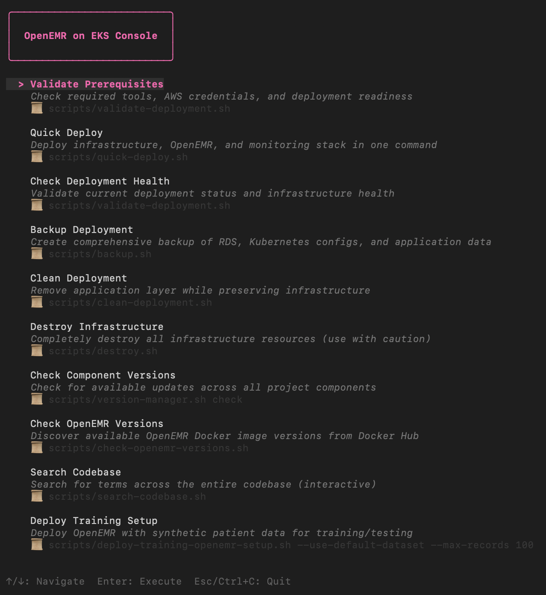

# OpenEMR on EKS Console (TUI)

A Terminal User Interface (TUI) built with Go and [Bubbletea](https://github.com/charmbracelet/bubbletea) that provides an intuitive, menu-driven interface for managing your OpenEMR on EKS deployment.



## Table of Contents

- [Overview](#overview)
- [Features](#features)
- [Quick Start](#quick-start)
  - [Using the Launcher Script](#using-the-launcher-script)
  - [Manual Build and Run](#manual-build-and-run)
  - [Using the Makefile](#using-the-makefile)
- [Navigation](#navigation)
- [Available Commands](#available-commands)
- [Prerequisites](#prerequisites)
- [Installation](#installation)
  - [Install Go](#install-go)
  - [Verify Installation](#verify-installation)
- [Project Structure](#project-structure)
- [Dependencies](#dependencies)
- [Building from Source](#building-from-source)
- [Installation to System Path](#installation-to-system-path)
- [Troubleshooting](#troubleshooting)
  - [Console Won't Start](#console-wont-start)
  - [Scripts Not Found](#scripts-not-found)
  - [Permission Denied](#permission-denied)
  - [Build Errors](#build-errors)
- [Development](#development)
  - [Adding New Commands](#adding-new-commands)
  - [Architecture](#architecture)
  - [Command Execution](#command-execution)
- [Documentation](#documentation)
- [License](#license)

## Overview

Instead of remembering complex command-line arguments, you can navigate through a simple menu and execute common operations with ease. The console provides access to 10 essential deployment and management commands.

**Platform Support**: Currently macOS only. Commands execute in separate Terminal windows to preserve script colors, formatting, and interactivity.

## Features

- **Simple Navigation**: Use arrow keys to navigate through available commands
- **Clear Descriptions**: Each command includes a brief description of what it does
- **Integrated Execution**: Commands run directly from the console interface
- **Error Handling**: Clear error messages when commands fail
- **No Configuration Required**: Automatically detects project structure and script locations

## Quick Start

### Using the Launcher Script

The easiest way to launch the console is from the project root:

```bash
./start_console
```

The launcher script will:
1. Check for Go installation (requires Go 1.25+)
2. Navigate to the console directory
3. Download dependencies (if needed)
4. Build the console application
5. Launch the TUI

### Manual Build and Run

```bash
cd console
go mod download
go build -o openemr-eks-console main.go
./openemr-eks-console
```

### Using the Makefile

```bash
cd console
make build     # Build the console
make install   # Install to /usr/local/bin (requires sudo)
make uninstall # Remove from /usr/local/bin (requires sudo)
make run       # Build and run
make clean     # Remove build artifacts
```

After installation, you can run the console from anywhere:

```bash
openemr-eks-console
```

## Navigation

- **↑/↓ Arrow Keys**: Navigate up and down through the command list
- **Enter**: Execute the selected command
- **Esc** or **Ctrl+C**: Quit the console

## Available Commands

1. **Validate Prerequisites** - Check required tools, AWS credentials, and deployment readiness
2. **Quick Deploy** - Deploy infrastructure, OpenEMR, and monitoring stack in one command
3. **Check Deployment Health** - Validate current deployment status and infrastructure health
4. **Backup Deployment** - Create comprehensive backup of RDS, Kubernetes configs, and application data
5. **Clean Deployment** - Remove application layer while preserving infrastructure
6. **Destroy Infrastructure** - Completely destroy all infrastructure resources (use with caution)
7. **Check Component Versions** - Check for available updates across all project components
8. **Check OpenEMR Versions** - Discover available OpenEMR Docker image versions from Docker Hub
9. **Search Codebase** - Search for terms across the entire codebase (interactive)
10. **Deploy Training Setup** - Deploy OpenEMR with synthetic patient data for training/testing

## Prerequisites

- **macOS** operating system (required - console currently only supports macOS)
- **Go 1.25 or later** installed on your system
- Access to the OpenEMR on EKS project directory

## Installation

### Install Go

If Go is not installed, download it from:
- **Official Site**: https://golang.org/dl/
- **macOS**: `brew install go` (may need `brew upgrade go` for latest version)

### Verify Installation

```bash
go version
# Should show: go version go1.25.x or later
```

## Project Structure

```
console/
├── main.go          # Main console application
├── go.mod           # Go module definition
├── go.sum           # Go module checksums
├── Makefile         # Build automation
└── README.md        # This file
```

## Dependencies

- [`github.com/charmbracelet/bubbletea v1.3.10`](https://github.com/charmbracelet/bubbletea) - TUI framework
- [`github.com/charmbracelet/lipgloss v1.1.0`](https://github.com/charmbracelet/lipgloss) - Styling

**Version Management**: All Go dependencies are tracked in `../versions.yaml` under the `go_packages` section for automated version checking and update notifications.

## Building from Source

1. **Clone the repository** (if not already done):
   ```bash
   git clone https://github.com/openemr/openemr-on-eks
   cd openemr-on-eks
   ```

2. **Navigate to console directory**:
   ```bash
   cd console
   ```

3. **Download dependencies**:
   ```bash
   go mod download
   ```

4. **Build the binary** (with embedded project path):
   ```bash
   # Get project root (parent of console directory)
   PROJECT_ROOT="$(dirname "$(pwd)")"
   go build -ldflags "-X main.embeddedProjectRoot=$PROJECT_ROOT" -o openemr-eks-console main.go
   ```

5. **Run the console**:
   ```bash
   ./openemr-eks-console
   ```

## Installation to System Path

To install the console globally so it can be run from anywhere:

```bash
cd console
make install
```

This will:
- Build the console binary as `openemr-eks-console`
- Embed the project root path in the binary
- Install it to `/usr/local/bin/openemr-eks-console`
- Make it executable

After installation, you can run:

```bash
openemr-eks-console
```

To uninstall the console:

```bash
cd console
make uninstall
```

This will:
- Remove the binary from `/usr/local/bin/openemr-eks-console`
- Check if the binary exists before attempting removal

After installation, you can run:

```bash
openemr-eks-console
```

**Important**: The console automatically knows the project location:
1. **During installation**: The project root path is embedded in the binary
2. **If project is moved**: Set `OPENEMR_EKS_PROJECT_ROOT` environment variable to override the embedded path

**If you move the project directory**, update the path:

```bash
export OPENEMR_EKS_PROJECT_ROOT=/new/path/to/openemr-on-eks
openemr-eks-console
```

Or add it to your shell profile (`~/.zshrc`, `~/.bashrc`, etc.) for persistence:

```bash
echo 'export OPENEMR_EKS_PROJECT_ROOT=/path/to/openemr-on-eks' >> ~/.zshrc
```

The console will automatically find the scripts directory using the embedded path or the environment variable.

## Troubleshooting

### Console Won't Start

**Issue**: `Error: Go is not installed` or version too old

**Solution**: Install or upgrade Go to version 1.25 or later:
- Download from: https://golang.org/dl/
- macOS: `brew install go` or `brew upgrade go`

### Scripts Not Found

**Issue**: `Script not found: [path]`

**Solution**: Ensure you're running the console from the project root directory, or that the console can find the project root (it auto-detects).

### Permission Denied

**Issue**: Scripts fail with permission errors

**Solution**: The console automatically makes scripts executable, but if issues persist:
```bash
chmod +x ../scripts/*.sh
```

### Build Errors

**Issue**: Go build fails

**Solution**: 
1. Ensure Go 1.25+ is installed: `go version`
2. Clean and rebuild: `cd console && go clean && go mod tidy && go build`
3. Check for network issues when downloading dependencies

## Development

### Adding New Commands

To add new commands to the console:

1. Edit `main.go`
2. Add a new `command` entry to the `commands` slice in `initialModel()`:

```go
{
    title:       "Your New Command",
    description: "What your command does",
    script:      filepath.Join(scriptsPath, "your-script.sh"),
    args:        []string{"arg1", "arg2"},
},
```

3. Rebuild: `make build` or `go build -o openemr-eks-console main.go`

### Architecture

- **Framework**: [Bubbletea](https://github.com/charmbracelet/bubbletea) (Go TUI framework)
- **Language**: Go 1.25+
- **Execution Model**: Opens commands in separate Terminal windows (macOS only)

### Command Execution

The console executes scripts by:
1. Locating the script file in the `../scripts/` directory
2. Making it executable (if needed)
3. Opening it in a new Terminal window with `osascript` (macOS)
4. Displaying success/error messages

## Documentation

For more detailed information, see:
- **[Console Guide](../docs/CONSOLE_GUIDE.md)** - Comprehensive usage guide
- **[Main README](../README.md)** - Project overview and documentation
- **[Scripts README](../scripts/README.md)** - Documentation for individual scripts

## License

This console is part of the OpenEMR on EKS project and follows the same license terms.
