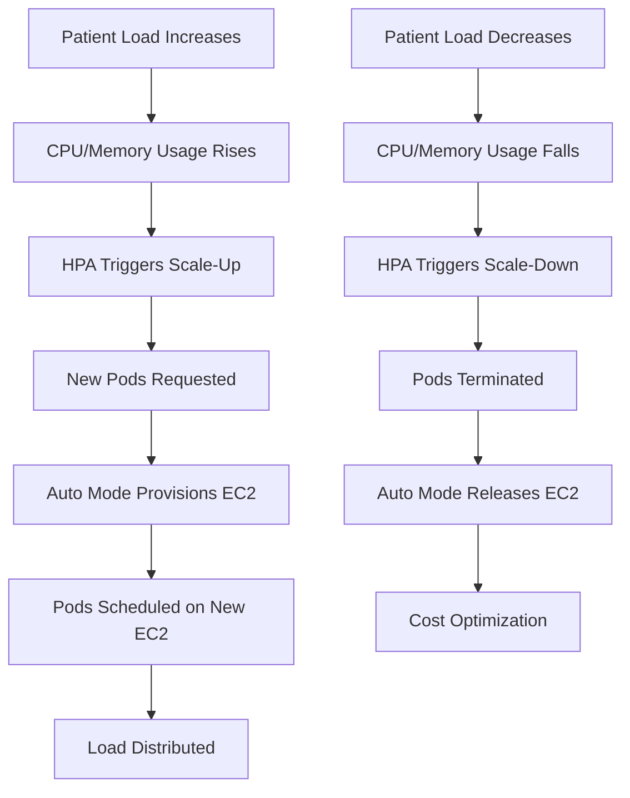

# OpenEMR Autoscaling Configuration Guide

This guide helps you configure optimal autoscaling for your OpenEMR deployment on EKS Auto Mode based on your healthcare organization's specific needs.

> **📌 Important**: With EKS Auto Mode, node-level scaling is handled automatically. This guide focuses on **pod-level autoscaling** through Horizontal Pod Autoscaler (HPA) configuration.

## 📋 Table of Contents

- [Understanding Healthcare Workload Patterns](#-understanding-healthcare-workload-patterns)
- [EKS Auto Mode Scaling Architecture](#-eks-auto-mode-scaling-architecture)
- [Sizing Guidelines by Organization Type](#-sizing-guidelines-by-organization-type)
- [Determining Your Optimal Configuration](#-determining-your-optimal-configuration)
- [Monitoring and Optimization](#-monitoring-and-optimization)
- [Troubleshooting Autoscaling Issues](#-troubleshooting-autoscaling-issues)
- [Configuration Examples](#-configuration-examples)
- [Quick Start Recommendations](#-quick-start-recommendations)
- [Capacity Planning](#-capacity-planning)
- [Summary](#summary)

## 📊 Understanding Healthcare Workload Patterns

### Typical Healthcare Usage Patterns

Healthcare organizations have predictable daily and seasonal patterns:

| Time Period | Load Level | Characteristics |
|------------|------------|-----------------|
| **7:00-9:00 AM** | 🔴 Peak | Clinic opening, patient check-ins |
| **9:00 AM-12:00 PM** | 🟠 High | Active patient care |
| **12:00-1:00 PM** | 🟡 Moderate | Lunch break reduction |
| **1:00-5:00 PM** | 🟠 High | Afternoon appointments |
| **5:00-7:00 PM** | 🟡 Moderate | Documentation, catching up |
| **7:00 PM-7:00 AM** | 🟢 Low | After-hours, emergency only |

### Seasonal Variations

- **Flu Season** (Oct-Feb): increased load
- **Back-to-School** (Aug-Sep): increased load
- **Holiday Periods**: Reduced load except emergencies
- **Pandemic/Crisis**: Unpredictable surges requiring rapid scaling

## 🎯 EKS Auto Mode Scaling Architecture



### Key Differences with Auto Mode

- **No node group management**: Auto Mode handles all EC2 provisioning
- **Instant pod scheduling**: No waiting for node provisioning
- **Automatic bin packing**: Optimal pod placement for cost efficiency
- **21-day node rotation**: Automatic security patching
- **12% management fee**: Additional cost for full automation

## 🏥 Sizing Guidelines by Organization Type

### Small Clinic (10-50 Users)

```yaml
# Recommended HPA Configuration
apiVersion: autoscaling/v2
kind: HorizontalPodAutoscaler
metadata:
  name: openemr-hpa
  namespace: openemr
spec:
  scaleTargetRef:
    apiVersion: apps/v1
    kind: Deployment
    name: openemr
  minReplicas: 2  # High availability minimum
  maxReplicas: 6  # Cost-conscious maximum
  behavior:
    scaleUp:
      stabilizationWindowSeconds: 60   # Quick response
      policies:
      - type: Percent
        value: 100                     # Double capacity quickly
        periodSeconds: 60
    scaleDown:
      stabilizationWindowSeconds: 600  # Avoid thrashing
      policies:
      - type: Percent
        value: 25                      # Gradual scale-down
        periodSeconds: 300
  metrics:
  - type: Resource
    resource:
      name: cpu
      target:
        type: Utilization
        averageUtilization: 75         # Balance cost/performance
  - type: Resource
    resource:
      name: memory
      target:
        type: Utilization
        averageUtilization: 80
```

**Rationale:**

- **Min 2 replicas**: Ensures availability during maintenance
- **Max 6 replicas**: Handles 3x normal load for emergencies
- **75% CPU threshold**: Allows headroom for spikes
- **10-minute scale-down**: Prevents disruption during breaks

### Medium Practice (50-200 Users)

```yaml
# Recommended HPA Configuration
apiVersion: autoscaling/v2
kind: HorizontalPodAutoscaler
metadata:
  name: openemr-hpa
  namespace: openemr
spec:
  scaleTargetRef:
    apiVersion: apps/v1
    kind: Deployment
    name: openemr
  minReplicas: 3   # Better load distribution
  maxReplicas: 12  # Handle seasonal peaks
  behavior:
    scaleUp:
      stabilizationWindowSeconds: 45  # Faster response
      policies:
      - type: Pods
        value: 2         # Add 2 pods at a time
        periodSeconds: 60
      - type: Percent
        value: 50        # Or 50% increase
        periodSeconds: 60
      selectPolicy: Max  # Use whichever scales more
    scaleDown:
      stabilizationWindowSeconds: 300  # 5-minute buffer
      policies:
      - type: Pods
        value: 1  # Remove 1 pod at a time
        periodSeconds: 120
  metrics:
  - type: Resource
    resource:
      name: cpu
      target:
        type: Utilization
        averageUtilization: 70  # More aggressive scaling
  - type: Resource
    resource:
      name: memory
      target:
        type: Utilization
        averageUtilization: 75
```

### Large Hospital (200-1000+ Users)

```yaml
# Recommended HPA Configuration
apiVersion: autoscaling/v2
kind: HorizontalPodAutoscaler
metadata:
  name: openemr-hpa
  namespace: openemr
spec:
  scaleTargetRef:
    apiVersion: apps/v1
    kind: Deployment
    name: openemr
  minReplicas: 5   # Always maintain capacity
  maxReplicas: 30  # Handle major incidents
  behavior:
    scaleUp:
      stabilizationWindowSeconds: 30  # Rapid response
      policies:
      - type: Pods
        value: 4    # Add 4 pods quickly
        periodSeconds: 30
      - type: Percent
        value: 100  # Or double capacity
        periodSeconds: 60
      selectPolicy: Max
    scaleDown:
      stabilizationWindowSeconds: 600  # Conservative scale-down
      policies:
      - type: Pods
        value: 2  # Remove 2 pods gradually
        periodSeconds: 300
  metrics:
  - type: Resource
    resource:
      name: cpu
      target:
        type: Utilization
        averageUtilization: 60  # Performance priority
  - type: Resource
    resource:
      name: memory
      target:
        type: Utilization
        averageUtilization: 70
  # Custom metrics for advanced scaling
  - type: Pods
    pods:
      metric:
        name: http_requests_per_second
      target:
        type: AverageValue
        averageValue: "1000"  # Scale based on request rate
```

## 🔍 Determining Your Optimal Configuration

### Step 1: Baseline Monitoring (2-4 Weeks)

```bash
# Deploy with the default configuration.
```

### Step 2: Analyze Usage Patterns

```bash
# Use Grafana and the other tools in the monitoring stack to gather data on how the deployment performs.
```

### Step 3: Configure Based on Patterns

```bash
# Apply optimized configuration generated after studying usage patterns
kubectl apply -f optimized-hpa.yaml

# Monitor scaling behavior
kubectl get hpa openemr-hpa -n openemr --watch

# Check scaling events
kubectl describe hpa openemr-hpa -n openemr
```

## 📊 Monitoring and Optimization

### Performance Optimization Checklist

| Metric | Target | Action if Exceeded |
|--------|--------|-------------------|
| **CPU Utilization** | < 70% average | Lower HPA threshold or increase max replicas |
| **Memory Usage** | < 80% average | Increase pod memory limits or replicas |
| **Response Time P95** | < 2 seconds | Scale up more aggressively |
| **Error Rate** | < 1% | Review application logs and scaling |

### Operational Scripts for Autoscaling Management

#### **Deployment Validation and Health Checks**

```bash
cd scripts

# Comprehensive deployment validation (includes HPA checks)
./validate-deployment.sh

# Check current OpenEMR version and available updates
./check-openemr-versions.sh --latest

# Verify feature configuration (features can impact scaling)
./openemr-feature-manager.sh status all
```

#### **Monitoring and Performance Analysis**

```bash
# Use monitoring stack for detailed autoscaling metrics
cd monitoring
./install-monitoring.sh

# Access Grafana dashboards for autoscaling analysis
```

## 🚨 Troubleshooting Autoscaling Issues

### Script-Based Troubleshooting Workflow

#### **Step 1: Validate Overall System Health**

```bash
cd scripts

# Run comprehensive validation first
./validate-deployment.sh

# Check for any infrastructure issues
./validate-efs-csi.sh
```

#### **Step 2: Check Application Configuration**

```bash
# Check overall system health and application configuration
./check-openemr-versions.sh --latest
./openemr-feature-manager.sh status all
```

#### **Step 3: Clean Deployment if Needed**

```bash
# If HPA or deployment is corrupted
# WARNING: This will delete data so make sure you backup first!
./clean-deployment.sh

# Then redeploy with updated configuration
cd ../k8s && ./deploy.sh
```

### Issue: Constant Scaling (Flapping)

**Symptoms:** HPA continuously scales up and down

**Diagnosis:**

```bash
cd scripts
./validate-deployment.sh  # Check for underlying issues

# Check HPA events
kubectl describe hpa openemr-hpa -n openemr
```

**Solution:**

```yaml
# Increase stabilization windows
behavior:
  scaleUp:
    stabilizationWindowSeconds: 120  # Increased from 60
  scaleDown:
    stabilizationWindowSeconds: 900  # Increased from 300
```

### Issue: Slow Response During Peak Hours

**Symptoms:** High latency during morning rush

**Diagnosis:**

```bash
cd scripts
./validate-deployment.sh  # Check system health
```

**Solution:**

```yaml
# More aggressive scaling
metrics:
- type: Resource
  resource:
    name: cpu
    target:
      type: Utilization
      averageUtilization: 50  # Reduced from 70
behavior:
  scaleUp:
    policies:
    - type: Pods
      value: 4           # Increased from 2
      periodSeconds: 30  # Reduced from 60
```

### Issue: Pods Stuck Pending with Auto Mode

**Symptoms:** Pods remain pending despite Auto Mode

**Diagnosis:**

```bash
# Check pod events
kubectl describe pod <pending-pod> -n openemr

# Check Auto Mode status
kubectl get nodeclaim
kubectl get nodepools

# Verify resource requests
kubectl get pod <pending-pod> -n openemr -o yaml | grep -A 5 "resources:"
```

**Common Causes:**

- **Resource requests too high**: Auto Mode has instance type limits
- **Anti-affinity rules**: Conflicting with Auto Mode placement
- **PVC issues**: Storage not available in the availability zone

## 🔧 Configuration Examples

### 🔒 **MANDATORY: End-to-End Testing Before Configuration Changes**

**Before making any autoscaling configuration changes, the end-to-end backup/restore test MUST pass successfully.** This ensures that infrastructure modifications don't break disaster recovery capabilities.

#### **Testing Process**

```bash
# Run the complete end-to-end test
./scripts/test-end-to-end-backup-restore.sh --cluster-name openemr-eks-test

# Expected outcome: All 10 test steps must pass
# ✅ Infrastructure deployment
# ✅ OpenEMR installation
# ✅ Test data creation
# ✅ Backup creation
# ✅ Monitoring stack test
# ✅ Infrastructure destruction
# ✅ Infrastructure recreation
# ✅ Backup restoration
# ✅ Verification
# ✅ Final cleanup
```

#### **Why This Is Critical**

- **Disaster Recovery**: Ensures backup/restore functionality works correctly
- **Infrastructure Validation**: Validates Terraform and Kubernetes configurations
- **Regression Prevention**: Prevents changes that could break recovery procedures
- **Compliance**: Demonstrates disaster recovery capabilities for audits
- **Quality Assurance**: Ensures all changes are thoroughly tested

#### **Test Requirements**

- **All test steps must pass**: No exceptions or partial failures allowed
- **Complete infrastructure cycle**: Test must validate full create/destroy/restore cycle
- **Data integrity verification**: Proof files must be correctly restored
- **Connectivity validation**: Database and application connectivity must work after restore
- **Resource cleanup**: All test resources must be properly cleaned up

#### **Failure Handling**

- **If any test step fails**: Changes must be reverted or fixed before proceeding
- **No exceptions**: This testing is mandatory for all configuration changes
- **Re-test required**: After fixes, complete test must pass again
- **Documentation required**: All changes must include test results

### Conservative (Cost-Optimized)

```yaml
apiVersion: autoscaling/v2
kind: HorizontalPodAutoscaler
metadata:
  name: openemr-conservative
  namespace: openemr
spec:
  scaleTargetRef:
    apiVersion: apps/v1
    kind: Deployment
    name: openemr
  minReplicas: 2
  maxReplicas: 8
  metrics:
  - type: Resource
    resource:
      name: cpu
      target:
        type: Utilization
        averageUtilization: 80         # Higher threshold
  - type: Resource
    resource:
      name: memory
      target:
        type: Utilization
        averageUtilization: 85
  behavior:
    scaleDown:
      stabilizationWindowSeconds: 600  # Slower scale-down
      policies:
      - type: Percent
        value: 10                      # Gradual reduction
        periodSeconds: 300
```

### Balanced (Recommended Default)

```yaml
apiVersion: autoscaling/v2
kind: HorizontalPodAutoscaler
metadata:
  name: openemr-balanced
  namespace: openemr
spec:
  scaleTargetRef:
    apiVersion: apps/v1
    kind: Deployment
    name: openemr
  minReplicas: 3
  maxReplicas: 15
  metrics:
  - type: Resource
    resource:
      name: cpu
      target:
        type: Utilization
        averageUtilization: 70
  - type: Resource
    resource:
      name: memory
      target:
        type: Utilization
        averageUtilization: 80
  behavior:
    scaleUp:
      stabilizationWindowSeconds: 60
      policies:
      - type: Percent
        value: 50
        periodSeconds: 60
    scaleDown:
      stabilizationWindowSeconds: 300
      policies:
      - type: Percent
        value: 25
        periodSeconds: 120
```

### Aggressive (Performance-Optimized)

```yaml
apiVersion: autoscaling/v2
kind: HorizontalPodAutoscaler
metadata:
  name: openemr-aggressive
  namespace: openemr
spec:
  scaleTargetRef:
    apiVersion: apps/v1
    kind: Deployment
    name: openemr
  minReplicas: 5
  maxReplicas: 30
  metrics:
  - type: Resource
    resource:
      name: cpu
      target:
        type: Utilization
        averageUtilization: 50         # Low threshold
  - type: Resource
    resource:
      name: memory
      target:
        type: Utilization
        averageUtilization: 60
  behavior:
    scaleUp:
      stabilizationWindowSeconds: 30   # Fast response
      policies:
      - type: Percent
        value: 100                     # Double quickly
        periodSeconds: 30
    scaleDown:
      stabilizationWindowSeconds: 900  # Conservative scale-down
      policies:
      - type: Pods
        value: 1
        periodSeconds: 300
```

## 🎯 Quick Start Recommendations

### For New Deployments

1. **Start with Default Configuration**

   ```bash
   # Will be configured by default when you deploy
   ```

2. **Monitor for 2 Weeks**

   ```bash
   # Daily monitoring
   # Use the monitoring stack tools
   ```

3. **Analyze Patterns**
   - Peak usage times
   - Maximum concurrent users
   - Response time during peaks

4. **Adjust Based on Data**
   - Increase min replicas if frequently scaling up
   - Decrease thresholds if response times are high
   - Increase max replicas if hitting limits

5. **Document Changes**

   ```yaml
   # Track configuration changes
   annotations:
     config-version: "v2"
     last-modified: "2025-01-15"
     reason: "Increased min replicas for morning surge"
   ```

### Healthcare-Specific Considerations

#### Patient Safety First

- **Never set min replicas below 2** - Ensures availability
- **Conservative scale-down** - Prevents disruption during care
- **Lower thresholds for critical systems** - Prioritize performance

#### Compliance Requirements

- **Audit scaling events** - Track all changes
- **Document configuration rationale** - For compliance reviews

#### Cost Management

- **Review monthly costs** - Compare with patient volume
- **Optimize during off-hours** - Reduce minimums at night
- **Use spot instances for non-critical** - Dev/test environments

## 📈 Capacity Planning

### Calculating Required Capacity

```python
def calculate_capacity(patient_count, visit_duration_min=20,
                       peak_factor=2.5, utilization_target=0.7):
    """
    Calculate required OpenEMR capacity

    Args:
        patient_count: Average daily patients
        visit_duration_min: Average visit duration in minutes
        peak_factor: Multiplier for peak vs average
        utilization_target: Target CPU utilization (0.7 = 70%)

    Returns:
        dict: Capacity recommendations
    """
    # Concurrent users during peak assuming clinic is active for 8 hours a day
    concurrent_users = (patient_count * peak_factor * visit_duration_min) / (8 * 60)

    # Pods needed (25 users per pod at target utilization)
    pods_needed = concurrent_users / (25 * utilization_target)

    return {
        'min_replicas': max(2, int(pods_needed * 0.5)),             # 50% of peak
        'max_replicas': int(max(2, int(pods_needed * 0.5)) * 1.5),  # 150% of peak for headroom
        'cpu_threshold': int(utilization_target * 100),
        'expected_peak_users': int(concurrent_users)
    }

# Example for 200 patients/day clinic
capacity = calculate_capacity(200)
print(f"Min Replicas: {capacity['min_replicas']}")
print(f"Max Replicas: {capacity['max_replicas']}")
print(f"CPU Threshold: {capacity['cpu_threshold']}%")
print(f"Expected Peak Users: {capacity['expected_peak_users']}")
```

## Summary

Effective autoscaling with EKS Auto Mode requires:

1. **Understanding your workload patterns** - Monitor before optimizing
2. **Right-sizing pod resources** - Don't over-provision
3. **Configuring appropriate thresholds** - Balance performance and cost
4. **Monitoring and adjusting** - Continuous optimization
5. **Leveraging Auto Mode benefits** - Let AWS handle node management

Remember: EKS Auto Mode charges a 12% premium but eliminates node management overhead. Focus your efforts on application-level scaling for best results.
