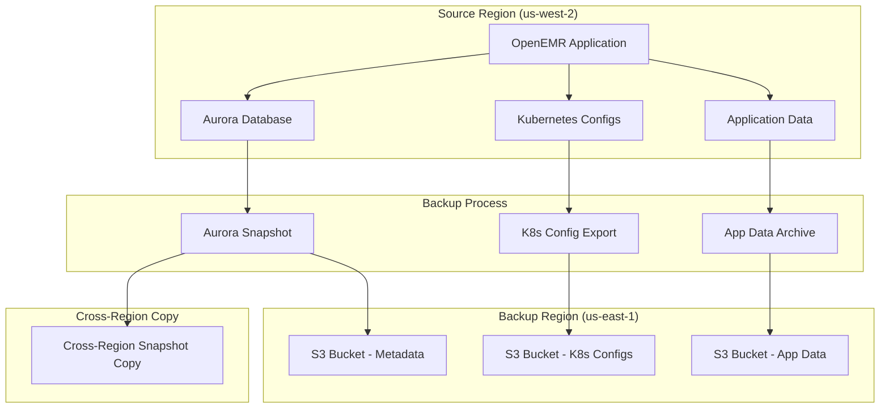
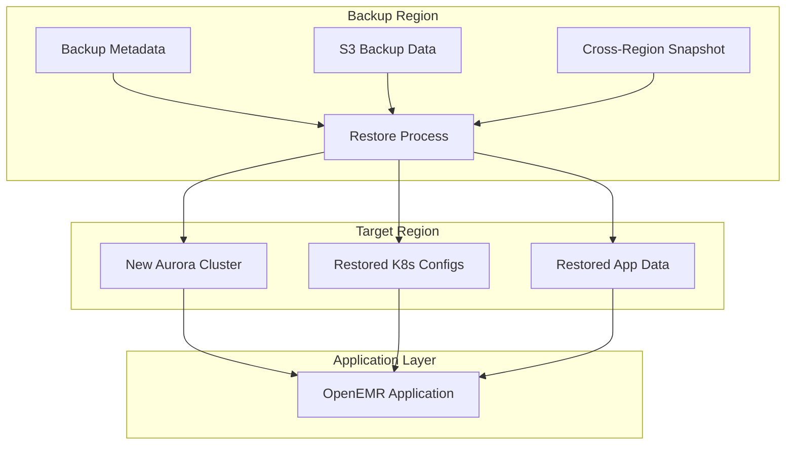

# OpenEMR on EKS Backup & Restore Guide

This guide covers the comprehensive backup and restore system for OpenEMR on EKS, designed to protect your critical healthcare data with cross-region disaster recovery capabilities.

## 📋 Table of Contents

- [Overview](#overview)
- [Backup System](#backup-system)
- [What Gets Backed Up](#what-gets-backed-up)
- [Prerequisites](#prerequisites)
- [Quick Start](#quick-start)
- [Backup Operations](#backup-operations)
- [Restore Operations](#restore-operations)
- [Testing & Validation](#testing--validation)
- [Cross-Region Disaster Recovery](#cross-region-disaster-recovery)
- [Monitoring & Maintenance](#monitoring--maintenance)
- [Troubleshooting](#troubleshooting)

## Overview

The OpenEMR backup system provides a comprehensive, multi-layered backup strategy:

- ✅ **AWS Backup Integration** - Automated, centralized backups of all infrastructure components
- ✅ **Automated RDS Aurora snapshots** with enhanced cross-region/cross-account support
- ✅ **Kubernetes configuration backup** (all resources, secrets, configs)
- ✅ **Application data backup** from S3
- ✅ **Cross-region disaster recovery** capabilities using new RDS features
- ✅ **Cross-account backup** for compliance and data sharing
- ✅ **Simple, reliable scripts** with graceful error handling
- ✅ **Multiple backup strategies** (same-region, cross-region, cross-account)
- ✅ **7-year retention** for compliance and long-term recovery needs

The restore system has been significantly simplified and improved:

- ✅ **One-command restore** - Simple, reliable restore with auto-detection
- ✅ **Automatic cluster detection** - No need to specify cluster names manually
- ✅ **Smart database restore** - Enhanced cross-region/cross-account snapshot restoration
- ✅ **Strategy auto-detection** - Automatically detects restore strategy from backup metadata
- ✅ **Application data restore** - Downloads and extracts data directly to EFS via existing pods
- ✅ **Auto-reconfiguration** - Automatically updates database and Redis connections
- ✅ **Manual fallback** - Step-by-step manual instructions if automated process fails
- ✅ **Modular options** - Restore database, app data, or both as needed
- ✅ **Cross-account restore** - Support for restoring from different AWS accounts

### Backup Architecture



### Restore Architecture



## Backup System

### AWS Backup Integration

The OpenEMR deployment includes a comprehensive AWS Backup configuration that automatically backs up all critical infrastructure components. This system provides centralized backup management, encryption, and retention policies that complement the existing script-based backup process.

#### What AWS Backup Covers

AWS Backup automatically backs up the following resources on scheduled intervals:

- **All S3 Buckets**: ALB logs, WAF logs, Loki storage, CloudTrail logs
- **EFS File System**: Application data and configuration files
- **RDS Aurora Cluster**: Database snapshots with point-in-time recovery
- **EKS Cluster**: Cluster configuration and metadata (using AWS Backup support for EKS)

#### Backup Plans

Three backup plans are configured to provide comprehensive coverage:

1. **Daily Backups** - Runs every day at 2:00 AM UTC
   - Retention: 7 years (2555 days)
   - Cold storage transition: After 30 days
   - Purpose: Frequent backups for recent recovery needs

2. **Weekly Backups** - Runs every Sunday at 3:00 AM UTC
   - Retention: 7 years (2555 days)
   - Cold storage transition: After 90 days
   - Purpose: Weekly snapshots for intermediate recovery needs

3. **Monthly Backups** - Runs on the 1st of each month at 4:00 AM UTC
   - Retention: 7 years (2555 days)
   - Cold storage transition: After 180 days
   - Purpose: Monthly snapshots for long-term retention

#### Encryption and Security

- **Dedicated KMS Key**: All backups are encrypted using a dedicated KMS key specifically for AWS Backup
- **Automatic Key Rotation**: KMS key rotation is enabled for enhanced security
- **Access Control**: IAM role-based access control for backup operations
- **Compliance**: 7-year retention meets most healthcare compliance requirements

#### Integration with Existing Backup Process

The AWS Backup system complements the existing script-based backup process:

- **AWS Backup**: Provides automated, scheduled backups of all infrastructure components
- **Script-Based Backups**: Provides on-demand backups, cross-region replication, and application-specific data backups
- **Dual Strategy**: Both systems work together to provide comprehensive backup coverage

#### Benefits of AWS Backup Integration

- **Centralized Management**: All backups managed in a single AWS Backup vault
- **Automated Scheduling**: No manual intervention required for scheduled backups
- **Long-Term Retention**: 7-year retention for compliance requirements
- **Cost Optimization**: Automatic transition to cold storage reduces costs
- **EKS Support**: Native support for EKS cluster backups (see: https://aws.amazon.com/about-aws/whats-new/2025/11/aws-backup-supports-amazon-eks/)
- **Recovery Point Management**: Easy recovery point selection and restoration

#### Monitoring and Management

- **AWS Backup Console**: Monitor backup jobs, recovery points, and restore operations
- **CloudWatch Integration**: Backup job status and metrics in CloudWatch
- **Recovery Point Tags**: Automatic tagging for backup organization and cost allocation
- **Backup Reports**: Comprehensive backup reports for compliance and auditing

#### Backup Storage Costs

AWS Backup storage costs vary by service and storage tier. Pricing is based on the [AWS Backup pricing page](https://aws.amazon.com/backup/pricing/):

**Standard (Warm) Storage Pricing:**
- **EFS**: $0.05 per GB-month
- **RDS/Aurora**: $0.095 per GB-month
- **S3**: $0.05 per GB-month (for objects ≥128 KB; smaller objects billed as 128 KB)
- **EKS**: One-time backup creation fee per backup (per namespace) + storage charges for cluster state data
- **EBS**: $0.05 per GB-month (for persistent storage attached to EKS cluster)

**Cold Storage Pricing:**
- **Cold Storage**: $0.01 per GB-month for EFS (Note: cold storage as of Nov 2025 is only supported for EBS, EFS, DynamoDB, Timestream, SAP HANA, and VMware)
- **Minimum Retention**: Backups transitioned to cold storage must be retained for a minimum of 90 days

**Additional Considerations:**
- **S3 Additional Charges**: GET/LIST requests on S3 objects and EventBridge events (for S3 backups)
- **Data Transfer**: No charges for data transfer within the same region
- **EKS Backup**: Additional charges apply for EKS cluster backups (varies by cluster size and namespace count)

**Estimated Monthly Storage Costs (for 500 GB of backup data):**

- Warm storage at ~$0.05/GB-month → ~$25/month (depending on service mix maybe $30-40).
- If you transition all 500 GB to cold storage at ~$0.01/GB-month → ~$5/month (after transition).
- Thus: First month (warm) ~$30-40, after transition ~$5-10/month.

## What Gets Backed Up

### 🗄️ Database (RDS Aurora)

- **Aurora cluster snapshots** with point-in-time recovery
- **Enhanced cross-region snapshot copying** using new RDS capabilities
- **Cross-account snapshot sharing** for compliance and collaboration
- **Automated retention policies** (30 days default)
- **Multiple backup strategies** (same-region, cross-region, cross-account)

### ⚙️ Kubernetes Configuration

- All resources in the OpenEMR namespace
- Secrets and ConfigMaps
- Persistent Volume Claims (PVCs)
- Ingress and HPA configurations
- Service definitions

### 📦 Application Data

- OpenEMR sites directory (`/var/www/localhost/htdocs/openemr/sites/`)
- Patient data and uploaded files
- Custom configurations and templates
- Log files and audit trails

### 📋 Backup Metadata

- JSON metadata with restore instructions
- Human-readable reports with status
- Cross-region backup information
- Timestamp and versioning data

### 🔍 Logging Configuration (OpenEMR 7.0.3.4)

The restore process now includes comprehensive logging configuration for OpenEMR 7.0.3.4:

**Log Directory Structure:**

- `/var/log/openemr/` - Application logs (error, access, system)
- `/var/log/apache2/` - Web server logs
- `/var/www/localhost/htdocs/openemr/sites/default/documents/logs_and_misc/`
  - `system_logs/` - System-level operational logs
  - `audit_logs/` - Detailed audit trails
  - `logbook/` - Legacy logbook entries

**CloudWatch Integration:**

- **Automatic log group creation** during restore
- **Real-time log streaming** via Fluent Bit sidecar
- **IRSA authentication** for secure AWS service integration
- **KMS encryption** for all log data
- **Compliance tagging** for audit requirements

**Log Types Captured:**

- **Application Logs**: OpenEMR PHP application events
- **Audit Logs**: User actions, patient record access, database operations
- **System Logs**: Component status, operational events, health checks
- **Access Logs**: Web server requests and responses
- **Error Logs**: Application errors with stack traces
- **PHP Errors**: Detailed PHP errors with file and line information
- **Fluent Bit Metrics**: Operational metrics and health monitoring

**Restore Options:**

- `CONFIGURE_LOGGING=true` (default) - Full logging setup with Fluent Bit sidecar
- `CONFIGURE_LOGGING=false` - Skip logging configuration
- Automatic log directory creation and permission setup
- OpenEMR configuration file updates for logging paths
- Fluent Bit sidecar deployment with IRSA authentication

## Prerequisites

### Required Tools

```bash
# Verify required tools are installed
aws --version        # AWS CLI v2
kubectl version      # Kubernetes CLI
terraform --version  # Terraform (for infrastructure queries)
jq --version         # JSON processor
```

### AWS Permissions

Your AWS credentials need permissions for:

- RDS snapshot creation and management
- S3 bucket creation and management
- EKS cluster access
- Cross-region resource access

### Infrastructure Requirements

- EKS cluster with OpenEMR deployed
- RDS Aurora cluster (optional - gracefully handled if missing)
- EFS file system with application data
- Cross-region access configured

## Quick Start

### Create a Backup

```bash
# Basic backup to same region (default strategy)
./scripts/backup.sh

# Cross-region backup for disaster recovery
./scripts/backup.sh --strategy cross-region --backup-region us-east-1

# Cross-account backup for compliance/sharing
./scripts/backup.sh --strategy cross-account --target-account 123456789012 --backup-region us-east-1

# Custom cluster and namespace with cross-region backup
./scripts/backup.sh --cluster-name my-cluster --namespace my-namespace --strategy cross-region --backup-region us-east-1
```

### Restore from Backup

```bash
# Auto-detect restore strategy (recommended)
./scripts/restore.sh <backup-bucket> <snapshot-id> <backup-region>

# Cross-region restore
./scripts/restore.sh <backup-bucket> <snapshot-id> --strategy cross-region

# Cross-account restore
./scripts/restore.sh <backup-bucket> <snapshot-id> --strategy cross-account --source-account 123456789012

# Example with auto-detection
./scripts/restore.sh openemr-backups-123456789012-openemr-eks-20250815 openemr-eks-aurora-backup-20250815-120000 us-east-1
```

## Backup Operations

### Backup Script Usage

```bash
./scripts/backup.sh [OPTIONS]

Options:
  --cluster-name NAME     EKS cluster name (default: openemr-eks)
  --source-region REGION  Source AWS region (default: us-west-2)
  --backup-region REGION  Backup AWS region (default: same as source)
  --namespace NAMESPACE   Kubernetes namespace (default: openemr)
  --strategy STRATEGY     Backup strategy: same-region, cross-region, cross-account (default: same-region)
  --target-account ID     Target AWS account ID for cross-account backups
  --kms-key-id KEY        KMS key ID for encrypted snapshots (optional)
  --no-copy-tags          Don't copy tags to backup snapshots
  --help                  Show help message
```

### Backup Process Flow

1. **Prerequisites Check**
   - Verify AWS credentials and region access
   - Check required tools availability

2. **S3 Bucket Creation**
   - Create encrypted backup bucket in target region
   - Enable versioning and lifecycle policies
   - Configure cross-region replication if needed

3. **RDS Aurora Backup**
   - Detect Aurora cluster automatically
   - Create cluster snapshot with timestamp
   - Handle cluster status gracefully (backing-up, unavailable, etc.)
   - Use enhanced cross-region/cross-account snapshot copying
   - Apply selected backup strategy (same-region, cross-region, cross-account)

4. **Kubernetes Configuration Backup**
   - Export all resources from OpenEMR namespace
   - Create compressed archive
   - Upload to S3 backup bucket

5. **Application Data Backup**
   - Access running OpenEMR pods
   - Create tar archive of sites directory
   - Upload to S3 backup bucket

6. **Metadata Generation**
   - Create JSON metadata with restore instructions
   - Generate human-readable report
   - Capture database configuration for automatic restore
   - Store VPC, security group, and scaling settings
   - Track backup strategy and target account information
   - Upload both to S3 backup bucket

### Backup Outputs

After successful backup, you'll receive:

```
✅ Backup ID: openemr-backup-20250815-120000
✅ Backup Bucket: s3://openemr-backups-123456789012-openemr-eks-20250815
✅ Backup Region: us-east-1
✅ Backup Strategy: cross-region
✅ Aurora Snapshot: openemr-eks-aurora-backup-20250815-120000-us-east-1

📋 Backup Results:
Aurora RDS: SUCCESS (openemr-eks-aurora-backup-20250815-120000-us-east-1 (cross-region copy completed))
Kubernetes Config: SUCCESS (k8s-backup-20250815-120000.tar.gz)
Application Data: SUCCESS (app-data-backup-20250815-120000.tar.gz)

🚀 Enhanced Features Used:
✅ Cross-Region Snapshot Copy (New RDS Feature)

🔄 Restore Command:
   ./restore.sh openemr-backups-123456789012-openemr-eks-20250815 openemr-eks-aurora-backup-20250815-120000-us-east-1 us-east-1
```

## Restore Operations

### Restore Script Usage

```bash
./scripts/restore.sh <backup-bucket> <snapshot-id> [backup-region] [options]

Arguments:
  backup-bucket    S3 bucket containing the backup
  snapshot-id      RDS cluster snapshot identifier
  backup-region    AWS region where backup is stored (optional, defaults to target region)

Options:
  --cluster-name NAME    EKS cluster name (auto-detected from Terraform if not specified)
  --strategy STRATEGY    Restore strategy: auto-detect, same-region, cross-region, cross-account (default: auto-detect)
  --source-account ID    Source AWS account ID for cross-account restores
  --kms-key-id KEY       KMS key ID for encrypted snapshots (optional)
  --force, -f            Skip confirmation prompts
  --recreate-storage     Recreate storage classes before restore
  --help, -h             Show help message
  --manual-instructions  Show manual restore instructions

Environment Variables:
  AWS_REGION              Target AWS region (default: us-west-2)
  NAMESPACE               Kubernetes namespace (default: openemr)
  RESTORE_DATABASE        Restore database (default: true)
  RESTORE_APP_DATA        Restore application data (default: true)
  RECONFIGURE_DB          Reconfigure database (default: true)
  RESTORE_STRATEGY        Restore strategy (default: auto-detect)
  SOURCE_ACCOUNT_ID       Source AWS account ID for cross-account restores
  KMS_KEY_ID              KMS key ID for encrypted snapshots
  DB_CLEANUP_MAX_ATTEMPTS Maximum attempts to wait for database cleanup pod completion (default: 12)
```

### Key Improvements in the New Restore Script

- **🎯 Simplified Usage**: Only requires backup bucket and snapshot ID
- **🔍 Auto-Detection**: Automatically detects EKS cluster from Terraform output
- **🚀 Strategy Auto-Detection**: Automatically detects restore strategy from backup metadata
- **⚡ Faster Execution**: Uses existing OpenEMR pods instead of creating temporary ones
- **🔧 Auto-Reconfiguration**: Automatically updates database and Redis connections
- **📋 Manual Fallback**: Provides step-by-step manual instructions if needed
- **🌍 Enhanced Cross-Region**: Uses new RDS capabilities for faster cross-region restores
- **🏢 Cross-Account Support**: Full support for restoring from different AWS accounts
- **🧠 Intelligent Database Detection**: Automatically detects database state and adjusts restore process
- **🔄 Dynamic Process Order**: Smart 5-step or 4-step process based on database configuration
- **🛡️ Enhanced Error Handling**: Robust handling of missing databases and cleanup failures
- **⚙️ Configurable Timeouts**: Environment variables for fine-tuning cleanup operations

### Restore Process Flow

The restore process now features intelligent database detection and dynamic step ordering:

#### **Intelligent Database Detection**

Before starting the restore, the script automatically checks:
- **Database existence**: Does the expected RDS cluster exist?
- **Cluster status**: Is the cluster available and ready?
- **Instance validation**: Are the correct instances present and available?
- **Configuration validation**: Do instances match Terraform expectations?

#### **Dynamic Restore Process**

The script automatically adjusts the restore order based on database state:

**When database doesn't exist or is misconfigured (5 steps):**
1. **Early Database Restore** - Creates database from snapshot
2. **Clean Deployment** - Removes existing resources and cleans database
3. **Deploy OpenEMR** - Fresh install (creates proper config files)
4. **Database Restore** - Creates database from snapshot (always)
5. **Application Data Restore** - Extracts backup files + updates configuration

**When database exists and is properly configured (4 steps):**
1. **Clean Deployment** - Removes existing resources and database
2. **Deploy OpenEMR** - Fresh install (creates proper config files)
3. **Database Restore** - Creates database from snapshot
4. **Application Data Restore** - Extracts backup files + updates configuration

#### **Detailed Process Steps**

1. **Pre-flight Validation & Database Detection**
   - Auto-detect EKS cluster name from Terraform output
   - Auto-detect restore strategy from backup metadata
   - Verify AWS credentials and region access
   - Confirm backup bucket exists and is accessible
   - Check database existence and configuration
   - Determine if early database restore is needed
   - Update kubeconfig for target cluster

2. **Early Database Restore** (if needed)
   - Restore Aurora cluster from snapshot
   - Handle cross-region/cross-account restoration automatically
   - Use enhanced RDS capabilities for snapshot copying

3. **Clean Deployment**
   - Remove existing OpenEMR Kubernetes resources
   - Clean database (drop tables, recreate structure)
   - Handle orphaned storage and PVCs
   - Enhanced error handling for missing databases

4. **Deploy OpenEMR**
   - Fresh OpenEMR installation
   - Creates proper configuration files
   - Establishes correct database connections
   - Allows OpenEMR to run its initialization

5. **Database Restore** (always)
   - Restore Aurora cluster from snapshot
   - Use existing cluster identifier from Terraform
   - Handle cross-region/cross-account restoration automatically

6. **Application Data Restore**
   - Find existing OpenEMR pod in the cluster
   - Download backup from S3 to local temporary file
   - Copy backup to pod and extract to EFS volume
   - Update sqlconf.php with correct database connection
   - Create config.php if missing
   - Manage docker setup files properly
   - Clean up temporary files

7. **Redis/Valkey Reconfiguration**
   - Get Redis cluster details from Terraform output
   - Update Redis credentials secret in Kubernetes
   - Ensure OpenEMR can connect to Redis/Valkey

8. **Completion**
   - Provide restore status and next steps
   - All operations use existing infrastructure (no temporary resources)

### Advanced Features

#### **Redis/Valkey Auto-Reconfiguration**

The restore script automatically handles Redis/Valkey connection updates:

- **Automatic Detection**: Gets Redis cluster details from Terraform output
- **Secret Management**: Updates `openemr-redis-credentials` secret in Kubernetes
- **Connection Validation**: Ensures OpenEMR can connect to the restored Redis/Valkey cluster
- **No Manual Intervention**: All Redis configuration is handled automatically

This ensures that after a restore, OpenEMR can immediately connect to the correct Redis/Valkey instance without manual configuration.

#### **Error Handling & Validation**

The restore script includes comprehensive error handling:

- **Pre-flight Checks**: Validates AWS credentials, cluster access, and backup availability
- **Graceful Degradation**: Continues with available operations if some components fail
- **Detailed Logging**: Color-coded output with timestamps for easy troubleshooting
- **Manual Fallback**: Built-in manual restore instructions when automated process fails

## Enhanced Backup Strategies

The backup system now supports multiple strategies leveraging new Amazon RDS capabilities:

### 📍 Same-Region Backup (Default)

**Best for**: Development, testing, and cost optimization

```bash
# Same-region backup (fastest, lowest cost)
./scripts/backup.sh --strategy same-region
```

**Benefits**:
- Fastest backup completion
- Lowest storage costs
- No data transfer charges
- Ideal for regular development backups

### 🌍 Cross-Region Backup

**Best for**: Disaster recovery and compliance requirements

```bash
# Cross-region backup for disaster recovery
./scripts/backup.sh --strategy cross-region --backup-region us-east-1
```

**Benefits**:
- Uses new RDS single-step cross-region copy
- Eliminates intermediate snapshots (cost reduction)
- Faster completion times (improved RPO)
- Geographic separation for disaster recovery

### 🏢 Cross-Account Backup

**Best for**: Compliance, data sharing, and multi-tenant scenarios

```bash
# Cross-account backup for compliance/sharing
./scripts/backup.sh --strategy cross-account --target-account 123456789012 --backup-region us-east-1
```

**Benefits**:
- Direct cross-account snapshot sharing
- Compliance with data residency requirements
- Secure data sharing between organizations
- Simplified KMS key management

### Enhanced Features

All strategies now benefit from:

- **Single-Step Operations**: New RDS capabilities eliminate multi-step processes
- **Cost Reduction**: No intermediate snapshots required
- **Improved RPO**: Faster backup completion times
- **Simplified KMS Handling**: Automatic KMS key detection and management
- **Tag Preservation**: Optional tag copying to backup snapshots
- **Comprehensive Metadata**: Full backup strategy tracking

### Restore Examples

#### Basic Restore (Simplified - Most Common Use Case)

```bash
# Auto-detect restore strategy (recommended)
./scripts/restore.sh my-backup-bucket my-snapshot-id

# Cross-region restore
./scripts/restore.sh my-backup-bucket my-snapshot-id --strategy cross-region

# Cross-account restore
./scripts/restore.sh my-backup-bucket my-snapshot-id --strategy cross-account --source-account 123456789012
```

#### Automated Restore (Skip Confirmations)

```bash
# Skip confirmation prompts for automated scripts
./scripts/restore.sh my-backup-bucket my-snapshot-id --force
```

#### Intelligent Restore Process

The restore script now automatically detects your database state and adjusts the process accordingly:

```bash
# The script automatically detects if database exists and is properly configured
# No additional parameters needed - it handles everything intelligently
./scripts/restore.sh my-backup-bucket my-snapshot-id

# Example output showing intelligent detection:
# 🔍 Checking database existence and configuration...
# ✅ Correct database cluster exists and is available
# ✅ All instances are properly configured
# 🧹 STEP 1: Running Clean Deployment
# 🚀 STEP 2: Deploying OpenEMR (Fresh Install)
# 🔄 STEP 3: Restoring RDS Cluster from Snapshot
# 📁 STEP 4: Restoring Application Data & Updating Configuration
```

**What the script automatically detects:**
- Database cluster existence and status
- Instance configuration and availability
- Whether early database restore is needed
- Optimal restore process order (4 or 5 steps)

#### Selective Restore (Modular Options)

```bash
# Only restore database, skip application data
RESTORE_APP_DATA=false ./scripts/restore.sh my-backup-bucket my-snapshot-id

# Only restore application data, skip database
RESTORE_DATABASE=false ./scripts/restore.sh my-backup-bucket my-snapshot-id

# Skip database reconfiguration
RECONFIGURE_DB=false ./scripts/restore.sh my-backup-bucket my-snapshot-id
```

#### Manual Restore Instructions

```bash
# Get step-by-step manual restore instructions
./scripts/restore.sh --manual-instructions
```

### Cross-Region Restore

For cross-region disaster recovery:

```bash
# If snapshot needs to be copied to target region first
aws rds copy-db-cluster-snapshot \
    --source-db-cluster-snapshot-identifier arn:aws:rds:us-west-2:123456789012:cluster-snapshot:openemr-eks-aurora-backup-20250815-120000 \
    --target-db-cluster-snapshot-identifier openemr-eks-aurora-backup-20250815-120000-us-east-1 \
    --source-region us-west-2 \
    --region us-east-1

# Then restore with the copied snapshot
./scripts/restore.sh openemr-backups-123456789012-openemr-eks-20250815 openemr-eks-aurora-backup-20250815-120000-us-east-1 us-east-1
```

### Manual Restore Instructions

For situations where you need full control over the restore process or want to understand what's happening, the restore script provides manual instructions:

```bash
# Get step-by-step manual restore guide
./scripts/restore.sh --manual-instructions
```

The manual restore guide covers:

- **Step-by-step commands** for each restore operation
- **No script dependency** for understanding the process
- **Full control** over each step
- **Educational value** for learning the restore process

This is useful for:

- Learning the restore process
- Custom restore workflows
- Troubleshooting automated restores
- Situations where you need full control

## Backward Compatibility

**The restore script maintains 100% backward compatibility with existing workflows:**

- ✅ **Existing restore commands work unchanged** - no modifications needed
- ✅ **All restore operations enabled by default** - behaves exactly as before
- ✅ **No breaking changes** - existing automation and scripts continue to work
- ✅ **Same output format** - same success/error messages and exit codes

**What this means for you:**

- If you have existing restore automation, it will continue to work without changes
- If you manually run restore commands, they will work exactly as before
- The new modular options are purely additive - they don't change default behavior

### Restore Options and Use Cases

The restore script now provides granular control over what gets restored, making it suitable for various scenarios:

#### **Development and Testing**

```bash
# Set up development environment from production backup
NEW_DB_CLUSTER="openemr-dev-$(date +%Y%m%d)" \
./scripts/restore.sh backup-bucket snapshot-id
```

#### **Database Migration**

```bash
# Restore database to existing cluster for migration
EXISTING_DB_CLUSTER="my-production-db" \
RESTORE_APP_DATA=false \
./scripts/restore.sh backup-bucket snapshot-id
```

#### **Full Disaster Recovery**

```bash
# Complete restore with automatic database setup
RESTORE_DATABASE=true RESTORE_APP_DATA=true RESTORE_K8S_CONFIG=true RECONFIGURE_DB=true \
./scripts/restore.sh backup-bucket snapshot-id
```

#### **Backup Integrity Testing**

```bash
# Test backup without affecting production
RESTORE_DATABASE=true RESTORE_APP_DATA=true NEW_DB_CLUSTER="backup-test-$(date +%Y%m%d)" \
./scripts/restore.sh backup-bucket snapshot-id
```

#### **End-to-End Backup/Restore Testing**

For comprehensive testing of the entire backup and restore process, use the automated end-to-end test script:

```bash
# Run complete end-to-end test
./scripts/test-end-to-end-backup-restore.sh

# Custom test configuration
./scripts/test-end-to-end-backup-restore.sh \
  --cluster-name openemr-eks-test \
  --aws-region us-west-2 \
  --namespace openemr
```

**What the End-to-End Test Does:**

1. **Deploy Infrastructure** - Creates complete EKS cluster from scratch
2. **Deploy OpenEMR** - Installs and configures OpenEMR application
3. **Deploy Test Data** - Creates timestamped proof.txt file for verification
4. **Create Backup** - Runs full backup of the installation
5. **Destroy Infrastructure** - Completely removes all AWS resources
6. **Recreate Infrastructure** - Rebuilds the infrastructure from scratch
7. **Restore from Backup** - Restores the application from the backup
8. **Verify Restoration** - Confirms proof.txt exists and database connectivity works
9. **Final Cleanup** - Removes all resources and test backups

**Test Features:**

- **Automated Infrastructure Management** - Uses Terraform with auto-approve
- **Comprehensive Verification** - Tests data integrity and connectivity
- **Resource Cleanup** - Ensures no orphaned resources remain
- **Detailed Reporting** - Provides step-by-step results and timing
- **Resource Usage** - Notes that AWS resources will be created and destroyed

**Use Cases:**

- **Pre-production Validation** - Verify backup/restore works before going live
- **Disaster Recovery Testing** - Test complete recovery procedures
- **Infrastructure Validation** - Ensure Terraform configurations work correctly
- **Compliance Testing** - Demonstrate backup/restore capabilities for audits

**⚠️ Important Notes:**

- This test creates and destroys real AWS resources
- AWS resources will be created and destroyed during testing
- Requires proper AWS credentials and permissions
- Test duration: 160-165 minutes (~2.7 hours, measured from actual test runs)
- Backup creation: ~30-35 seconds, Restore: 38-43 minutes (comprehensive restore with verification)

## Cross-Region Disaster Recovery

### Setup Cross-Region Backups

```bash
# Regular cross-region backups for disaster recovery
./scripts/backup.sh --strategy cross-region --backup-region us-east-1

# Cross-account backups for compliance
./scripts/backup.sh --strategy cross-account --target-account 123456789012 --backup-region us-east-1

# Automated via cron (example)
0 2 * * * /path/to/scripts/backup.sh --strategy cross-region --backup-region us-east-1
```

### Disaster Recovery Procedure

1. **Assess the Situation**
   - Determine scope of primary region failure
   - Identify most recent viable backup

2. **Prepare Target Region**
   - Ensure target region infrastructure is ready
   - Verify network connectivity and DNS

3. **Execute Restore**

   ```bash
   # Restore to disaster recovery region (auto-detect strategy)
   AWS_REGION=us-east-1 ./scripts/restore.sh \
     openemr-backups-123456789012-openemr-eks-20250815 \
     openemr-eks-aurora-backup-20250815-120000-us-east-1 \
     us-east-1

   # Cross-account restore (if needed)
   AWS_REGION=us-east-1 ./scripts/restore.sh \
     openemr-backups-123456789012-openemr-eks-20250815 \
     openemr-eks-aurora-backup-20250815-120000-123456789012-us-east-1 \
     us-east-1 \
     --strategy cross-account --source-account 123456789012
   ```

4. **Verify and Activate**
   - Test application functionality
   - Update DNS records to point to new region
   - Notify users of the recovery

5. **Monitor and Maintain**
   - Continue backups from new primary region
   - Plan for eventual failback if needed

## Monitoring & Maintenance

### Backup Monitoring

Monitor backup success through:

- **AWS Backup Console** - Monitor backup jobs, recovery points, and restore operations
- **CloudWatch Metrics** - Backup job status and metrics in CloudWatch
- **Backup Reports** - Comprehensive backup reports for compliance and auditing
- **S3 bucket contents** - Verify regular backup uploads (script-based backups)
- **RDS snapshots** - Check snapshot creation and retention
- **CloudWatch logs** - Monitor backup script execution
- **Test reports** - Regular restore testing results

#### AWS Backup Monitoring

- **Backup Jobs**: Monitor backup job status and completion in AWS Backup console
- **Recovery Points**: Track recovery points and retention periods
- **Backup Vault**: Monitor storage usage and costs in backup vault
- **Backup Plans**: Verify backup plans are running on schedule
- **Backup Selections**: Confirm all resources are being backed up
- **CloudWatch Alarms**: Set up alarms for backup job failures
- **Backup Reports**: Generate backup reports for compliance and auditing

### Maintenance Tasks

#### Weekly

- Review AWS Backup job status and recovery points
- Review backup reports for any failures
- Verify S3 bucket lifecycle policies
- Check RDS snapshot retention
- Monitor backup vault storage usage

#### Monthly

- Run full backup/restore test cycle
- Review and update disaster recovery procedures
- Audit cross-region backup costs
- Review AWS Backup storage costs and optimize
- Verify backup plans are running as expected
- Test restore operations from AWS Backup vault

#### Quarterly

- Test cross-region disaster recovery procedures
- Review and update backup retention policies
- Validate backup/restore documentation

### Cost Optimization

- **AWS Backup Cold Storage** - Automatic transition to cold storage after 30-180 days
- **Backup Retention Policies** - Review and optimize retention periods
- **Backup Frequency** - Adjust backup frequency based on recovery point objectives
- **S3 Lifecycle Policies** - Automatic transition to cheaper storage classes
- **RDS Snapshot Cleanup** - Automated deletion of old snapshots
- **Cross-Region Optimization** - Balance cost vs. recovery requirements

## Troubleshooting

### Common Issues

#### Backup Script Fails

**Issue**: AWS credentials not configured

```bash
# Solution: Configure AWS credentials
aws configure
# or
export AWS_PROFILE=your-profile
```

**Issue**: Kubernetes cluster not accessible

```bash
# Solution: Update kubeconfig
aws eks update-kubeconfig --region us-west-2 --name openemr-eks
```

**Issue**: RDS cluster in backing-up state

```
# This is normal - the script will skip and continue
# The cluster will be available for backup on the next run
```

#### Restore Script Fails

**Issue**: Backup bucket not found

```bash
# Solution: Verify bucket name and region
aws s3 ls s3://your-backup-bucket --region us-east-1
```

**Issue**: Cross-region snapshot not available

```bash
# Solution: Copy snapshot to target region first
aws rds copy-db-cluster-snapshot \
  --source-db-cluster-snapshot-identifier arn:aws:rds:source-region:account:cluster-snapshot:snapshot-id \
  --target-db-cluster-snapshot-identifier new-snapshot-id \
  --source-region source-region \
  --region target-region
```

**Issue**: EKS cluster not found or not accessible

```bash
# Solution: Verify cluster exists and update kubeconfig
aws eks describe-cluster --name openemr-eks --region us-west-2
aws eks update-kubeconfig --region us-west-2 --name openemr-eks
```

**Issue**: No OpenEMR pod found for restore

```bash
# Solution: Ensure OpenEMR is deployed and running
kubectl get pods -n openemr -l app=openemr
# If no pods, deploy OpenEMR first
cd k8s && ./deploy.sh
```

**Issue**: Database reconfiguration fails

```bash
# Solution: Check database credentials secret
kubectl get secret openemr-db-credentials -n openemr -o yaml
# Verify database endpoint is accessible
kubectl exec -n openemr <pod-name> -c openemr -- nslookup <db-endpoint>
```

**Issue**: Redis/Valkey reconfiguration fails

```bash
# Solution: Check Redis cluster details from Terraform
cd terraform && terraform output redis_endpoint
# Verify Redis credentials secret
kubectl get secret openemr-redis-credentials -n openemr -o yaml
```

#### Test Script Issues

**Issue**: Application not ready

```bash
# Solution: Check pod status and logs
kubectl get pods -n openemr
kubectl logs -f deployment/openemr -n openemr
```

### Getting Help

1. **Check script logs** - All scripts provide detailed logging
2. **Review S3 backup reports** - Human-readable status reports
3. **Verify AWS resources** - Check RDS, S3, and EKS in AWS console
4. **Test in isolation** - Run individual backup/restore operations
5. **Check documentation** - Review this guide and troubleshooting section

### Support Information

For additional support:

- Review the comprehensive test reports
- Check AWS CloudWatch logs for detailed execution traces
- Verify backup metadata JSON files for restore instructions
- Test restore procedures in a non-production environment first

---

## 🚀 New Amazon RDS Capabilities

The backup and restore system now leverages Amazon RDS's new cross-Region and cross-account snapshot copy functionality:

### Key Benefits

- **Single-Step Operations**: Direct cross-Region and cross-account copying without intermediate steps
- **Cost Reduction**: Eliminates intermediate snapshots, reducing storage costs
- **Improved RPO**: Faster backup completion times with better recovery point objectives
- **Simplified Workflows**: No need for complex multi-step processes or custom monitoring
- **Enhanced Security**: Direct AWS-managed transfers with proper encryption handling

### Technical Improvements

- **Direct Cross-Region Copy**: Single command for cross-region snapshot copying
- **Cross-Account Support**: Direct snapshot sharing between AWS accounts
- **Automatic KMS Handling**: Simplified encryption key management
- **Tag Preservation**: Optional copying of resource tags to backup snapshots
- **Comprehensive Metadata**: Full tracking of backup strategies and configurations

### Use Cases

- **Disaster Recovery**: Faster cross-region backup and restore operations
- **Compliance**: Cross-account backup for regulatory requirements
- **Data Sharing**: Secure snapshot sharing between organizations
- **Multi-Region Deployments**: Simplified backup management across regions

## 🔒 Security Considerations

- All backups are encrypted at rest using S3 server-side encryption
- RDS snapshots inherit cluster encryption settings
- Cross-region transfers use AWS secure channels with new RDS capabilities
- Cross-account transfers use AWS IAM and resource-based policies
- Backup metadata includes audit trail information
- Access to backup buckets should be restricted via IAM policies
- KMS key management is simplified with automatic detection

## 📊 Performance Considerations

### Measured Backup Timings (from E2E tests)
- **RDS Snapshot Creation:** ~20 seconds (very fast, AWS-managed)
- **S3 Data Backup:** ~5 seconds (application data)
- **K8s Config Backup:** ~4 seconds (manifests and configs)
- **Total Backup Time:** ~30-35 seconds (very consistent)

### Measured Restore Timings (from E2E tests, v3.0)
- **Clean Deployment:** ~3-5 minutes (EFS wipe, database cleanup, CSI restart)
- **OpenEMR Deployment:** ~5-6 minutes (fresh deployment with initial setup)
- **RDS Cluster Destroy:** ~11-13 minutes (delete existing instances and cluster)
- **RDS Cluster Restoration:** ~11-13 minutes (restore from snapshot, create instances)
- **Application Data Restoration:** <1 minute (download from S3 and extract to EFS)
- **Crypto Key Cleanup:** ~40 seconds (delete sixa/sixb, wait for regeneration)
- **Verification:** ~10 seconds (poll for pod readiness with retry logic)
- **Total Restore Time:** ~38-43 minutes (very consistent, ±6% variation)

### General Performance Notes
- **Backup:** Very consistent (~30-35 seconds) and incremental after first snapshot
- **Restore:** Very predictable with v3.0 process (~38-43 minutes, ±6% variation)
- RDS cluster destroy and restore are the longest components (~11-13 min each)
- **Enhanced cross-region transfers** are faster with new RDS capabilities
- **Automatic crypto key cleanup** prevents encryption key mismatches
- **Verification with retry** ensures reliability (up to 3 attempts with 5-min timeout)
- Application data restore is the fastest component (<1 minute)
- **Cross-account transfers** use optimized AWS infrastructure

---

*This guide covers the comprehensive backup and restore system for OpenEMR on EKS. For additional questions or support, refer to the troubleshooting section or review the detailed test reports generated by the test script.*
