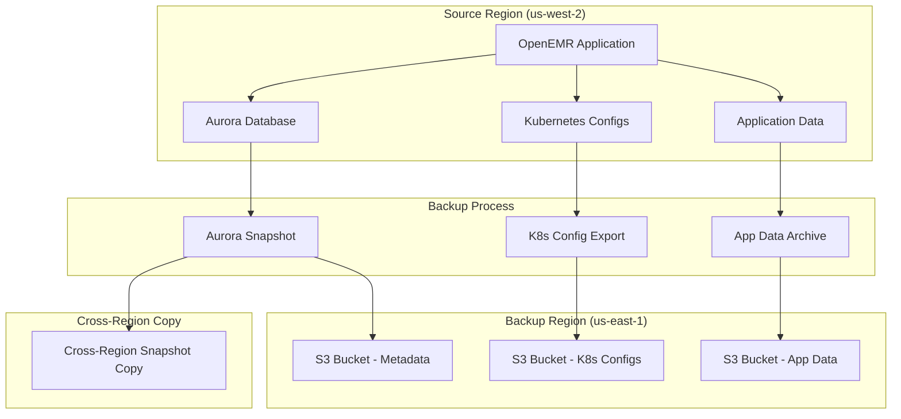
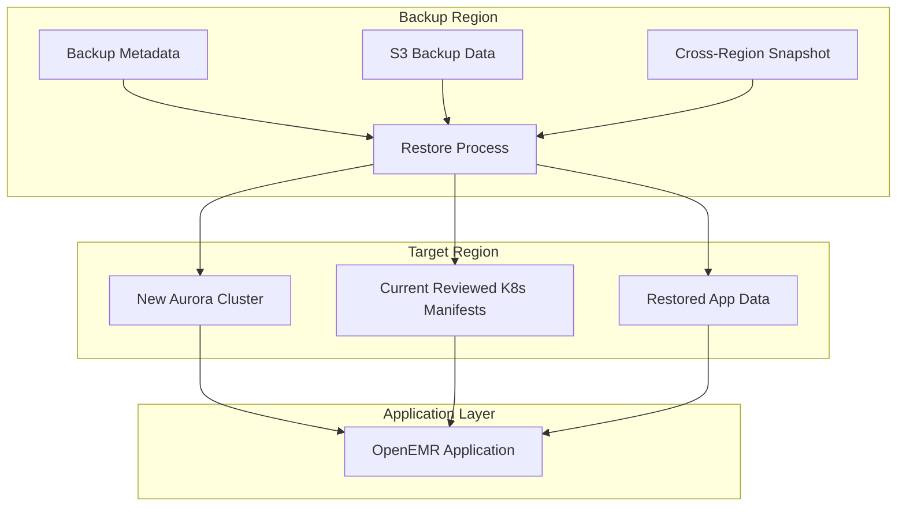

# OpenEMR on EKS Backup & Restore Guide

This guide covers the comprehensive backup and restore system for OpenEMR on EKS, designed to protect your critical healthcare data with cross-region disaster recovery capabilities.

## 📋 Table of Contents

- [Overview](#overview)
- [Backup System](#backup-system)
- [What Gets Backed Up](#what-gets-backed-up)
- [Prerequisites](#prerequisites)
- [Quick Start](#quick-start)
- [Backup Operations](#backup-operations)
- [Restore Operations](#restore-operations)
- [Testing & Validation](#testing--validation)
- [Cross-Region Disaster Recovery](#cross-region-disaster-recovery)
- [Monitoring & Maintenance](#monitoring--maintenance)
- [Troubleshooting](#troubleshooting)

## Overview

The OpenEMR backup system provides a comprehensive, multi-layered backup strategy:

- ✅ **AWS Backup Integration** - Automated, centralized backups of all infrastructure components
- ✅ **Automated RDS Aurora snapshots** with enhanced cross-region/cross-account support
- ✅ **Kubernetes configuration backup** (all resources, secrets, configs)
- ✅ **Application data backup** from EFS to S3
- ✅ **Cross-region disaster recovery** capabilities using new RDS features
- ✅ **Cross-account backup** for compliance and data sharing
- ✅ **Simple, reliable scripts** with graceful error handling
- ✅ **Multiple backup strategies** (same-region, cross-region, cross-account)
- ✅ **7-year retention** for compliance and long-term recovery needs

The restore system uses a **Python orchestrator** (`scripts/openemr_dr`) with phased execution, manifest v2 metadata, and checkpoint resume. Bash `restore.sh` delegates to Python by default.

- ✅ **Phased restore** — preflight → bootstrap → RDS → data → deploy → verify
- ✅ **Manifest v2** — restore from `--from-metadata s3://.../backup-metadata-....json`
- ✅ **Checkpoint resume** — `--from-phase data --state-file .restore-state`
- ✅ **Kubernetes Job** for application data restore (`k8s/jobs/data-restore-job.yaml`)
- ✅ **Hardened extraction** — the Job drops all Linux capabilities and uses
  `tar --no-same-owner` to preserve EFS access-point ownership
- ✅ **One-command restore** — `./scripts/restore.sh <bucket> <snapshot-id>`
- ✅ **Manifest-driven restore** — supply `--from-metadata` to load the region,
  object key, and backup strategy recorded in manifest-v2 metadata
- ✅ **Explicit access model** — the active AWS identity must already be able
  to read the backup bucket and selected snapshot; restore has no account-switch flag

See [Disaster Recovery Python Architecture](DISASTER_RECOVERY_PYTHON.md) for full CLI and migration details.

Legacy ordering is available through `--legacy-order`, which keeps Python
preflight and verification around the legacy Bash bridge. Add `--bash-only`
to bypass Python and run the Bash implementation directly.

- ✅ **Database restore** — Restore the selected snapshot in the target region
- ✅ **Application data restore** — Download and extract S3 data to EFS via Job
- ✅ **Auto-reconfiguration** — Deploy against restored database/storage outputs

### Backup Architecture


```mermaid
graph TB
    subgraph "Source Region (us-west-2)"
        A[OpenEMR Application] --> B[Aurora Database]
        A --> D[Kubernetes Configs]
        A --> E[Application Data]
    end

    subgraph "Backup Process"
        B --> F[Aurora Snapshot]
        D --> H[K8s Config Export]
        E --> I[App Data Archive]
    end

    subgraph "Backup Region (us-east-1)"
        F --> J[S3 Bucket - Metadata]
        H --> L[S3 Bucket - K8s Configs]
        I --> M[S3 Bucket - App Data]
    end

    subgraph "Cross-Region Copy"
        F --> N[Cross-Region Snapshot Copy]
    end
```

### Restore Architecture


```mermaid
graph TB
    subgraph "Backup Region"
        A[Backup Metadata] --> B[Restore Process]
        C[S3 Backup Data] --> B
        D[Cross-Region Snapshot] --> B
    end

    subgraph "Target Region"
        B --> E[New Aurora Cluster]
        B --> G[Current Reviewed K8s Manifests]
        B --> H[Restored App Data]
    end

    subgraph "Application Layer"
        E --> I[OpenEMR Application]
        G --> I
        H --> I
    end
```

## Backup System

### AWS Backup Integration

The OpenEMR deployment includes a comprehensive AWS Backup configuration that automatically backs up all critical infrastructure components. This system provides centralized backup management, encryption, and retention policies that complement the existing script-based backup process.

#### What AWS Backup Covers

AWS Backup automatically backs up the following resources on scheduled intervals:

- **All S3 Buckets**: ALB/WAF logs, Loki and Tempo storage, Mimir blocks,
  ruler and Alertmanager state, and CloudTrail logs
- **EFS File System**: Application data and configuration files
- **RDS Aurora Cluster**: Scheduled recovery points (continuous backup is disabled)
- **EKS Cluster**: Cluster configuration and metadata (using AWS Backup support for EKS)

#### Backup Plans

Three backup plans are configured to provide comprehensive coverage:

1. **Daily Backups** - Runs every day at 2:00 AM UTC
   - Retention: 7 years (2555 days)
   - Cold storage transition: After 30 days
   - Purpose: Frequent backups for recent recovery needs

2. **Weekly Backups** - Runs every Sunday at 3:00 AM UTC
   - Retention: 7 years (2555 days)
   - Cold storage transition: After 90 days
   - Purpose: Weekly snapshots for intermediate recovery needs

3. **Monthly Backups** - Runs on the 1st of each month at 4:00 AM UTC
   - Retention: 7 years (2555 days)
   - Cold storage transition: After 180 days
   - Purpose: Monthly snapshots for long-term retention

#### Encryption and Security

- **Dedicated KMS Key**: All backups are encrypted using a dedicated KMS key specifically for AWS Backup
- **Automatic Key Rotation**: KMS key rotation is enabled for enhanced security
- **Access Control**: IAM role-based access control for backup operations
- **Compliance**: 7-year retention meets most healthcare compliance requirements

#### Integration with Existing Backup Process

The AWS Backup system complements the existing script-based backup process:

- **AWS Backup**: Provides automated, scheduled backups of all infrastructure components
- **Script-Based Backups**: Provides on-demand backups, cross-region replication, and application-specific data backups
- **Dual Strategy**: Both systems work together to provide comprehensive backup coverage

#### Benefits of AWS Backup Integration

- **Centralized Management**: All backups managed in a single AWS Backup vault
- **Automated Scheduling**: No manual intervention required for scheduled backups
- **Long-Term Retention**: 7-year retention for compliance requirements
- **Cost Optimization**: Automatic transition to cold storage reduces costs
- **EKS Support**: Native support for EKS cluster backups (see: https://aws.amazon.com/about-aws/whats-new/2025/11/aws-backup-supports-amazon-eks/)
- **Recovery Point Management**: Easy recovery point selection and restoration

#### Monitoring and Management

- **AWS Backup Console**: Monitor backup jobs, recovery points, and restore operations
- **CloudWatch Integration**: Backup job status and metrics in CloudWatch
- **Recovery Point Tags**: Automatic tagging for backup organization and cost allocation
- **Backup Reports**: Comprehensive backup reports for compliance and auditing

#### Backup Storage Costs

AWS Backup storage costs vary by service and storage tier. Pricing is based on the [AWS Backup pricing page](https://aws.amazon.com/backup/pricing/):

**Standard (Warm) Storage Pricing:**
- **EFS**: $0.05 per GB-month
- **RDS/Aurora**: $0.095 per GB-month
- **S3**: $0.05 per GB-month (for objects ≥128 KB; smaller objects billed as 128 KB)
- **EKS**: One-time backup creation fee per backup (per namespace) + storage charges for cluster state data
- **EBS**: $0.05 per GB-month (for persistent storage attached to EKS cluster)

**Cold Storage Pricing:**
- **Cold Storage**: $0.01 per GB-month for EFS (Note: cold storage as of Nov 2025 is only supported for EBS, EFS, DynamoDB, Timestream, SAP HANA, and VMware)
- **Minimum Retention**: Backups transitioned to cold storage must be retained for a minimum of 90 days

**Additional Considerations:**
- **S3 Additional Charges**: GET/LIST requests on S3 objects and EventBridge events (for S3 backups)
- **Data Transfer**: No charges for data transfer within the same region
- **EKS Backup**: Additional charges apply for EKS cluster backups (varies by cluster size and namespace count)

**Estimated Monthly Storage Costs (for 500 GB of backup data):**

- Warm storage at ~$0.05/GB-month → ~$25/month (depending on service mix maybe $30-40).
- If you transition all 500 GB to cold storage at ~$0.01/GB-month → ~$5/month (after transition).
- Thus: First month (warm) ~$30-40, after transition ~$5-10/month.

## What Gets Backed Up

### 🗄️ Database (RDS Aurora)

- **Manual Aurora cluster snapshots** for discrete recovery points
- **Optional cross-region or cross-account snapshot copies**
- **Retention**: manual snapshots persist until deleted; Terraform-managed AWS
  Backup recovery points are retained for 2,555 days (seven years) by default
- **Multiple backup strategies** (same-region, cross-region, cross-account)

### ⚙️ Kubernetes Configuration

- All resources in the OpenEMR namespace
- Secrets and ConfigMaps
- Persistent Volume Claims (PVCs)
- Ingress and HPA configurations
- Service definitions

### 📦 Application Data

- OpenEMR sites directory (`/var/www/localhost/htdocs/openemr/sites/`)
- Patient data and uploaded files
- Custom configurations and templates
- Log files and audit trails

### 📋 Backup Metadata

- JSON metadata with restore instructions
- Human-readable reports with status
- Cross-region backup information
- Timestamp and versioning data

### 🔍 Logging After Restore (OpenEMR 8.2.0)

Logging is configured by the normal OpenEMR deployment phase. The restore
orchestrator has no `CONFIGURE_LOGGING` toggle.

**Log Directory Structure:**

- `/var/log/openemr/` - Application logs (error, access, system)
- `/var/log/apache2/` - Web server logs
- `/var/www/localhost/htdocs/openemr/sites/default/documents/logs_and_misc/`
  - `system_logs/` - System-level operational logs
  - `audit_logs/` - Detailed audit trails
  - `logbook/` - Legacy logbook entries

**CloudWatch Integration:**

- **Automatic log group creation** during restore
- **Real-time log streaming** via Fluent Bit sidecar
- **IRSA authentication** for secure AWS service integration
- **KMS encryption** for all log data
- **Compliance tagging** for audit requirements

**Log Types Captured:**

- **Application Logs**: OpenEMR PHP application events
- **Audit Logs**: User actions, patient record access, database operations
- **System Logs**: Component status, operational events, health checks
- **Access Logs**: Web server requests and responses
- **Error Logs**: Application errors with stack traces
- **PHP Errors**: Detailed PHP errors with file and line information
- **Fluent Bit Metrics**: Operational metrics and health monitoring

After restore, verify the Fluent Bit sidecar and configured log groups with the
[Logging Guide](LOGGING_GUIDE.md). Do not expect the restore CLI to enable or
disable logging independently.

## Prerequisites

### Required Tools

```bash
# Verify required tools are installed
aws --version       # AWS CLI v2
kubectl version     # Kubernetes CLI
terraform --version # Terraform (for infrastructure queries)
jq --version        # JSON processor
```

### AWS Permissions

Your AWS credentials need permissions for:

- RDS snapshot creation and management
- S3 bucket creation and management
- EKS cluster access
- Cross-region resource access

### Infrastructure Requirements

- EKS cluster with OpenEMR deployed
- RDS Aurora cluster (optional - gracefully handled if missing)
- EFS file system with application data
- Cross-region access configured

## Quick Start

### Create a Backup

```bash
# Basic backup to same region (default strategy)
./scripts/backup.sh

# Cross-region backup for disaster recovery
./scripts/backup.sh --strategy cross-region --backup-region us-east-1

# Cross-account backup for compliance/sharing
./scripts/backup.sh --strategy cross-account --target-account 123456789012 --backup-region us-east-1

# Custom cluster and namespace with cross-region backup
./scripts/backup.sh --cluster-name my-cluster --namespace my-namespace --strategy cross-region --backup-region us-east-1
```

### Restore from Backup

```bash
# Recommended: Python orchestrator (default via restore.sh)
./scripts/restore.sh <backup-bucket> <snapshot-id> --region <aws-region>

# From backup manifest v2 (no manual snapshot/bucket pairing)
./scripts/restore.sh --from-metadata s3://<bucket>/metadata/backup-metadata-<timestamp>.json

# Resume after a failed phase
cd scripts && python3 -m openemr_dr restore <bucket> <snapshot> --from-phase data

# Legacy order through the Python orchestrator's Bash bridge
./scripts/restore.sh <backup-bucket> <snapshot-id> --legacy-order

# Force the Bash implementation with the same legacy order
./scripts/restore.sh <backup-bucket> <snapshot-id> --legacy-order --bash-only
```

## Backup Operations

### Backup Script Usage

```bash
./scripts/backup.sh [OPTIONS]

Options:
  --cluster-name NAME     EKS cluster name (default: openemr-eks)
  --source-region REGION  Source AWS region (default: us-west-2)
  --backup-region REGION  Backup AWS region (default: same as source)
  --namespace NAMESPACE   Kubernetes namespace (default: openemr)
  --strategy STRATEGY     Backup strategy: same-region, cross-region, cross-account (default: same-region)
  --target-account ID     Target AWS account ID for cross-account backups
  --kms-key-id KEY        KMS key ID for encrypted snapshots (optional)
  --no-copy-tags          Don't copy tags to backup snapshots
  --help                  Show help message
```

### Backup Process Flow

1. **Prerequisites Check**
   - Verify AWS credentials and region access
   - Check required tools availability

2. **S3 Bucket Creation**
   - Create encrypted backup bucket in target region
   - Enable versioning and lifecycle policies
   - Configure cross-region replication if needed

3. **RDS Aurora Backup**
   - Detect Aurora cluster automatically
   - Create cluster snapshot with timestamp
   - Handle cluster status gracefully (backing-up, unavailable, etc.)
   - Use enhanced cross-region/cross-account snapshot copying
   - Apply selected backup strategy (same-region, cross-region, cross-account)

4. **Kubernetes Configuration Backup**
   - Export all resources from OpenEMR namespace
   - Create compressed archive
   - Upload to S3 backup bucket

5. **Application Data Backup**
   - Access running OpenEMR pods
   - Create tar archive of sites directory
   - Upload to S3 backup bucket

6. **Metadata Generation**
   - Create JSON metadata with restore instructions
   - Generate human-readable report
   - Capture database configuration for automatic restore
   - Store VPC, security group, and scaling settings
   - Track backup strategy and target account information
   - Upload both to S3 backup bucket

### Backup Outputs

After successful backup, you'll receive:

```
✅ Backup ID: openemr-backup-20250815-120000
✅ Backup Bucket: s3://openemr-backups-123456789012-openemr-eks-20250815
✅ Backup Region: us-east-1
✅ Backup Strategy: cross-region
✅ Aurora Snapshot: openemr-eks-aurora-backup-20250815-120000-us-east-1

📋 Backup Results:
Aurora RDS: SUCCESS (openemr-eks-aurora-backup-20250815-120000-us-east-1 (cross-region copy completed))
Kubernetes Config: SUCCESS (k8s-backup-20250815-120000.tar.gz)
Application Data: SUCCESS (app-data-backup-20250815-120000.tar.gz)

🚀 Enhanced Features Used:
✅ Cross-Region Snapshot Copy (New RDS Feature)

🔄 Restore Command:
   ./restore.sh \
     openemr-backups-123456789012-openemr-eks-20250815 \
     openemr-eks-aurora-backup-20250815-120000-us-east-1 \
     --region us-east-1
```

## Restore Operations

### Restore Script Usage

```bash
./scripts/restore.sh <backup-bucket> <snapshot-id> [options]

Arguments:
  backup-bucket    S3 bucket containing the backup
  snapshot-id      RDS cluster snapshot identifier

Options:
  --cluster-name NAME     EKS cluster name (auto-detected when omitted)
  --namespace NAME        Kubernetes namespace (default: openemr)
  --region REGION         AWS region (default: us-west-2)
  --kms-key ARN           Custom KMS key for RDS restore
  --from-metadata URI     Load a manifest-v2 restore plan from S3
  --from-phase PHASE      Resume at preflight|bootstrap|rds|data|deploy|verify
  --phase PHASE           Run one named phase (or legacy)
  --state-file PATH       Checkpoint path (default: .restore-state)
  --use-aws-backup        Restore RDS through an AWS Backup recovery point
  --legacy-order          Request the legacy phase order
  --dry-run               Preview native phases; never combine with
                          --legacy-order or --phase legacy
  --list-phases           List phases and exit
  --bash-only             Bypass Python and run the Bash implementation
  -h, --help              Show help
```

The positional backup-region argument and the former `--strategy`, `--force`,
`--source-account`, `--recreate-storage`, `--manual-instructions`, and
selective `RESTORE_*` environment toggles are not supported by the current
Python CLI. Use `--region`, `--from-metadata`, or named phases instead.
The human-readable report currently emitted by `scripts/backup.sh` also shows
the former positional-region form; replace it with `--region REGION` before
running the reported restore command.
The wrapper's `--latest-snapshot`, short `-c`/`-n`/`-r` aliases, and
`--cluster` spelling apply only to `--bash-only`; provide an explicit snapshot
and the long Python option names for the default orchestrator.
Python orchestration is already the default. Do not pass the historical
`--orchestrator` switch advertised by the wrapper's Bash help; the current
Python CLI does not accept it.

### Current Restore Model

- **Simple entry point**: bucket and snapshot ID are the only required arguments
- **Manifest v2**: metadata can supply the region, object key, and strategy
- **Checkpoint resume**: completed phases are recorded in `.restore-state`
- **Dependency-safe ordering**: EFS and IRSA exist before application-data restore
- **No running OpenEMR pod required**: a dedicated Job writes restored data to EFS
- **Failing phases stop the restore**: fix the cause, then resume explicitly

### Restore Process Flow

| Phase | Behavior |
|-------|----------|
| `preflight` | Confirm `terraform.tfstate` exists, the S3 `application-data/` prefix is accessible, the snapshot is available, and AWS caller identity resolves |
| `bootstrap` | Create the namespace, EFS PVC, and IRSA prerequisites with `k8s/restore-bootstrap.sh` |
| `rds` | Restore Aurora from the selected snapshot or AWS Backup recovery point |
| `data` | Render the data-restore Job, download the S3 archive, extract to EFS, and update `sqlconf.php` |
| `deploy` | Restore manifest templates, ensure EFS CSI readiness, deploy OpenEMR, prepare one replica, and clean cached crypto keys |
| `verify` | Poll pod and HTTP readiness (six attempts by default), re-clean crypto keys between failed attempts, render pristine `hpa.yaml` from Terraform outputs, and reapply autoscaling |

The data Job runs as UID 0 for its short-lived EFS/package work, but disables
privilege escalation, uses `RuntimeDefault` seccomp, and drops all Linux
capabilities. `tar --no-same-owner` avoids requiring `CAP_CHOWN`.

Resume after a corrected failure:

```bash
./scripts/restore.sh BUCKET SNAPSHOT \
  --from-phase data --state-file .restore-state
```

After restoring a deployment that uses dual-slot credential rotation, run
`./scripts/run-credential-rotation.sh --sync-db-users` and consult the
[Credential Rotation Guide](CREDENTIAL_ROTATION_GUIDE.md).

### Advanced Features

#### **Redis/Valkey Configuration During Deploy**

Restore has no independent Valkey reconfiguration phase. During the normal
`deploy` phase, `k8s/deploy.sh` reads the current Terraform Valkey outputs,
validates the endpoint, and creates or updates the
`openemr-redis-credentials` Secret before deploying OpenEMR.

#### **Error Handling & Validation**

The restore script includes comprehensive error handling:

- **Pre-flight Checks**: Validates Terraform state presence, S3 application
  data access, snapshot availability, and AWS caller identity
- **Phase Failure**: Stops on an unsuccessful phase rather than reporting a
  partial restore as complete
- **Checkpoint Resume**: Continues from a named phase after the underlying
  problem is corrected
- **Detailed Logging**: Color-coded output with timestamps for easy troubleshooting

## Enhanced Backup Strategies

The backup system now supports multiple strategies leveraging new Amazon RDS capabilities:

### 📍 Same-Region Backup (Default)

**Best for**: Development, testing, and cost optimization

```bash
# Same-region backup (fastest, lowest cost)
./scripts/backup.sh --strategy same-region
```

**Benefits**:
- Fastest backup completion
- Lowest storage costs
- No data transfer charges
- Ideal for regular development backups

### 🌍 Cross-Region Backup

**Best for**: Disaster recovery and compliance requirements

```bash
# Cross-region backup for disaster recovery
./scripts/backup.sh --strategy cross-region --backup-region us-east-1
```

**Benefits**:
- Uses new RDS single-step cross-region copy
- Eliminates intermediate snapshots (cost reduction)
- Faster completion times (improved RPO)
- Geographic separation for disaster recovery

### 🏢 Cross-Account Backup

**Best for**: Compliance, data sharing, and multi-tenant scenarios

```bash
# Cross-account backup for compliance/sharing
./scripts/backup.sh --strategy cross-account --target-account 123456789012 --backup-region us-east-1
```

**Benefits**:
- Direct cross-account snapshot sharing
- Compliance with data residency requirements
- Secure data sharing between organizations
- Simplified KMS key management

### Enhanced Features

All strategies now benefit from:

- **Single-Step Operations**: New RDS capabilities eliminate multi-step processes
- **Cost Reduction**: No intermediate snapshots required
- **Improved RPO**: Faster backup completion times
- **Simplified KMS Handling**: Automatic KMS key detection and management
- **Tag Preservation**: Optional tag copying to backup snapshots
- **Comprehensive Metadata**: Full backup strategy tracking

### Restore Examples

```bash
# Basic restore
./scripts/restore.sh my-backup-bucket my-snapshot-id

# Restore in the region containing the copied snapshot and backup objects
./scripts/restore.sh my-backup-bucket my-snapshot-id --region us-east-1

# Restore from manifest-v2 metadata
./scripts/restore.sh \
  --from-metadata s3://my-backup-bucket/metadata/backup-metadata.json

# Resume after correcting a failed phase
./scripts/restore.sh my-backup-bucket my-snapshot-id \
  --from-phase data --state-file .restore-state

# Use AWS Backup instead of a direct RDS snapshot restore
./scripts/restore.sh my-backup-bucket my-snapshot-id --use-aws-backup
```

### CLI Compatibility

`./scripts/restore.sh <bucket> <snapshot>` remains supported. Existing
automation that passes a third positional region or uses `--force`,
`--strategy`, `--manual-instructions`, `--recreate-storage`, or selective
`RESTORE_*` variables must be updated. Use `--region`, `--from-metadata`,
checkpoint phases, or `--legacy-order`; add `--bash-only` only when Python must
be bypassed.

## Testing & Validation

### End-to-End Backup/Restore Testing

For comprehensive testing of the entire backup and restore process, use the automated end-to-end test script:

```bash
# Run complete E2E test with persistent logging
AWS_PROFILE_NAME=<your-profile> ./scripts/run-e2e-full-test.sh

# Custom test configuration
AWS_PROFILE_NAME=<your-profile> ./scripts/run-e2e-full-test.sh \
  --cluster-name openemr-eks-test \
  --aws-region us-west-2 \
  --namespace openemr
```

**What the End-to-End Test Does:**

1. **Deploy Infrastructure** - Creates complete EKS cluster from scratch
2. **Deploy OpenEMR** - Installs and configures OpenEMR application
3. **Deploy Test Data** - Creates timestamped proof.txt file for verification
4. **Create Backup** - Runs full backup of the installation
5. **Test Monitoring** - Installs, validates, and uninstalls the monitoring stack
6. **Destroy Infrastructure** - Completely removes all AWS resources
7. **Recreate Infrastructure** - Rebuilds Terraform without an empty RDS cluster
8. **Restore from Backup** - Restores RDS, EFS data, and OpenEMR
9. **Verify Restoration** - Confirms proof.txt exists and database connectivity works
10. **Final Cleanup** - Removes all resources and test backups

**Test Features:**

- **Automated Infrastructure Management** - Uses Terraform with auto-approve
- **Comprehensive Verification** - Tests data integrity and connectivity
- **Resource Cleanup** - Ensures no orphaned resources remain
- **Detailed Reporting** - Provides step-by-step results and timing
- **Resource Usage** - Notes that AWS resources will be created and destroyed

**Use Cases:**

- **Pre-production Validation** - Verify backup/restore works before going live
- **Disaster Recovery Testing** - Test complete recovery procedures
- **Infrastructure Validation** - Ensure Terraform configurations work correctly
- **Compliance Testing** - Demonstrate backup/restore capabilities for audits

**⚠️ Important Notes:**

- Run only in a non-production AWS account; the test creates and destroys real
  resources
- Requires proper AWS credentials and permissions
- OpenEMR 8.2.0 full-run timing: 169 minutes 9 seconds (August 1, 2026)
- Historical full-run baselines: ~150–160 minutes for 8.1.x and ~211–217
  minutes for the December 2025 8.0.x runs
- The wrapper appends output to the gitignored `e2e-full-test.log`

## Cross-Region Disaster Recovery

### Setup Cross-Region Backups

```bash
# Regular cross-region backups for disaster recovery
./scripts/backup.sh --strategy cross-region --backup-region us-east-1

# Cross-account backups for compliance
./scripts/backup.sh --strategy cross-account --target-account 123456789012 --backup-region us-east-1

# Automated via cron (example)
0 2 * * * /path/to/scripts/backup.sh --strategy cross-region --backup-region us-east-1
```

### Disaster Recovery Procedure

1. **Assess the Situation**
   - Determine scope of primary region failure
   - Identify most recent viable backup

2. **Prepare Target Region**
   - Ensure target region infrastructure is ready
   - Verify network connectivity and DNS

3. **Execute Restore**

   ```bash
   # Restore in the disaster-recovery region
   ./scripts/restore.sh \
     openemr-backups-123456789012-openemr-eks-20250815 \
     openemr-eks-aurora-backup-20250815-120000-us-east-1 \
     --region us-east-1

   # If metadata contains the complete cross-account/cross-region restore plan,
   # provide it explicitly. The active AWS identity still needs access.
   ./scripts/restore.sh \
     --from-metadata s3://openemr-backups-123456789012-openemr-eks-20250815/metadata/backup-metadata.json
   ```

4. **Verify and Activate**
   - Test application functionality
   - Update DNS records to point to new region
   - Notify users of the recovery

5. **Monitor and Maintain**
   - Continue backups from new primary region
   - Plan for eventual failback if needed

## Monitoring & Maintenance

### Backup Monitoring

Monitor backup success through:

- **AWS Backup Console** - Monitor backup jobs, recovery points, and restore operations
- **CloudWatch Metrics** - Backup job status and metrics in CloudWatch
- **Backup Reports** - Comprehensive backup reports for compliance and auditing
- **S3 bucket contents** - Verify regular backup uploads (script-based backups)
- **RDS snapshots** - Check snapshot creation and retention
- **CloudWatch logs** - Monitor backup script execution
- **Test reports** - Regular restore testing results

#### AWS Backup Monitoring

- **Backup Jobs**: Monitor backup job status and completion in AWS Backup console
- **Recovery Points**: Track recovery points and retention periods
- **Backup Vault**: Monitor storage usage and costs in backup vault
- **Backup Plans**: Verify backup plans are running on schedule
- **Backup Selections**: Confirm all resources are being backed up
- **CloudWatch Alarms**: Set up alarms for backup job failures
- **Backup Reports**: Generate backup reports for compliance and auditing

### Maintenance Tasks

#### Weekly

- Review AWS Backup job status and recovery points
- Review backup reports for any failures
- Verify S3 bucket lifecycle policies
- Check RDS snapshot retention
- Monitor backup vault storage usage

#### Monthly

- Run full backup/restore test cycle
- Review and update disaster recovery procedures
- Audit cross-region backup costs
- Review AWS Backup storage costs and optimize
- Verify backup plans are running as expected
- Test restore operations from AWS Backup vault

#### Quarterly

- Test cross-region disaster recovery procedures
- Review and update backup retention policies
- Validate backup/restore documentation

### Cost Optimization

- **AWS Backup Cold Storage** - Automatic transition to cold storage after 30-180 days
- **Backup Retention Policies** - Review and optimize retention periods
- **Backup Frequency** - Adjust backup frequency based on recovery point objectives
- **S3 Lifecycle Policies** - Automatic transition to cheaper storage classes
- **RDS Snapshot Cleanup** - Automated deletion of old snapshots
- **Cross-Region Optimization** - Balance cost vs. recovery requirements

## Troubleshooting

### Common Issues

#### Database Access Denied After Restore

**Issue**: After restoring from backup, OpenEMR pods show `Access denied` errors because the restored database has different credentials than the current Secrets Manager state.

```bash
# Re-sync dual-slot credentials after restore
./scripts/run-credential-rotation.sh --sync-db-users

# Or verify rotation prerequisites first
./scripts/verify-credential-rotation.sh
```

#### Backup Script Fails

**Issue**: AWS credentials not configured

```bash
# Solution: Configure AWS credentials
aws configure
# or
export AWS_PROFILE=your-profile
```

**Issue**: Kubernetes cluster not accessible

```bash
# Solution: Update kubeconfig
aws eks update-kubeconfig --region us-west-2 --name openemr-eks
```

**Issue**: RDS cluster in backing-up state

```
# This is normal - the script will skip and continue
# The cluster will be available for backup on the next run
```

#### Restore Script Fails

**Issue**: Backup bucket not found

```bash
# Solution: Verify bucket name and region
aws s3 ls s3://your-backup-bucket --region us-east-1
```

**Issue**: Cross-region snapshot not available

```bash
# Solution: Copy snapshot to target region first
aws rds copy-db-cluster-snapshot \
  --source-db-cluster-snapshot-identifier arn:aws:rds:source-region:account:cluster-snapshot:snapshot-id \
  --target-db-cluster-snapshot-identifier new-snapshot-id \
  --source-region source-region \
  --region target-region
```

**Issue**: EKS cluster not found or not accessible

```bash
# Solution: Verify cluster exists and update kubeconfig
aws eks describe-cluster --name openemr-eks --region us-west-2
aws eks update-kubeconfig --region us-west-2 --name openemr-eks
```

**Issue**: Data restore Job failed

```bash
kubectl get job openemr-data-restore -n openemr
kubectl logs job/openemr-data-restore -n openemr
kubectl describe job/openemr-data-restore -n openemr
```

Common causes are an incorrect application-data S3 key, missing IRSA/S3
permission, an unbound EFS PVC, or archive extraction errors. The default
inverted flow intentionally restores data before an OpenEMR pod exists. A
"no OpenEMR pod" error applies only to legacy ordering (`--legacy-order`).

**Issue**: Database reconfiguration fails

```bash
# Solution: Check database credentials secret
kubectl get secret openemr-db-credentials -n openemr -o yaml
# Verify database endpoint is accessible
kubectl exec -n openemr <pod-name> -c openemr -- nslookup <db-endpoint>
```

**Issue**: Deployment-time Redis/Valkey configuration fails

```bash
# k8s/deploy.sh reads these values during the deploy phase
cd terraform && terraform output redis_endpoint
# Verify the Secret generated by the normal deployment
kubectl get secret openemr-redis-credentials -n openemr -o yaml
```

#### Test Script Issues

**Issue**: Application not ready

```bash
# Solution: Check pod status and logs
kubectl get pods -n openemr
kubectl logs -f deployment/openemr -n openemr
```

### Getting Help

1. **Check script logs** - All scripts provide detailed logging
2. **Review S3 backup reports** - Human-readable status reports
3. **Verify AWS resources** - Check RDS, S3, and EKS in AWS console
4. **Test in isolation** - Run individual backup/restore operations
5. **Check documentation** - Review this guide and troubleshooting section

### Support Information

For additional support:

- Review the comprehensive test reports
- Check AWS CloudWatch logs for detailed execution traces
- Verify backup metadata JSON files for restore instructions
- Test restore procedures in a non-production environment first

---

## 🚀 New Amazon RDS Capabilities

The backup and restore system now leverages Amazon RDS's new cross-Region and cross-account snapshot copy functionality:

### Key Benefits

- **Single-Step Operations**: Direct cross-Region and cross-account copying without intermediate steps
- **Cost Reduction**: Eliminates intermediate snapshots, reducing storage costs
- **Improved RPO**: Faster backup completion times with better recovery point objectives
- **Simplified Workflows**: No need for complex multi-step processes or custom monitoring
- **Enhanced Security**: Direct AWS-managed transfers with proper encryption handling

### Technical Improvements

- **Direct Cross-Region Copy**: Single command for cross-region snapshot copying
- **Cross-Account Support**: Direct snapshot sharing between AWS accounts
- **Automatic KMS Handling**: Simplified encryption key management
- **Tag Preservation**: Optional copying of resource tags to backup snapshots
- **Comprehensive Metadata**: Full tracking of backup strategies and configurations

### Use Cases

- **Disaster Recovery**: Faster cross-region backup and restore operations
- **Compliance**: Cross-account backup for regulatory requirements
- **Data Sharing**: Secure snapshot sharing between organizations
- **Multi-Region Deployments**: Simplified backup management across regions

## 🔒 Security Considerations

- All backups are encrypted at rest using S3 server-side encryption
- RDS snapshots inherit cluster encryption settings
- Cross-region transfers use AWS secure channels with new RDS capabilities
- Cross-account transfers use AWS IAM and resource-based policies
- Backup metadata includes audit trail information
- Access to backup buckets should be restricted via IAM policies
- KMS key management is simplified with automatic detection

## 📊 Performance Considerations

### Measured Backup Timings (from E2E tests)
- **RDS Snapshot Creation:** ~20 seconds (very fast, AWS-managed)
- **S3 Data Backup:** ~5 seconds (application data)
- **K8s Config Backup:** ~4 seconds (manifests and configs)
- **OpenEMR 8.2.0 full-run backup phase:** 40 seconds
- **Historical total backup time:** ~30-35 seconds

### Measured Restore Timings

- **OpenEMR 8.2.0 full-run restore phase:** 33 minutes 33 seconds
- **December 2025 full restore:** ~53–55 minutes
- **Application data extraction:** under one minute in that historical run
- **Largest contributors:** Aurora deletion/restoration and OpenEMR deployment

### General Performance Notes
- **Backup:** 40 seconds in the 8.2.0 full run and incremental after the first
  snapshot
- **Restore:** 33 minutes 33 seconds in the 8.2.0 full run; historical December
  2025 runs were ~53–55 minutes
- RDS cluster operations and OpenEMR deployment are the longest components
- **Enhanced cross-region transfers** are faster with new RDS capabilities
- **Automatic crypto key cleanup** prevents encryption key mismatches
- **Verification with retry** defaults to six attempts with a five-minute poll
  window per attempt
- Application data restore is the fastest component (<1 minute)
- **Cross-account transfers** use optimized AWS infrastructure

---

*This guide covers the comprehensive backup and restore system for OpenEMR on EKS. For additional questions or support, refer to the troubleshooting section or review the detailed test reports generated by the test script.*
