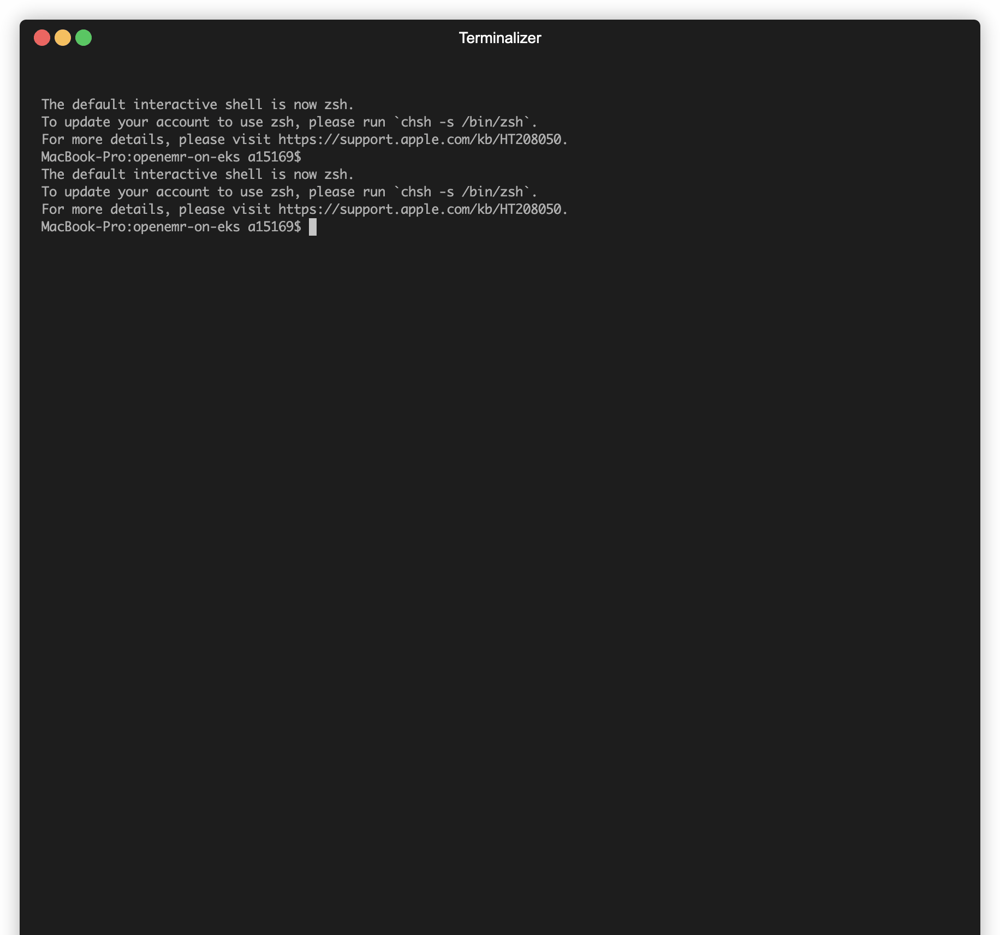

# OpenEMR on EKS Console Guide

> **Platform Support**: The console supports **macOS** and **Windows**. Commands execute in separate Terminal windows (macOS) or PowerShell windows (Windows) to preserve script colors, formatting, and interactivity.



## Table of Contents

- [Overview](#overview)
- [Features](#features)
- [Installation](#installation)
  - [Prerequisites](#prerequisites)
  - [Quick Start](#quick-start)
  - [Manual Installation](#manual-installation)
- [Usage](#usage)
  - [Launching the Console](#launching-the-console)
  - [Navigation](#navigation)
  - [Available Commands](#available-commands)
    - [1. Validate Prerequisites](#1-validate-prerequisites)
    - [2. Quick Deploy](#2-quick-deploy)
    - [3. Check Deployment Health](#3-check-deployment-health)
    - [4. Backup Deployment](#4-backup-deployment)
    - [5. Clean Deployment](#5-clean-deployment)
    - [6. Destroy Infrastructure](#6-destroy-infrastructure)
    - [7. Check Component Versions](#7-check-component-versions)
    - [8. Check OpenEMR Versions](#8-check-openemr-versions)
    - [9. Search Codebase](#9-search-codebase)
    - [10. Deploy Training Setup](#10-deploy-training-setup)
  - [Command Execution](#command-execution)
- [Troubleshooting](#troubleshooting)
  - [Console Won't Start](#console-wont-start)
  - [Scripts Not Found](#scripts-not-found)
  - [Permission Denied](#permission-denied)
  - [Build Errors](#build-errors)
  - [Command Execution Fails](#command-execution-fails)
- [Advanced Usage](#advanced-usage)
  - [Custom Script Paths](#custom-script-paths)
  - [Adding New Commands](#adding-new-commands)
  - [Running Commands Directly](#running-commands-directly)
- [Best Practices](#best-practices)
- [Keyboard Shortcuts Reference](#keyboard-shortcuts-reference)
- [Support](#support)
- [Technical Details](#technical-details)
  - [Architecture](#architecture)
  - [Project Structure](#project-structure)
  - [Script Execution](#script-execution)
- [License](#license)

## Overview

The OpenEMR on EKS Console is a Terminal User Interface (TUI) built with the [Bubbletea](https://github.com/charmbracelet/bubbletea) Go framework and [Lipgloss](https://pkg.go.dev/github.com/charmbracelet/lipgloss) for styling that provides an intuitive, menu-driven interface for managing your OpenEMR on EKS deployment. Instead of remembering complex command-line arguments, you can navigate through a simple menu and execute common operations with ease.

**Platform Support**: macOS and Windows. Commands execute in separate Terminal windows (macOS) or PowerShell windows (Windows) to preserve script colors, formatting, and interactivity.

## Features

- **Simple Navigation**: Use arrow keys to navigate through available commands
- **Clear Descriptions**: Each command includes a brief description of what it does
- **Integrated Execution**: Commands run directly from the console interface
- **Error Handling**: Clear error messages when commands fail
- **No Configuration Required**: Automatically detects project structure and script locations

## Installation

### Prerequisites

- **macOS** or **Windows** operating system
- Go 1.25 or later installed on your system
- Access to the OpenEMR on EKS project directory
- **Windows only**: Git Bash or WSL installed (required to run .sh scripts)

### Quick Start

The console can be launched directly using the provided launcher script:

**macOS:**
```bash
./start_console
```

**Windows:**
```powershell
.\start_console.ps1
```

The launcher script will:
1. Check for Go installation
2. Navigate to the console directory
3. Download dependencies (if needed)
4. Build a static binary called `openemr-eks-console.exe` in the `console/` directory
5. Launch the TUI

**Windows Binary**: After the first run, a static binary `openemr-eks-console.exe` is created in the `console/` directory. This binary can be launched anytime by double-clicking it, and it will open the console interface for deploying, managing, and monitoring your OpenEMR on EKS infrastructure. The binary is self-contained and includes the embedded project root path, so it will automatically find your project scripts and configuration.

### Manual Installation

If you prefer to build and install manually:

```bash
cd console
go mod download
go build -o openemr-eks-console main.go
./openemr-eks-console
```

Or use the provided Makefile (macOS only):

**Note**: The Makefile is designed for macOS systems only. For Windows, use `start_console.ps1` instead.

```bash
cd console
make build    # Build the console
make install  # Install to /usr/local/bin (requires sudo)
make run      # Build and run
```

**Windows Users**: Running `start_console.ps1` creates a static binary `openemr-eks-console.exe` in the `console/` directory. This binary can be launched anytime by double-clicking it, and it will open the console interface for deploying, managing, and monitoring your OpenEMR on EKS infrastructure. The binary is self-contained and includes the embedded project root path.

## Usage

### Launching the Console

Simply run:

```bash
./start_console
```

### Navigation

- **↑/↓ Arrow Keys**: Navigate up and down through the command list
- **Enter**: Execute the selected command
- **Esc** or **Ctrl+C**: Quit the console

### Available Commands

The console provides access to 10 essential operations:

#### 1. Validate Prerequisites
**Script**: [`../scripts/validate-deployment.sh`](../scripts/validate-deployment.sh)

**Description**: Check required tools, AWS credentials, and deployment readiness

**What it does**:
- Verifies required command-line tools are installed (kubectl, aws, helm, jq)
- Validates AWS credentials and authentication
- Checks Terraform state and infrastructure status
- Verifies EKS cluster accessibility
- Validates AWS resources (VPC, RDS, ElastiCache, EFS)
- Checks Kubernetes namespace and deployment status
- Reviews security configuration

**When to use**: Before any deployment, when troubleshooting, or for routine health checks

#### 2. Quick Deploy
**Script**: [`../scripts/quick-deploy.sh`](../scripts/quick-deploy.sh)

**Description**: Deploy infrastructure, OpenEMR, and monitoring stack in one command

**What it does**:
- Deploys Terraform infrastructure (VPC, EKS, RDS, ElastiCache, EFS, S3, etc.)
- Deploys OpenEMR application to Kubernetes
- Installs comprehensive monitoring stack (Prometheus, Grafana, Loki, Tempo, Mimir, OTeBPF, AlertManager)
- Prints login addresses and credentials

**When to use**: For fresh deployments or when you want to deploy everything in one go

**Note**: This is a long-running operation (40-45 minutes total)

#### 3. Check Deployment Health
**Script**: [`../scripts/validate-deployment.sh`](../scripts/validate-deployment.sh)

**Description**: Validate current deployment status and infrastructure health

**What it does**:
- Performs the same comprehensive checks as "Validate Prerequisites"
- Provides detailed feedback about deployment readiness
- Identifies any issues that need attention
- Shows current infrastructure state

**When to use**: After deployment, during troubleshooting, or for routine health monitoring

#### 4. Backup Deployment
**Script**: [`../scripts/backup.sh`](../scripts/backup.sh)

**Description**: Create comprehensive backup of RDS, Kubernetes configs, and application data

**What it does**:
- Creates RDS Aurora cluster snapshot
- Exports Kubernetes namespace resources (deployments, services, secrets, configmaps, PVCs)
- Backs up application data from EFS volumes
- Uploads everything to S3 with encryption and versioning
- Generates metadata and restore instructions

**When to use**: Before major changes, for disaster recovery planning, or as part of regular backup schedule

**Note**: Requires AWS credentials with appropriate permissions

#### 5. Clean Deployment
**Script**: [`../scripts/clean-deployment.sh`](../scripts/clean-deployment.sh)

**Description**: Remove application layer while preserving infrastructure

**What it does**:
- Removes OpenEMR Kubernetes namespace and all resources
- Cleans up PVCs and PVs
- Restarts EFS CSI controller
- Removes backup files
- Preserves EKS cluster, RDS database, and all infrastructure

**When to use**: Before fresh deployments, when deployment is corrupted, or for testing scenarios

**Safety**: Only removes application layer - infrastructure remains intact

#### 6. Destroy Infrastructure
**Script**: [`../scripts/destroy.sh`](../scripts/destroy.sh)

**Description**: Completely destroy all infrastructure resources (use with caution)

**What it does**:
- Destroys all Terraform-managed infrastructure
- Removes EKS cluster, RDS, ElastiCache, EFS, S3 buckets, VPC, etc.
- Cleans up all associated resources
- **This action is irreversible**

**When to use**: When you want to completely remove the deployment and all associated costs

**Warning**: This will permanently delete all data and infrastructure. Use with extreme caution.

#### 7. Check Component Versions
**Script**: [`../scripts/version-manager.sh`](../scripts/version-manager.sh)

**Description**: Check for available updates across all project components

**What it does**:
- Checks versions of all project dependencies
- Compares current versions with latest available
- Identifies components with available updates
- Generates detailed update reports
- Shows where versions are referenced in the codebase

**When to use**: Before upgrades, for version planning, or to stay aware of available updates

**Note**: Some checks require AWS CLI credentials for EKS add-on version checking

#### 8. Check OpenEMR Versions
**Script**: [`../scripts/check-openemr-versions.sh`](../scripts/check-openemr-versions.sh)

**Description**: Discover available OpenEMR Docker image versions from Docker Hub

**What it does**:
- Queries Docker Hub for available OpenEMR versions
- Shows latest version, version count, or searches for specific patterns
- Displays current deployment version
- Provides versioning pattern awareness

**When to use**: Before version upgrades, checking for new releases, or version planning

#### 9. Search Codebase
**Script**: [`../scripts/search-codebase.sh`](../scripts/search-codebase.sh)

**Description**: Search for terms across the entire codebase (interactive)

**What it does**:
- Searches all files in the project for the specified term
- Excludes build artifacts, temporary files, and logs
- Displays results with file paths, line numbers, and context
- Case-insensitive search by default
- Color-coded output for easy reading

**When to use**: Finding where specific terms, functions, or configurations are used in the codebase

**Note**: Interactive - prompts for search term if not provided as argument

#### 10. Deploy Training Setup
**Script**: [`../scripts/deploy-training-openemr-setup.sh`](../scripts/deploy-training-openemr-setup.sh)

**Description**: Deploy OpenEMR with synthetic patient data for training/testing

**What it does**:
- Deploys OpenEMR with pre-configured synthetic patient data
- Uses default dataset with configurable number of records
- Provides a ready-to-use training environment
- Automatically sets up all necessary components

**When to use**: For training, testing, or demonstration purposes when you need sample patient data

## Command Execution

When you select a command and press Enter:

1. The console will display "Executing: [Command Name]"
2. The selected script will run in the background
3. Output will be displayed in real-time
4. Any errors will be shown in red
5. Press Enter, Esc, or Ctrl+C to return to the menu

## Troubleshooting

### Console Won't Start

**Issue**: `Error: Go is not installed` or `Error: Go version X is installed, but version 1.25 or later is required`

**Solution**: Install or upgrade Go to version 1.25 or later:
- Download from: https://golang.org/dl/
- macOS: `brew install go` (may need `brew upgrade go` for latest version)
- Windows: Download installer from https://golang.org/dl/ and run the installer

**Note**: The console requires Go 1.25 or later. Check your version with `go version`.

### Scripts Not Found

**Issue**: `Script not found: [path]`

**Solution**: Ensure you're running the console from the project root directory. The console automatically detects the project structure, but if you're in a different location, navigate to the project root first.

### Permission Denied

**Issue**: Scripts fail with permission errors

**Solution**: The console automatically makes scripts executable, but if issues persist:
```bash
chmod +x scripts/*.sh
```

### Build Errors

**Issue**: Go build fails

**Solution**: 
1. Ensure Go 1.25 or later is installed: `go version`
2. Clean and rebuild: `cd console && go clean && go mod tidy && go build`
3. Check for network issues when downloading dependencies
4. Verify Go version meets minimum requirement: `go version | grep -q "go1.2[5-9]\|go[2-9]"` (should return 0)

### Command Execution Fails

**Issue**: Commands execute but fail with errors

**Solution**: 
- Check the error message displayed in the console
- Verify prerequisites are met (AWS credentials, tools installed, etc.)
- Review the script documentation in `scripts/README.md`
- Some commands may require additional parameters or environment variables

## Advanced Usage

### Custom Script Paths

The console automatically detects the project structure. If you need to use custom paths, you can modify the `initialModel()` function in `console/main.go` to point to different script locations.

### Adding New Commands

To add new commands to the console:

1. Edit `console/main.go`
2. Add a new `command` entry to the `commands` slice in `initialModel()`
3. Rebuild the console: `cd console && go build -o console main.go`

Example:
```go
{
    title:       "Your New Command",
    description: "What your command does",
    script:      filepath.Join(scriptsPath, "your-script.sh"),
    args:        []string{"arg1", "arg2"},
},
```

### Running Commands Directly

If you prefer to run commands directly without the console, all scripts are available in the `scripts/` directory and can be executed manually:

```bash
./scripts/validate-deployment.sh
./scripts/quick-deploy.sh
# etc.
```

## Best Practices

1. **Always Validate First**: Run "Validate Prerequisites" before any deployment operations
2. **Backup Before Changes**: Use "Backup Deployment" before making significant changes
3. **Check Versions Regularly**: Use "Check Component Versions" to stay aware of available updates
4. **Monitor Health**: Use "Check Deployment Health" for routine monitoring

## Keyboard Shortcuts Reference

| Key | Action |
|-----|--------|
| ↑ | Move selection up |
| ↓ | Move selection down |
| Enter | Execute selected command |
| Esc | Quit console |
| Ctrl+C | Quit console |

## Support

For issues or questions:

1. Check the script documentation in `scripts/README.md`
2. Review the main project README
3. Check troubleshooting guides in `docs/TROUBLESHOOTING.md`
4. Review individual script help: `./scripts/[script-name].sh --help`

## Technical Details

### Architecture

- **Framework**: [Bubbletea](https://github.com/charmbracelet/bubbletea) (Go TUI framework)
- **Language**: Go 1.25+
- **Dependencies**: 
  - [`github.com/charmbracelet/bubbletea v1.3.10`](https://github.com/charmbracelet/bubbletea) - TUI framework
  - [`github.com/charmbracelet/lipgloss v1.1.0`](https://github.com/charmbracelet/lipgloss) - Styling

**Version Management**: All Go dependencies are tracked in `versions.yaml` under the `go_packages` section for automated version checking and update notifications.

### Project Structure

```
.
├── console/
│   ├── main.go          # Main console application
│   ├── go.mod           # Go module definition
│   └── Makefile         # Build automation
├── scripts/             # Scripts executed by console
└── start_console        # Launcher script
```

### Script Execution

The console executes scripts by:
1. Locating the script file in the `scripts/` directory
2. Making it executable (if needed)
3. Opening it in a new terminal window:
   - **macOS**: Uses `osascript` to open a new Terminal window
   - **Windows**: Uses PowerShell `Start-Process` to open a new PowerShell window (scripts run via bash)
4. Displaying success/error messages
5. Handling errors gracefully

**Note for Windows users**: The console scripts are bash scripts (`.sh` files). On Windows, these are executed through bash, which requires Git Bash or WSL to be installed and available in your PATH.

## License

This console is part of the OpenEMR on EKS project and follows the same license terms.
