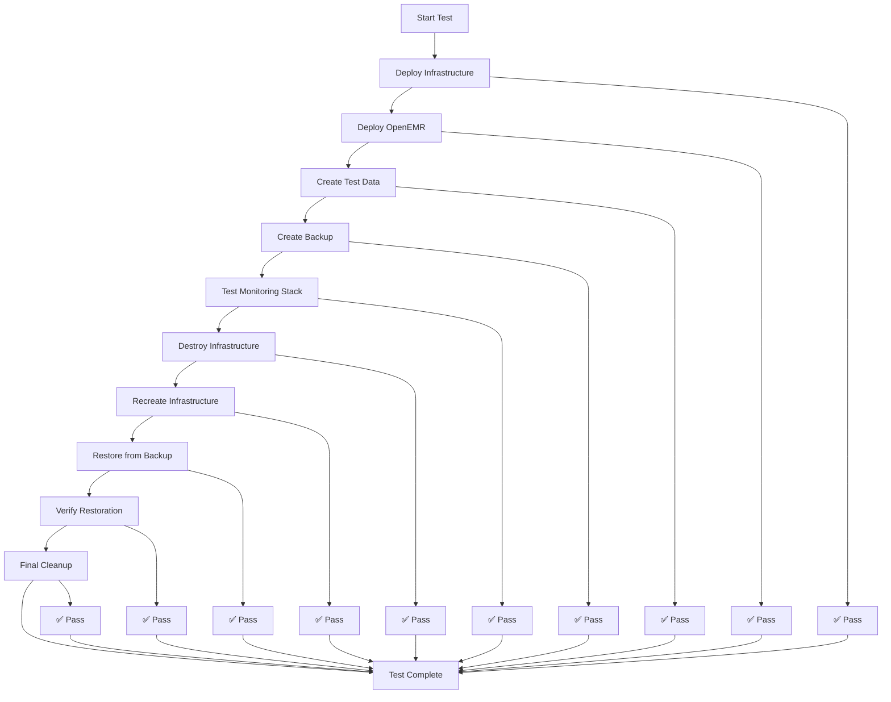

# OpenEMR on EKS End-to-End Testing Requirements Guide

## 🔒 **MANDATORY REQUIREMENT**

**Before any changes are made to the OpenEMR on EKS repository, the end-to-end backup/restore test script MUST pass successfully.** This is a core requirement that ensures disaster recovery capabilities remain intact.

This is a maintainer process requirement. The current GitHub Actions and manual
release workflows do not automatically launch or verify the destructive AWS
E2E run; the operator must record and review the result before release.

GitHub Actions also runs a **Floci e2e-lite** job
(`scripts/test-floci-e2e-lite.sh`) that mocks the backup/restore *scenario*
against the Floci AWS emulator (S3/KMS/Secrets/RDS API shapes). That CI job is
valuable regression coverage, but it is **not** a substitute for this
real-AWS end-to-end gate: Floci does not provide full EKS/EFS/Aurora/AWS Backup
restore fidelity.

> **⚠️ AWS Resource Warning**: The recommended
> `scripts/run-e2e-full-test.sh` wrapper and its inner
> `scripts/test-end-to-end-backup-restore.sh` script create and delete AWS
> resources, including backup buckets and RDS snapshots created by unfinished
> tests. Run them only in a development AWS account and **never** in an account
> that hosts production workloads.

## 📋 Table of Contents

- [Overview](#-overview)
- [Why This Is Critical](#-why-this-is-critical)
- [Testing Process](#-testing-process)
- [Test Requirements](#-test-requirements)
- [Integration with Development Workflows](#-integration-with-development-workflows)
- [Failure Handling](#-failure-handling)
- [Documentation Requirements](#-documentation-requirements)
- [Team Coordination](#-team-coordination)

## 🎯 Overview

The end-to-end backup/restore test validates the complete disaster recovery process by:

1. **Creating infrastructure from scratch**
2. **Deploying OpenEMR application**
3. **Creating test data for verification**
4. **Performing complete backup**
5. **Testing monitoring stack installation and uninstallation**
6. **Destroying all infrastructure**
7. **Recreating infrastructure**
8. **Restoring from backup**
9. **Verifying data integrity and connectivity**
10. **Cleaning up all test resources**

This comprehensive test ensures that any changes to the repository don't break the core disaster recovery capabilities.

## 🚨 Why This Is Critical

### **Disaster Recovery**

- **Patient Data Protection**: Ensures healthcare data can be recovered in disaster scenarios
- **Business Continuity**: Validates that the system can be restored and operational
- **Compliance Requirements**: Demonstrates disaster recovery capabilities for audits

### **Infrastructure Validation**

- **Terraform Configurations**: Ensures infrastructure as code works correctly
- **Kubernetes Manifests**: Validates application deployment configurations
- **Resource Dependencies**: Confirms all AWS resources are properly configured

### **Regression Prevention**

- **Change Impact Assessment**: Identifies if modifications break existing functionality
- **Integration Testing**: Validates that all components work together correctly
- **Quality Assurance**: Ensures changes meet production standards

### **Compliance and Auditing**

- **Regulatory Compliance**: Demonstrates data protection capabilities for healthcare applications
- **Audit Trail**: Provides evidence of disaster recovery testing
- **Risk Mitigation**: Reduces risk of data loss or system failure

## 🔄 Testing Process

### **Running the Test**

```bash
# Navigate to project root
cd /path/to/openemr-on-eks

# Recommended terminal wrapper: uses the selected AWS profile and appends all
# output to the gitignored e2e-full-test.log
AWS_PROFILE_NAME=<your-profile> ./scripts/run-e2e-full-test.sh \
  --cluster-name openemr-eks-test \
  --aws-region us-west-2

# Direct invocation (does not create the persistent wrapper log)
./scripts/test-end-to-end-backup-restore.sh \
  --cluster-name openemr-eks-test \
  --aws-region us-west-2 \
  --namespace openemr
```

When invoked with no forwarded arguments, the wrapper supplies cluster
`openemr-eks-test` and region `us-west-2`. It uses `AWS_PROFILE_NAME` when
provided, otherwise honors `AWS_PROFILE` or the standard AWS credential
provider chain; it has no account-specific profile default. Verify the account
printed at startup before allowing the destructive test to continue. If you
pass any E2E option, also pass `--cluster-name` and `--aws-region`; otherwise
the inner script uses its Terraform auto-detection/fallback behavior.

Follow the persistent log from another terminal:

```bash
tail -f e2e-full-test.log
```

The log is intentionally ignored by Git so it can remain available for local
review without being committed.

After any successful full or chunked run, the script replaces the bounded
"Latest Automated E2E Timing Report" section in
[`DEPLOYMENT_TIMINGS.md`](DEPLOYMENT_TIMINGS.md). Resource identifiers and
backup details are excluded. Use `--no-timing-report` to opt out or
`--timing-report PATH` to write the generated section to another prepared
report file.

> **Chunk timing caveat:** A successful partial run replaces that automated
> section with partial timing data. Pass `--no-timing-report` for development
> chunks and reserve the default report update for complete baseline runs.

### **Chunked Execution (Development Iteration)**

The OpenEMR 8.2.0 full-run baseline is 169 minutes 9 seconds (August 1, 2026).
The historical OpenEMR 8.1.x benchmark was ~150-160 minutes. For faster
development iteration, run **step groups** or **individual steps**. State
(backup bucket, snapshot ID, test timestamp) is persisted to
`.e2e-test-state` between runs.

```bash
# List all steps and predefined groups
./scripts/test-end-to-end-backup-restore.sh --list-steps
./scripts/test-end-to-end-backup-restore.sh --list-groups

# Common development workflows
./scripts/test-end-to-end-backup-restore.sh \
  --cluster-name openemr-eks-test --aws-region us-west-2 \
  --group deploy --no-timing-report
./scripts/test-end-to-end-backup-restore.sh \
  --cluster-name openemr-eks-test --aws-region us-west-2 \
  --group backup --no-timing-report
./scripts/test-end-to-end-backup-restore.sh \
  --cluster-name openemr-eks-test --aws-region us-west-2 \
  --step 5 --no-timing-report
./scripts/test-end-to-end-backup-restore.sh \
  --cluster-name openemr-eks-test --aws-region us-west-2 \
  --group backup-restore --no-timing-report

# Resume after a completed chunk (state file carries backup bucket + snapshot ID)
./scripts/test-end-to-end-backup-restore.sh \
  --cluster-name openemr-eks-test --aws-region us-west-2 \
  --from-step 6 --state-file .e2e-test-state --no-timing-report

# On failure, keep AWS resources for debugging instead of emergency cleanup
./scripts/test-end-to-end-backup-restore.sh \
  --cluster-name openemr-eks-test --aws-region us-west-2 \
  --group restore --no-emergency-cleanup --no-timing-report

# Skip k8s manifest reset when resuming mid-test
./scripts/test-end-to-end-backup-restore.sh \
  --cluster-name openemr-eks-test --aws-region us-west-2 \
  --from-step 8 --skip-restore-defaults --no-timing-report
```

| Group | Steps | Use when |
|-------|-------|----------|
| `deploy` | 1–3 | Infrastructure + OpenEMR + test data (8.2.0: ~47 min cold; steps 2-3 ~23 min) |
| `backup` | 4 | Testing backup script in isolation |
| `monitoring` | 5 | Testing monitoring install/uninstall |
| `destroy` / `recreate` | 6 / 7 | Testing infrastructure teardown/rebuild |
| `restore` | 8–9 | Testing restore + verification (requires prior backup) |
| `cleanup` | 10 | Manual cleanup after debugging |
| `backup-restore` | 4–9 | Backup through verification, including monitoring, destroy, and recreate |
| `backup-restore-inplace` | 4, 8–9 | In-place restore after steps 1–3; skips monitoring, destroy, and recreate |

**Note:** Steps 8+ require a state file from a prior run that completed step 4
(backup). The mandatory pre-release requirement remains the **full 10-step
test**.

When invoking the inner script directly, always pass the intended test cluster.
Its implementation auto-detects the Terraform output and otherwise falls back
to `openemr-eks`, even though the help text names `openemr-eks-test`.

### **Expected Test Flow**


```mermaid
graph TD
    A[Start Test] --> B[Deploy Infrastructure]
    B --> C[Deploy OpenEMR]
    C --> D[Create Test Data]
    D --> E[Create Backup]
    E --> F[Test Monitoring Stack]
    F --> G[Destroy Infrastructure]
    G --> H[Recreate Infrastructure]
    H --> I[Restore from Backup]
    I --> J[Verify Restoration]
    J --> K[Final Cleanup]
    K --> L[Test Complete]

    B --> B1[✅ Pass]
    C --> C1[✅ Pass]
    D --> D1[✅ Pass]
    E --> E1[✅ Pass]
    F --> F1[✅ Pass]
    G --> G1[✅ Pass]
    H --> H1[✅ Pass]
    I --> I1[✅ Pass]
    J --> J1[✅ Pass]
    K --> K1[✅ Pass]

    B1 --> L
    C1 --> L
    D1 --> L
    E1 --> L
    F1 --> L
    G1 --> L
    H1 --> L
    I1 --> L
    J1 --> L
    K1 --> L
```

### **Test Steps Details**

| Step | Description | Success Criteria |
|------|-------------|------------------|
| **1. Infrastructure Deployment** | Creates complete EKS cluster | Cluster is accessible and healthy |
| **2. OpenEMR Installation** | Deploys OpenEMR application | Application is running and accessible |
| **3. Test Data Creation** | Creates timestamped proof.txt | File exists with correct content |
| **4. Backup Creation** | Runs complete backup process | Backup is created successfully |
| **5. Monitoring Stack Test** | Installs and uninstalls monitoring stack | Monitoring components work correctly |
| **6. Infrastructure Destruction** | Removes all AWS resources | All resources are destroyed |
| **7. Infrastructure Recreation** | Rebuilds with `skip_rds_creation=true` | Infrastructure is ready; RDS is deferred to step 8 |
| **8. Backup Restoration** | Restores from backup | Application is restored |
| **9. Verification** | Confirms data integrity | Proof file exists and DB connects |
| **10. Final Cleanup** | Removes test resources | No orphaned resources remain |

### **Monitoring Stack Test Details**

The monitoring stack test (Step 5) validates that the optional monitoring components can be properly installed and uninstalled without affecting the core OpenEMR functionality. This test:

- **Installs the complete monitoring stack** including Prometheus, AlertManager, Grafana, Grafana Loki, Grafana Tempo, Grafana Mimir, OTeBPF
- **Verifies all monitoring components** are running and accessible
- **Tests monitoring functionality** to ensure metrics collection and visualization work
- **Uninstalls the monitoring stack** cleanly without leaving orphaned resources
- **Validates cleanup** to ensure no monitoring pods or resources remain

This step ensures that the monitoring stack integration is robust and doesn't interfere with the core backup/restore process, while also validating that the monitoring components themselves work correctly.

## ✅ Test Requirements

### **Success Criteria**

- **All 10 test steps must pass**: No exceptions or partial failures allowed
- **Complete infrastructure cycle**: Test must validate full create/destroy/restore cycle
- **Data integrity verification**: Proof files must be correctly restored
- **Connectivity validation**: Database and application connectivity must work after restore
- **Credential rotation readiness**: After restoration, verify rotation prerequisites are intact (`./scripts/verify-credential-rotation.sh`)
- **Resource cleanup**: All test resources must be properly cleaned up

### **Performance Requirements**

- **Test duration**: The successful OpenEMR 8.2.0 full 10-step baseline is
  169 minutes 9 seconds (August 1, 2026). Historical planning data is
  ~150–160 minutes for 8.1.x and ~211–217 minutes for the December 2025
  8.0.x runs.
- **Resource usage**: AWS resources will be created and destroyed during testing
- **Cleanup verification**: No orphaned AWS resources after test completion

### **Validation Requirements**

- **Infrastructure health**: All AWS resources must be in healthy state
- **Application functionality**: OpenEMR must be fully operational
- **Data persistence**: Test data must survive the backup/restore cycle
- **Network connectivity**: All services must communicate correctly

## 🔗 Integration with Development Workflows

> **⚠️ Developer Warning**: The end-to-end test script (`scripts/test-end-to-end-backup-restore.sh`) automatically resets all Kubernetes manifests to their default state using `restore-defaults.sh --force`. If you have uncommitted changes to Kubernetes manifests in the `k8s/` directory, **commit or stash your changes** before running the test script to avoid losing your work.

### **Before Any Changes**

```bash
# 1. Run end-to-end test with persistent logging
AWS_PROFILE_NAME=<your-profile> ./scripts/run-e2e-full-test.sh \
  --cluster-name openemr-eks-test --aws-region us-west-2

# 2. Verify all steps pass
# 3. Proceed with changes only if test is successful
```

### **Release Process Integration**

```bash
# Manual release workflow
# 1. Run end-to-end test with persistent logging
AWS_PROFILE_NAME=<your-profile> ./scripts/run-e2e-full-test.sh \
  --cluster-name openemr-eks-test --aws-region us-west-2

# 2. Verify test passes
# 3. Create GitHub release
# 4. Include test results in release notes
```

## ❌ Failure Handling

### **Test Failure Response**

- **Immediate halt**: Stop all development work until test passes
- **Issue investigation**: Identify and document the root cause
- **Fix implementation**: Apply necessary fixes to resolve the issue
- **Re-test required**: Run complete test again after fixes
- **Process gate**: Maintainers must enforce this requirement; GitHub Actions
  does not automatically run the destructive E2E test

### **Manual Destroy During a Paused Test**

The E2E script sets `PRESERVE_BACKUP_SNAPSHOTS=true` during step 6 and emergency
cleanup so the step-4 RDS snapshot remains available for restore. If you invoke
the destroy script yourself while debugging steps 6–10, preserve it explicitly:

```bash
PRESERVE_BACKUP_SNAPSHOTS=true ./scripts/destroy.sh --force
```

Running a manual destroy without this variable can delete the snapshot and make
step 8 unrecoverable without rerunning steps 1–4.

### **Common Failure Scenarios**

| Failure Type | Common Causes | Resolution |
|--------------|---------------|------------|
| **Infrastructure Deployment** | Terraform configuration errors | Fix configuration and re-test |
| **OpenEMR Installation** | Kubernetes manifest issues | Correct manifests and re-test |
| **Backup Creation** | IAM permission issues | Fix permissions and re-test |
| **Restoration Process** | Backup corruption or missing data | Investigate backup and re-test |
| **Connectivity Issues** | Network configuration problems | Fix networking and re-test |

### **Escalation Process**

1. **Developer investigation**: Initial troubleshooting and fixes
2. **Team review**: Code review and configuration validation
3. **Infrastructure validation**: Verify Terraform and Kubernetes configurations
4. **External support**: Engage AWS support if needed
5. **Documentation**: Document all issues and resolutions

## 📚 Documentation Requirements

### **Test Results Documentation**

All changes must include:

- **Test execution date**: When the test was run
- **Test results**: Pass/fail status for each step
- **Test duration**: Total time taken for the test
- **Resource usage**: AWS resources created and destroyed during testing
- **Issues encountered**: Any problems and their resolutions
- **Test environment**: Cluster name and configuration used

### **Example Documentation**

```markdown
## End-to-End Test Results

**Test Date**: 2026-08-01
**Test Environment**: openemr-eks-test
**Test Duration**: 2 hours 49 minutes 9 seconds (OpenEMR 8.2.0)
**Resources Used**: AWS resources created and destroyed

### Test Results
- ✅ Infrastructure Deployment: PASS (23m 52s)
- ✅ OpenEMR Installation: PASS (17m 30s)
- ✅ Test Data Creation: PASS (5m 14s)
- ✅ Backup Creation: PASS (40s)
- ✅ Monitoring Stack Test: PASS (18m 15s)
- ✅ Infrastructure Destruction: PASS (21m 30s)
- ✅ Infrastructure Recreation: PASS (26m 15s)
- ✅ Backup Restoration: PASS (33m 33s)
- ✅ Verification: PASS (51s)
- ✅ Final Cleanup: PASS (21m 23s)

**Overall Status**: PASS
```

## 👥 Team Coordination

### **Team Member Responsibilities**

- **Developers**: Run tests before making any changes
- **Code Reviewers**: Verify test results before approving changes
- **Release Managers**: Ensure tests pass before creating releases
- **DevOps Engineers**: Monitor test infrastructure and resolve issues
- **Compliance Officers**: Review test results for audit requirements

### **Communication Requirements**

- **Test notifications**: Inform team when tests are running
- **Failure alerts**: Immediately notify team of test failures
- **Success confirmations**: Confirm when tests pass successfully
- **Progress updates**: Regular updates during long-running tests
- **Results sharing**: Share test results with all stakeholders

### **Training and Onboarding**

- **New team members**: Must understand testing requirements
- **Documentation**: Provide clear testing procedures
- **Hands-on training**: Walk through test execution process
- **Troubleshooting**: Train on common failure scenarios
- **Best practices**: Share testing optimization techniques

## 📋 Summary

### **Key Points**

1. **End-to-end testing is MANDATORY** before any repository changes
2. **All 10 test steps must pass** - no exceptions allowed
3. **Test failure requires immediate halt** of development work
4. **Re-testing is required** after any fixes
5. **Documentation is mandatory** for all test results
6. **Team coordination is essential** for successful testing

### **Success Metrics**

- **100% test pass rate** for all development workflows
- **Zero production issues** related to disaster recovery
- **Complete audit trail** of all testing activities
- **Team compliance** with testing requirements
- **Continuous improvement** of testing processes

### **Getting Started**

```bash
# 1. Ensure you have proper AWS credentials
aws sts get-caller-identity

# 2. Navigate to project directory
cd /path/to/openemr-on-eks

# 3. Run your first end-to-end test with persistent logging
AWS_PROFILE_NAME=<your-profile> ./scripts/run-e2e-full-test.sh

# 4. Review the automatically updated docs/DEPLOYMENT_TIMINGS.md report
# 5. Proceed with development only after successful test
```

---

**Remember**: End-to-end testing is not optional - it's a core requirement that ensures the reliability and safety of the OpenEMR deployment. Always test before making changes, and never compromise on this requirement.
