# End-to-End Testing Requirements

## 🔒 **MANDATORY REQUIREMENT**

**Before any changes are made to the OpenEMR on EKS repository, the end-to-end backup/restore test script MUST pass successfully.** This is a core requirement that ensures disaster recovery capabilities remain intact.

> **⚠️ AWS Resource Warning**: The end-to-end test script (`scripts/test-end-to-end-backup-restore.sh`) will create and delete resources in AWS, including backup buckets and RDS snapshots created as part of other tests that may not have finished. As a result, it should only be run in a development AWS account and **NOT** in an AWS account that runs production workloads.

## 📋 Table of Contents

- [Overview](#-overview)
- [Why This Is Critical](#-why-this-is-critical)
- [Testing Process](#-testing-process)
- [Test Requirements](#-test-requirements)
- [Integration with Development Workflows](#-integration-with-development-workflows)
- [Failure Handling](#-failure-handling)
- [Documentation Requirements](#-documentation-requirements)
- [Team Coordination](#-team-coordination)

## 🎯 Overview

The end-to-end backup/restore test validates the complete disaster recovery process by:

1. **Creating infrastructure from scratch**
2. **Deploying OpenEMR application**
3. **Creating test data for verification**
4. **Performing complete backup**
5. **Destroying all infrastructure**
6. **Recreating infrastructure**
7. **Restoring from backup**
8. **Verifying data integrity and connectivity**
9. **Cleaning up all test resources**

This comprehensive test ensures that any changes to the repository don't break the core disaster recovery capabilities.

## 🚨 Why This Is Critical

### **Disaster Recovery**

- **Patient Data Protection**: Ensures healthcare data can be recovered in disaster scenarios
- **Business Continuity**: Validates that the system can be restored and operational
- **Compliance Requirements**: Demonstrates disaster recovery capabilities for audits

### **Infrastructure Validation**

- **Terraform Configurations**: Ensures infrastructure as code works correctly
- **Kubernetes Manifests**: Validates application deployment configurations
- **Resource Dependencies**: Confirms all AWS resources are properly configured

### **Regression Prevention**

- **Change Impact Assessment**: Identifies if modifications break existing functionality
- **Integration Testing**: Validates that all components work together correctly
- **Quality Assurance**: Ensures changes meet production standards

### **Compliance and Auditing**

- **Regulatory Compliance**: Demonstrates data protection capabilities for healthcare applications
- **Audit Trail**: Provides evidence of disaster recovery testing
- **Risk Mitigation**: Reduces risk of data loss or system failure

## 🔄 Testing Process

### **Running the Test**

```bash
# Navigate to project root
cd /path/to/openemr-on-eks

# Run the complete end-to-end test
./scripts/test-end-to-end-backup-restore.sh --cluster-name openemr-eks-test

# Custom test configuration
./scripts/test-end-to-end-backup-restore.sh \
  --cluster-name openemr-eks-test \
  --aws-region us-west-2 \
  --namespace openemr
```

### **Expected Test Flow**

```mermaid
graph TD
    A[Start Test] --> B[Deploy Infrastructure]
    B --> C[Deploy OpenEMR]
    C --> D[Create Test Data]
    D --> E[Create Backup]
    E --> F[Destroy Infrastructure]
    F --> G[Recreate Infrastructure]
    G --> H[Restore from Backup]
    H --> I[Verify Restoration]
    I --> J[Final Cleanup]
    J --> K[Test Complete]

    B --> B1[✅ Pass]
    C --> C1[✅ Pass]
    D --> D1[✅ Pass]
    E --> E1[✅ Pass]
    F --> F1[✅ Pass]
    G --> G1[✅ Pass]
    H --> H1[✅ Pass]
    I --> I1[✅ Pass]
    J --> J1[✅ Pass]

    B1 --> K
    C1 --> K
    D1 --> K
    E1 --> K
    F1 --> K
    G1 --> K
    H1 --> K
    I1 --> K
    J1 --> K
```



### **Test Steps Details**

| Step | Description | Success Criteria |
|------|-------------|------------------|
| **1. Infrastructure Deployment** | Creates complete EKS cluster | Cluster is accessible and healthy |
| **2. OpenEMR Installation** | Deploys OpenEMR application | Application is running and accessible |
| **3. Test Data Creation** | Creates timestamped proof.txt | File exists with correct content |
| **4. Backup Creation** | Runs complete backup process | Backup is created successfully |
| **5. Infrastructure Destruction** | Removes all AWS resources | All resources are destroyed |
| **6. Infrastructure Recreation** | Rebuilds infrastructure | New infrastructure is ready |
| **7. Backup Restoration** | Restores from backup | Application is restored |
| **8. Verification** | Confirms data integrity | Proof file exists and DB connects |
| **9. Final Cleanup** | Removes test resources | No orphaned resources remain |

## ✅ Test Requirements

### **Success Criteria**

- **All 9 test steps must pass**: No exceptions or partial failures allowed
- **Complete infrastructure cycle**: Test must validate full create/destroy/restore cycle
- **Data integrity verification**: Proof files must be correctly restored
- **Connectivity validation**: Database and application connectivity must work after restore
- **Resource cleanup**: All test resources must be properly cleaned up

### **Performance Requirements**

- **Test duration**: 2-4 hours depending on infrastructure size
- **Resource usage**: AWS resources will be created and destroyed during testing
- **Cleanup verification**: No orphaned AWS resources after test completion

### **Validation Requirements**

- **Infrastructure health**: All AWS resources must be in healthy state
- **Application functionality**: OpenEMR must be fully operational
- **Data persistence**: Test data must survive the backup/restore cycle
- **Network connectivity**: All services must communicate correctly

## 🔗 Integration with Development Workflows

> **⚠️ Developer Warning**: The end-to-end test script (`scripts/test-end-to-end-backup-restore.sh`) automatically resets all Kubernetes manifests to their default state using `restore-defaults.sh --force`. If you have uncommitted changes to Kubernetes manifests in the `k8s/` directory, **commit or stash your changes** before running the test script to avoid losing your work.

### **Before Any Changes**

```bash
# 1. Run end-to-end test
./scripts/test-end-to-end-backup-restore.sh --cluster-name openemr-eks-test

# 2. Verify all steps pass
# 3. Proceed with changes only if test is successful
```

### **Release Process Integration**

```bash
# Manual release workflow
# 1. Run end-to-end test
./scripts/test-end-to-end-backup-restore.sh --cluster-name openemr-eks-test

# 2. Verify test passes
# 3. Create GitHub release
# 4. Include test results in release notes
```

## ❌ Failure Handling

### **Test Failure Response**

- **Immediate halt**: Stop all development work until test passes
- **Issue investigation**: Identify and document the root cause
- **Fix implementation**: Apply necessary fixes to resolve the issue
- **Re-test required**: Run complete test again after fixes
- **No exceptions**: This testing is mandatory for all workflows

### **Common Failure Scenarios**

| Failure Type | Common Causes | Resolution |
|--------------|---------------|------------|
| **Infrastructure Deployment** | Terraform configuration errors | Fix configuration and re-test |
| **OpenEMR Installation** | Kubernetes manifest issues | Correct manifests and re-test |
| **Backup Creation** | IAM permission issues | Fix permissions and re-test |
| **Restoration Process** | Backup corruption or missing data | Investigate backup and re-test |
| **Connectivity Issues** | Network configuration problems | Fix networking and re-test |

### **Escalation Process**

1. **Developer investigation**: Initial troubleshooting and fixes
2. **Team review**: Code review and configuration validation
3. **Infrastructure validation**: Verify Terraform and Kubernetes configurations
4. **External support**: Engage AWS support if needed
5. **Documentation**: Document all issues and resolutions

## 📚 Documentation Requirements

### **Test Results Documentation**

All changes must include:

- **Test execution date**: When the test was run
- **Test results**: Pass/fail status for each step
- **Test duration**: Total time taken for the test
- **Resource usage**: AWS resources created and destroyed during testing
- **Issues encountered**: Any problems and their resolutions
- **Test environment**: Cluster name and configuration used

### **Example Documentation**

```markdown
## End-to-End Test Results

**Test Date**: 2025-08-27
**Test Environment**: openemr-eks-test
**Test Duration**: 3 hours 15 minutes
**Resources Used**: AWS resources created and destroyed

### Test Results
- ✅ Infrastructure Deployment: PASS (45 minutes)
- ✅ OpenEMR Installation: PASS (30 minutes)
- ✅ Test Data Creation: PASS (5 minutes)
- ✅ Backup Creation: PASS (60 minutes)
- ✅ Infrastructure Destruction: PASS (20 minutes)
- ✅ Infrastructure Recreation: PASS (45 minutes)
- ✅ Backup Restoration: PASS (60 minutes)
- ✅ Verification: PASS (10 minutes)
- ✅ Final Cleanup: PASS (15 minutes)

**Overall Status**: PASS
**Ready for Production**: YES
```

## 👥 Team Coordination

### **Team Member Responsibilities**

- **Developers**: Run tests before making any changes
- **Code Reviewers**: Verify test results before approving changes
- **Release Managers**: Ensure tests pass before creating releases
- **DevOps Engineers**: Monitor test infrastructure and resolve issues
- **Compliance Officers**: Review test results for audit requirements

### **Communication Requirements**

- **Test notifications**: Inform team when tests are running
- **Failure alerts**: Immediately notify team of test failures
- **Success confirmations**: Confirm when tests pass successfully
- **Progress updates**: Regular updates during long-running tests
- **Results sharing**: Share test results with all stakeholders

### **Training and Onboarding**

- **New team members**: Must understand testing requirements
- **Documentation**: Provide clear testing procedures
- **Hands-on training**: Walk through test execution process
- **Troubleshooting**: Train on common failure scenarios
- **Best practices**: Share testing optimization techniques

## 📋 Summary

### **Key Points**

1. **End-to-end testing is MANDATORY** before any repository changes
2. **All 9 test steps must pass** - no exceptions allowed
3. **Test failure requires immediate halt** of development work
4. **Re-testing is required** after any fixes
5. **Documentation is mandatory** for all test results
6. **Team coordination is essential** for successful testing

### **Success Metrics**

- **100% test pass rate** for all development workflows
- **Zero production issues** related to disaster recovery
- **Complete audit trail** of all testing activities
- **Team compliance** with testing requirements
- **Continuous improvement** of testing processes

### **Getting Started**

```bash
# 1. Ensure you have proper AWS credentials
aws sts get-caller-identity

# 2. Navigate to project directory
cd /path/to/openemr-on-eks

# 3. Run your first end-to-end test
./scripts/test-end-to-end-backup-restore.sh

# 4. Document your results
# 5. Proceed with development only after successful test
```

---

**Remember**: End-to-end testing is not optional - it's a core requirement that ensures the reliability and safety of the OpenEMR deployment. Always test before making changes, and never compromise on this requirement.
