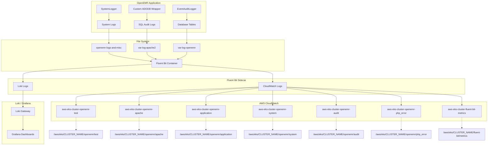

# OpenEMR on EKS Logging Guide

This comprehensive guide covers the enhanced logging configuration for OpenEMR 7.0.5 on Amazon EKS, including CloudWatch integration, Fluent Bit configuration, and troubleshooting.

## 📋 Table of Contents

- [Overview](#overview)
- [Logging Architecture](#logging-architecture)
- [CloudWatch Log Groups](#cloudwatch-log-groups)
- [Fluent Bit Configuration](#fluent-bit-configuration)
- [IRSA Authentication](#irsa-authentication)
- [OpenEMR Logging](#openemr-logging)
- [Log Directory Structure](#log-directory-structure)
- [Compliance and Security](#compliance-and-security)
- [Monitoring and Alerting](#monitoring-and-alerting)
- [Troubleshooting](#troubleshooting)
- [Best Practices](#best-practices)

## Overview

OpenEMR 7.0.5 includes comprehensive logging capabilities designed for healthcare compliance and operational monitoring:

- **Multi-layer logging**: Application, system, audit, and infrastructure logs
- **Real-time processing**: Fluent Bit with 5-second refresh intervals
- **CloudWatch integration**: Centralized log management with KMS encryption
- **Loki integration**: Unified log aggregation for Grafana dashboards
- **Enhanced reliability**: Filesystem buffering with pause-on-chunks-overlimit protection
- **Compliance ready**: audit trails and retention policies
- **IRSA authentication**: Secure AWS service integration using IAM Roles for Service Accounts
- **Sidecar deployment**: Fluent Bit runs as a sidecar container for reliable log collection
- **Metadata enrichment**: Automatic addition of cluster, region, version, and pod information
- **Dual outputs**: Logs sent to both CloudWatch and Loki for comprehensive monitoring

## Logging Architecture



## CloudWatch Log Groups

### Current Log Groups

| Log Group | Purpose | Retention | Encryption | Status |
|-----------|---------|-----------|------------|---------|
| `/aws/eks/${CLUSTER_NAME}/openemr/test` | Test logs for verification | 30 days | KMS | ✅ Working |
| `/aws/eks/${CLUSTER_NAME}/openemr/apache` | Apache access and error logs | 30 days | KMS | 🔄 Monitoring |
| `/aws/eks/${CLUSTER_NAME}/openemr/forward` | Forward protocol logs | 30 days | KMS | 🔄 Monitoring |
| `/aws/eks/${CLUSTER_NAME}/openemr/application` | OpenEMR application logs | 30 days | KMS | 🔄 Monitoring |
| `/aws/eks/${CLUSTER_NAME}/openemr/system` | System-level operational logs | 30 days | KMS | 🔄 Monitoring |
| `/aws/eks/${CLUSTER_NAME}/openemr/audit` | Basic audit trail | 365 days | KMS | 🔄 Monitoring |
| `/aws/eks/${CLUSTER_NAME}/openemr/php_error` | PHP application errors | 30 days | KMS | 🔄 Monitoring |
| `/aws/eks/${CLUSTER_NAME}/fluent-bit/metrics` | Fluent Bit operational metrics | 30 days | KMS | ✅ Working |

**Status Legend:**

- ✅ **Working**: Logs are actively flowing to CloudWatch
- 🔄 **Monitoring**: Paths are monitored, waiting for log files to be generated

### Log Group Features

- **Auto-creation**: `auto_create_group: true` allows Fluent Bit to create log groups automatically
- **Dynamic naming**: Uses environment variables for cluster-specific naming
- **IRSA integration**: Role-based authentication for secure access
- **Retry handling**: Configurable retry limits for reliable log delivery

## Fluent Bit Configuration

### Current Configuration Overview

The Fluent Bit configuration is deployed as a ConfigMap (`fluent-bit-sidecar-config`) and includes:

- **Service configuration**: Enhanced health checks, filesystem buffering, and retry logic
- **Test logs**: Dummy input for verification
- **Apache logs**: Access and error logs from `/var/log/apache2/`
- **OpenEMR logs**: Application, system, and audit logs with advanced filtering
- **PHP errors**: PHP application error logs
- **Forward protocol**: External log ingestion via port 24224
- **Metrics**: Fluent Bit operational metrics using `node_exporter_metrics`
- **Metadata enrichment**: Record modifier filter adds cluster, region, and version information
- **Dual outputs**: Logs sent to both CloudWatch and Loki for comprehensive monitoring

### Service Configuration

```yaml
[SERVICE]
    Flush                             1
    Log_Level                         info
    Daemon                            off
    HTTP_Server                       On
    HTTP_Listen                       0.0.0.0
    HTTP_Port                         2020
    HTTP_Allow                        *
    Health_Check                      On
    HC_Errors_Count                   50
    HC_Retry_Failure_Count            10
    HC_Period                         60
    storage.type                      filesystem
    storage.path                      /tmp/fluent-bit-buffer
    storage.backlog.mem_limit         50M
    storage.pause_on_chunks_overlimit On
    storage.max_chunks_up             256              
```

### Input Configuration

```yaml
# Test log input to verify functionality
[INPUT]
    Name              dummy
    Tag               test.logs
    Dummy            {"message": "Fluent Bit sidecar is working!", "timestamp": "2025-08-26", "level": "INFO"}
    Rate             1

# Collect Apache access logs
[INPUT]
    Name              tail
    Path              /var/log/apache2/access.log
    Tag               apache.access
    Refresh_Interval  5
    Buffer_Max_Size   5MB
    Skip_Empty_Lines  On

# Collect Apache error logs
[INPUT]
    Name              tail
    Path              /var/log/apache2/error.log
    Tag               apache.error
    Refresh_Interval  5
    Buffer_Max_Size   5MB
    Skip_Empty_Lines  On

# Collect OpenEMR application logs
[INPUT]
    Name              tail
    Path              /var/log/openemr/*.log
    Tag               openemr.application
    Refresh_Interval  5
    Buffer_Max_Size   5MB
    Skip_Empty_Lines  On
    Skip_Long_Lines   On
    Ignore_Older      24h
    Path_Key          filename
    exit_on_eof       false

# Collect OpenEMR system logs
[INPUT]
    Name              tail
    Path              /var/www/localhost/htdocs/openemr/sites/default/documents/logs_and_misc/system_logs/*.log
    Tag               openemr.system
    Refresh_Interval  5
    Buffer_Max_Size   5MB
    Skip_Empty_Lines  On
    Skip_Long_Lines   On
    Ignore_Older      24h
    Path_Key          filename
    exit_on_eof       false

# Collect OpenEMR audit logs
[INPUT]
    Name              tail
    Path              /var/www/localhost/htdocs/openemr/sites/default/documents/logs_and_misc/audit_logs/*.log
    Tag               openemr.audit
    Refresh_Interval  5
    Buffer_Max_Size   5MB
    Skip_Empty_Lines  On
    Skip_Long_Lines   On
    Ignore_Older      24h
    Path_Key          filename
    exit_on_eof       false

# Collect PHP error logs
[INPUT]
    Name              tail
    Path              /var/log/php_errors.log
    Tag               openemr.php_error
    Refresh_Interval  5
    Buffer_Max_Size   5MB
    Skip_Empty_Lines  On

# Forward protocol for external log sources
[INPUT]
    Name              forward
    Listen            0.0.0.0
    Port              24224
    Tag               forward.logs

# Fluent Bit Metrics
[INPUT]
    Name              node_exporter_metrics
    Tag               fluent-bit.metrics
    Scrape_Interval   30
    path.procfs       /host/proc
    path.sysfs        /host/sys
```

### Output Configuration

The current configuration uses hardcoded values for reliability:

```yaml
# Test logs output
[OUTPUT]
    Name                cloudwatch_logs
    Match               test.logs
    region              ${AWS_REGION}
    log_group_name      /aws/eks/${CLUSTER_NAME}/openemr/test
    log_stream_prefix   test-
    auto_create_group   true
    retry_limit         3

# Apache logs output
[OUTPUT]
    Name                cloudwatch_logs
    Match               apache.*
    region              ${AWS_REGION}
    log_group_name      /aws/eks/${CLUSTER_NAME}/openemr/apache
    log_stream_prefix   apache-
    auto_create_group   true
    retry_limit         3

# Forward logs output
[OUTPUT]
    Name                cloudwatch_logs
    Match               forward.logs
    region              ${AWS_REGION}
    log_group_name      /aws/eks/${CLUSTER_NAME}/openemr/forward
    log_stream_prefix   forward-
    auto_create_group   true
    retry_limit         3

# OpenEMR Application Logs
[OUTPUT]
    Name                cloudwatch_logs
    Match               openemr.application
    region              ${AWS_REGION}
    log_group_name      /aws/eks/${CLUSTER_NAME}/openemr/application
    log_stream_prefix   application-
    auto_create_group   true
    retry_limit         3

# OpenEMR System Logs
[OUTPUT]
    Name                cloudwatch_logs
    Match               openemr.system
    region              ${AWS_REGION}
    log_group_name      /aws/eks/${CLUSTER_NAME}/openemr/system
    log_stream_prefix   system-
    auto_create_group   true
    retry_limit         3

# OpenEMR Audit Logs
[OUTPUT]
    Name                cloudwatch_logs
    Match               openemr.audit
    region              ${AWS_REGION}
    log_group_name      /aws/eks/${CLUSTER_NAME}/openemr/audit
    log_stream_prefix   audit-
    auto_create_group   true
    retry_limit         3

# PHP Error Logs
[OUTPUT]
    Name                cloudwatch_logs
    Match               openemr.php_error
    region              ${AWS_REGION}
    log_group_name      /aws/eks/${CLUSTER_NAME}/openemr/php_error
    log_stream_prefix   php-error-
    auto_create_group   true
    retry_limit         3

# Fluent Bit Metrics
[OUTPUT]
    Name                cloudwatch_logs
    Match               fluent-bit.metrics
    region              ${AWS_REGION}
    log_group_name      /aws/eks/${CLUSTER_NAME}/fluent-bit/metrics
    log_stream_prefix   metrics-
    auto_create_group   true
    retry_limit         3
```

### Record Modifier Filter

The configuration includes a record modifier filter that adds metadata to all log records:

```yaml
[FILTER]
    Name                record_modifier
    Match               *
    Record              cluster_name ${CLUSTER_NAME}
    Record              region ${AWS_REGION}
    Record              openemr_version 7.0.5
    Record              pod_name ${HOSTNAME}
```

This enriches all log records with cluster, region, version, and pod identification information for better tracking and correlation.

### Loki Output Configuration

In addition to CloudWatch, logs are also sent to Loki for unified log aggregation in Grafana. All Loki outputs are configured with graceful failure handling:

```yaml
# Example: OpenEMR Application logs to Loki
[OUTPUT]
    Name                   loki
    Match                  openemr.application
    host                   loki-gateway.monitoring.svc.cluster.local
    port                   80
    uri                    /loki/api/v1/push
    labels                 job=openemr, namespace=openemr, log_type=application, cluster=${CLUSTER_NAME}
    line_format            json
    auto_kubernetes_labels on
    Retry_Limit            False
    net.connect_timeout    5
    net.keepalive          off
```

**Key Loki Configuration Features:**
- **Graceful failure handling**: `Retry_Limit False` retries indefinitely without crashing (buffers to disk)
- **Connection timeout**: 5-second timeout prevents hanging connections
- **Keepalive disabled**: Avoids connection persistence issues
- **Auto Kubernetes labels**: Automatically includes pod, namespace, and other K8s metadata
- **Structured logs**: JSON format for better parsing and filtering
- **Apache label keys**: Apache logs include `label_keys $tag` to capture the source log type (access vs error)

### Sidecar Deployment Pattern

Fluent Bit is deployed as a sidecar container within each OpenEMR pod, providing:

- **Reliable log collection**: No dependency on external DaemonSets
- **Pod-level isolation**: Each pod manages its own logging
- **Automatic scaling**: Logging scales with application replicas
- **Resource efficiency**: Shared pod resources and networking
- **Root access**: Runs as root user for comprehensive file access

### Container Configuration

```yaml
- name: fluent-bit-sidecar
  image: fluent/fluent-bit:4.2.2
  ports:
  - containerPort: 2020
    name: fluent-bit-http
    protocol: TCP
  - containerPort: 24224
    name: fluent-bit-fwd
    protocol: TCP
  env:
  - name: AWS_REGION
    value: "${AWS_REGION}"
  - name: CLUSTER_NAME
    value: "${CLUSTER_NAME}"
  - name: AWS_WEB_IDENTITY_TOKEN_FILE
    value: "/var/run/secrets/eks.amazonaws.com/serviceaccount/token"
  - name: AWS_ROLE_ARN
    value: "arn:aws:iam::${AWS_ACCOUNT}:role/openemr-service-account-role"
  resources:
    limits:
      cpu: "200m"
      memory: "256Mi"
    requests:
      cpu: "50m"
      memory: "64Mi"
  volumeMounts:
  - name: fluent-bit-config
    mountPath: /fluent-bit/etc/
  - name: tmp
    mountPath: /tmp
```

## IRSA Authentication

### Service Account Configuration

The logging configuration uses IAM Role for Service Accounts (IRSA) for secure AWS authentication:

```yaml
# Service account with CloudWatch permissions
apiVersion: v1
kind: ServiceAccount
metadata:
  name: openemr-sa
  namespace: openemr
  annotations:
    eks.amazonaws.com/role-arn: arn:aws:iam::${AWS_ACCOUNT}:role/openemr-service-account-role
```

### Required IAM Permissions

The `openemr-service-account-role` includes comprehensive CloudWatch Logs permissions:

```json
{
    "Version": "2012-10-17",
    "Statement": [
        {
            "Effect": "Allow",
            "Action": [
                "logs:CreateLogGroup",
                "logs:CreateLogStream",
                "logs:PutLogEvents",
                "logs:DescribeLogGroups",
                "logs:DescribeLogStreams"
            ],
            "Resource": [
                "arn:aws:logs:${AWS_REGION}:${AWS_ACCOUNT}:log-group:/aws/eks/${CLUSTER_NAME}/openemr/*",
                "arn:aws:logs:${AWS_REGION}:${AWS_ACCOUNT}:log-group:/aws/eks/${CLUSTER_NAME}/openemr/*:*",
                "arn:aws:logs:${AWS_REGION}:${AWS_ACCOUNT}:log-group:/aws/eks/${CLUSTER_NAME}/fluent-bit/*",
                "arn:aws:logs:${AWS_REGION}:${AWS_ACCOUNT}:log-group:/aws/eks/${CLUSTER_NAME}/fluent-bit/*:*"
            ]
        }
    ]
}
```

### Trust Policy

The IAM role trust policy allows the EKS OIDC provider to assume the role:

```json
{
    "Version": "2012-10-17",
    "Statement": [
        {
            "Effect": "Allow",
            "Principal": {
                "Federated": "arn:aws:iam::${AWS_ACCOUNT}:oidc-provider/oidc.eks.${AWS_REGION}.amazonaws.com/id/EXAMPLETOKEN"
            },
            "Action": "sts:AssumeRoleWithWebIdentity",
            "Condition": {
                "StringEquals": {
                    "oidc.eks.${AWS_REGION}.amazonaws.com/id/EXAMPLETOKEN:sub": "system:serviceaccount:openemr:openemr-sa",
                    "oidc.eks.${AWS_REGION}.amazonaws.com/id/EXAMPLETOKEN:aud": "sts.amazonaws.com"
                }
            }
        }
    ]
}
```

## OpenEMR Logging

### EventAuditLogger

The `EventAuditLogger` class provides comprehensive audit logging:

```php
// Located in: src/Common/Logging/EventAuditLogger.php
class EventAuditLogger
{
    // Logs audited events to database tables
    public function newEvent($event, $status, $comments = '', $user = '', $group = '', $success = '1', $log_from = '', $patient_id = '', $log_user = '', $log_group = '')

    // Records log items with RFC3881 compliance
    public function recordLogItem($event, $status, $comments = '', $user = '', $group = '', $success = '1', $log_from = '', $patient_id = '', $log_user = '', $log_group = '')
}
```

### SystemLogger

The `SystemLogger` class implements PSR-3 logging interface:

```php
// Located in: src/Common/Logging/SystemLogger.php
class SystemLogger implements LoggerInterface
{
    // Uses Monolog ErrorLogHandler for system logging
    // Configurable log levels based on $GLOBALS['system_error_logging']
    // Default level: WARNING
}
```

### Database Logging

OpenEMR uses custom ADODB wrapper for SQL auditing:

```php
// Located in: library/ADODB_mysqli_log.php
class ADODB_mysqli_log extends ADODB_mysqli
{
    // Logs all SQL operations using EventAuditLogger
    // Captures queries, parameters, and execution results
    // Integrates with audit trail for compliance
}
```

## Log Directory Structure

### Standard Log Directories

```
/var/log/
├── openemr/
│   ├── placeholder.log      # Placeholder for application logs
├── apache2/
│   ├── access.log           # Web server access logs
│   ├── error.log            # Web server error logs
│   └── ssl_error.log        # SSL error logs
└── php_errors.log           # PHP application error logs
```

### OpenEMR-Specific Directories

```
/var/www/localhost/htdocs/openemr/sites/default/documents/logs_and_misc/
├── system_logs/             # System-level operational logs
│   └── placeholder.log      # Placeholder for system logs
├── audit_logs/              # Detailed audit trails
│   └── placeholder.log      # Placeholder for audit logs
└── methods/                 # Legacy method logs
    └── existing_logs.log
```

## Compliance and Security

### Compliance

- **Audit trails**: Comprehensive logging of all patient data access
- **User authentication**: Logged user actions and system access
- **Data integrity**: Immutable log records with retention policies
- **Access controls**: Role-based permissions for log access

### Security Features

- **IRSA authentication**: Secure AWS service integration
- **KMS encryption**: CloudWatch logs encrypted at rest
- **IAM policies**: Least-privilege access to CloudWatch resources
- **Network isolation**: Logs transmitted over secure AWS infrastructure

### Retention Policies

- **Application logs**: 30 days retention
- **Audit logs**: 365 days retention (compliance requirement)
- **System logs**: 30 days retention
- **Metrics**: 30 days retention

## Monitoring and Alerting

### CloudWatch Metrics

Fluent Bit provides operational metrics via the `node_exporter_metrics` plugin:

- **Input metrics**: Records processed, bytes received
- **Output metrics**: Records sent, bytes transmitted
- **Error metrics**: Failed operations, retry counts
- **Performance metrics**: Processing latency, buffer usage

### Health Checks

Fluent Bit includes comprehensive health monitoring:

```yaml
livenessProbe:
  httpGet:
    path: /
    port: 2020
  initialDelaySeconds: 30
  periodSeconds: 30
  timeoutSeconds: 1
  failureThreshold: 3

readinessProbe:
  httpGet:
    path: /api/v1/health
    port: 2020
  initialDelaySeconds: 10
  periodSeconds: 10
  timeoutSeconds: 1
  failureThreshold: 3
```

### Log Verification

To verify logging is working correctly:

```bash
# Check Fluent Bit container status
kubectl get pods -n openemr -l app=openemr

# View Fluent Bit logs
kubectl logs <pod-name> -c fluent-bit-sidecar -n openemr

# Verify CloudWatch log groups
aws logs describe-log-groups --log-group-name-prefix "/aws/eks/${CLUSTER_NAME}" --region ${AWS_REGION}

# Check specific log streams
aws logs describe-log-streams --log-group-name "/aws/eks/${CLUSTER_NAME}/openemr/test" --region ${AWS_REGION}
```

## Troubleshooting

### Common Issues

#### 1. Permission Errors for Log Files

**Symptoms**: Fluent Bit logs show "read error, check permissions"

**Cause**: Log directories or files don't exist yet

**Solution**:

```bash
# Create missing directories and placeholder files
kubectl exec <pod-name> -c openemr -n openemr -- mkdir -p /var/log/openemr /var/www/localhost/htdocs/openemr/sites/default/documents/logs_and_misc/system_logs /var/www/localhost/htdocs/openemr/sites/default/documents/logs_and_misc/audit_logs

kubectl exec <pod-name> -c openemr -n openemr -- touch /var/log/openemr/placeholder.log /var/www/localhost/htdocs/openemr/sites/default/documents/logs_and_misc/system_logs/placeholder.log /var/www/localhost/htdocs/openemr/sites/default/documents/logs_and_misc/audit_logs/placeholder.log
```

#### 2. IRSA Authentication Issues

**Symptoms**: "AccessDeniedException: Unauthorized Exception! EKS does not have permissions to assume the associated role"

**Cause**: Incorrect IAM role trust policy or missing IRSA annotation

**Solution**: Verify service account annotation and IAM role trust policy

#### 3. Missing Log Groups

**Symptoms**: CloudWatch log groups not created

**Cause**: Fluent Bit configuration issues or IAM permissions

**Solution**: Check Fluent Bit logs and IAM policy permissions

#### 4. Loki Connection Issues

**Symptoms**: Fluent Bit logs show connection errors to Loki, but CloudWatch logs work fine

**Cause**: Loki service may be unavailable or unreachable

**Solution**: 
- This is expected behavior when Loki is not installed. The graceful failure handling (`Retry_Limit False`) ensures logs are buffered to disk and will be retried when Loki becomes available
- Verify Loki is installed: `kubectl get pods -n monitoring | grep loki`
- Check Loki gateway service: `kubectl get svc -n monitoring | grep loki`
- Logs will continue to flow to CloudWatch regardless of Loki status

### Debugging Steps

1. **Check pod status**: Ensure Fluent Bit sidecar is running
2. **Review container logs**: Look for error messages in Fluent Bit logs
3. **Verify IAM permissions**: Check CloudWatch Logs permissions
4. **Test authentication**: Verify IRSA token and role assumption
5. **Monitor CloudWatch**: Check if log groups are being created
6. **Check Loki status**: Verify Loki pods and services are running if using Grafana
7. **Review buffer status**: Check Fluent Bit buffer usage for any blocks due to downstream issues

## Recent Improvements

### Enhanced Service Configuration

- **Filesystem buffering**: Added filesystem storage with 50MB backlog memory limit
- **Pause-on-chunks-overlimit**: Prevents buffer overflow by pausing processing when chunks exceed limit
- **Health check monitoring**: 50 error count, 10 retry failure count, 60-second period
- **256 chunk limit**: Maximum chunks limit for better memory management

### Improved Input Configuration

- **Buffer size standardization**: Changed from Mem_Buf_Limit to Buffer_Max_Size (5MB per input)
- **Smart log handling**: Added Skip_Long_Lines, Ignore_Older (24h), Path_Key, and exit_on_eof for OpenEMR logs
- **Metrics enhancement**: Added path.procfs and path.sysfs for node_exporter_metrics

### Metadata Enrichment

- **Record modifier filter**: Automatically adds cluster_name, region, openemr_version, and pod_name to all logs
- **Better traceability**: Enhanced log correlation and identification across distributed environment

### Dual Output Configuration

- **Loki integration**: Added comprehensive Loki outputs for all log types
- **Graceful failure handling**: Retry_Limit False prevents crashes when Loki is unavailable
- **Connection optimization**: 5-second connect timeout and disabled keepalive for better reliability
- **Auto Kubernetes labels**: Automatic inclusion of pod, namespace, and other metadata

### Enhanced Health Checks

- **Improved probe configuration**: Better timing and failure thresholds for production workloads
- **User-Agent headers**: Added health check identification for better monitoring
- **Optimized intervals**: Reduced unnecessary health check overhead

### Resource Optimization

- **Better resource allocation**: Increased CPU and memory limits for improved performance
- **Fluent Bit optimization**: Enhanced resource allocation for better log processing
- **Security context improvements**: Added proper group permissions for compliance

### Performance Enhancements

- **Startup probe optimization**: Better handling of slow-starting containers
- **Readiness probe tuning**: Faster detection of ready state
- **Liveness probe improvements**: More resilient to temporary issues

## Best Practices

### Configuration

- **Service-level configuration**: Enhanced health checks (50 error count, 10 retry failure count, 60s period)
- **Filesystem buffering**: Use filesystem storage type with 50MB backlog limit and 256 chunk limit
- **Monitor all inputs**: Include health checks for all log sources
- **Set appropriate limits**: Configure memory and CPU limits for Fluent Bit
- **Enable health checks**: Use liveness and readiness probes
- **Record enrichment**: Add metadata to all logs via record modifier filter
- **Dual outputs**: Configure both CloudWatch and Loki outputs for comprehensive monitoring

### Security

- **Least privilege**: Grant only necessary CloudWatch permissions
- **Encrypt logs**: Enable KMS encryption for all log groups
- **Monitor access**: Log all authentication and authorization events

### Performance

- **Optimize buffer sizes**: Set appropriate `Buffer_Max_Size` values (currently 5MB per input)
- **Use skip empty lines**: Reduce processing overhead for empty log entries
- **Monitor metrics**: Track Fluent Bit performance metrics
- **Set refresh intervals**: Balance real-time processing with resource usage
- **Filesystem buffering**: 50MB filesystem buffer with 256 chunk limit for reliability
- **Smart log handling**: Skip long lines and ignore files older than 24h for OpenEMR logs

### Maintenance

- **Regular verification**: Periodically check log flow to CloudWatch
- **Update configurations**: Keep Fluent Bit configuration current
- **Monitor resource usage**: Track CPU and memory consumption
- **Review retention policies**: Ensure compliance with data retention requirements
