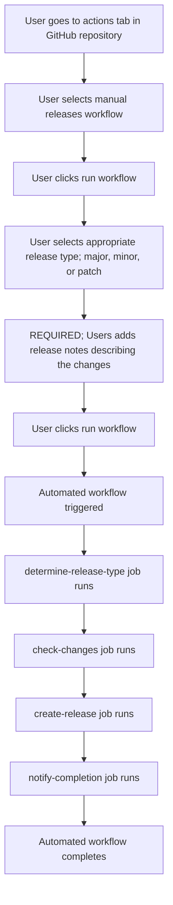

# OpenEMR on EKS Manual GitHub Releases Guide

## 📋 Table of Contents

- [Overview](#-overview)
- [Release Architecture](#-release-architecture)
- [Release Schedule](#-release-schedule)
- [How It Works](#-how-it-works)
- [Manual Release Process](#-manual-release-process)
- [End-to-End Testing Requirements](#-end-to-end-testing-requirements)
- [Release Notes Generation](#-release-notes-generation)
- [Safety Features](#️-safety-features)
- [File Structure](#-file-structure)
- [Configuration](#️-configuration)
- [Workflow Jobs](#-workflow-jobs)
- [Monitoring and Debugging](#-monitoring-and-debugging)
- [Best Practices](#-best-practices)
- [Related Documentation](#-related-documentation)
- [Support](#-support)

---

This document describes the manual release system for the OpenEMR on EKS project, which provides controlled version bumping and release management through GitHub Actions.

## 🚀 Overview

The manual release system manages project versions and creates GitHub releases based on:

- **Manual triggers only**: All releases are manually initiated through GitHub Actions
- **Full control**: You decide when and what type of release to create
- **Flexible timing**: No automatic schedules, releases happen when you want them

## 🎯 Release Architecture



## 📅 Release Schedule

### Manual Releases Only

| Trigger | Version Bump | Description |
|---------|--------------|-------------|
| **Manual** | `major`, `minor`, or `patch` | On-demand releases triggered by you |

**Note**: There are no automatic scheduled releases. All releases must be manually triggered.

## 🔧 How It Works

### 1. Release Type Determination

The workflow determines the release type based on your manual input:

```yaml
# Manual trigger only
case "${{ github.event.inputs.release_type }}" in
  "major")
    bump-version="major"   # Breaking changes
    ;;
  "minor")
    bump-version="minor"   # New features
    ;;
  "patch")
    bump-version="patch"   # Bug fixes
    ;;
esac
```

### 2. Change Detection

Before creating a release, the system checks if there are actual changes since the last release:

```bash
# Get the last release tag
LAST_TAG=$(git describe --tags --abbrev=0 2>/dev/null || echo "")

# Check if there are commits since last tag
if [[ -z "$LAST_TAG" ]]; then
  echo "No previous tags found. This will be the first release."
  has-changes=true
elif git log --oneline "$LAST_TAG..HEAD" | grep -q .; then
  echo "Changes detected since last release, proceeding"
  has-changes=true
else
  echo "No changes since last release, skipping"
  has-changes=false
fi
```

### 3. Version Bumping

The system automatically calculates and updates the new version using the Python `semver` library:

```python
import semver

current = semver.Version.parse(os.environ["CURRENT"])
bump_type = os.environ["BUMP"]

if bump_type == "major":
    new = current.bump_major()      # 1.0.0 (resets minor and patch to 0)
elif bump_type == "minor":
    new = current.bump_minor() # 0.2.0 (resets patch to 0)
else:                          # patch
    new = current.bump_patch() # 0.1.1 (increments patch only)
```

**Version Reset Rules:**

- **Major bump** (`1.0.0`): Resets both minor and patch to `0`
- **Minor bump** (`0.1.0`): Resets patch to `0`
- **Patch bump** (`0.0.1`): Only increments patch number

### 4. File Updates

Version information is updated in the primary version file:

- `VERSION` - Primary version file (automatically updated)

### 5. Release Creation

The system creates:

- Git tag with the new version
- GitHub release with comprehensive release notes
- Commit with version bump and metadata
- Detailed release notes including commit history and statistics

## 📋 Manual Release Process

### Triggering a Manual Release

1. **🔒 MANDATORY**: Run end-to-end backup/restore test before any changes

   ```bash
   ./scripts/test-end-to-end-backup-restore.sh --cluster-name openemr-eks-test
   ```

   - All 10 test steps must pass successfully
   - This ensures disaster recovery capabilities remain intact
   - No exceptions - testing is mandatory for all releases

2. Go to the **Actions** tab in your GitHub repository
3. Select **Manual Releases** workflow
4. Click **Run workflow**
5. Choose your release type:
   - **Major**: For breaking changes
   - **Minor**: For new features
   - **Patch**: For bug fixes
6. **Required**: Add release notes describing the changes
7. (Optional) Enable dry run for testing
8. Click **Run workflow**

### Manual Release Options

| Option | Description | Example |
|--------|-------------|---------|
| `release_type` | Type of version bump | `major`, `minor`, `patch` |
| `release_notes` | **Required** release notes | "Added new ML features and resolved EFS mounting issues" |
| `dry_run` | Test without creating release | `true`/`false` |

**Important**: Release notes are now **required** for all manual releases to ensure proper documentation of changes.

## 🔒 End-to-End Testing Requirements

### **MANDATORY BEFORE ANY RELEASE**

Before any manual release can be created, the end-to-end backup/restore test script **must** pass successfully. This is a core requirement that ensures disaster recovery capabilities remain intact.

#### **Why This Is Critical**

- **Disaster Recovery**: Ensures the core backup/restore functionality remains intact
- **Infrastructure Validation**: Validates that Terraform and Kubernetes configurations work correctly
- **Regression Prevention**: Prevents releases that could break production recovery procedures
- **Compliance**: Demonstrates that disaster recovery capabilities are maintained
- **Quality Assurance**: Ensures all changes are thoroughly tested before release

#### **Testing Process**

```bash
# Run the complete end-to-end test
./scripts/test-end-to-end-backup-restore.sh --cluster-name openemr-eks-test

# Expected outcome: All 10 test steps must pass
# ✅ Infrastructure deployment
# ✅ OpenEMR installation
# ✅ Test data creation
# ✅ Backup creation
# ✅ Monitoring stack test
# ✅ Infrastructure destruction
# ✅ Infrastructure recreation
# ✅ Backup restoration
# ✅ Verification
# ✅ Final cleanup
```

#### **Test Requirements**

- **All test steps must pass**: No exceptions or partial failures allowed
- **Complete infrastructure cycle**: Test must validate full create/destroy/restore cycle
- **Data integrity verification**: Proof files must be correctly restored
- **Connectivity validation**: Database and application connectivity must work after restore
- **Resource cleanup**: All test resources must be properly cleaned up

#### **Failure Handling**

- **If any test step fails**: Release process must be halted
- **Changes must be reverted**: Fix issues before proceeding with release
- **Re-test required**: After fixes, complete test must pass again
- **No exceptions**: This testing is mandatory for all releases

#### **Integration with Release Process**

- **Pre-release validation**: Test must pass before release workflow can proceed
- **Release notes requirement**: Include test results in release notes
- **Team coordination**: Ensure all team members understand this requirement
- **Documentation**: All releases must include test validation results

## 🔍 Release Notes Generation

### Automatic Release Notes

The system automatically generates comprehensive release notes by combining your required input with commit information:

```markdown
## Release v0.2.0

**Release Type:** Minor
**Triggered By:** @username
**Date:** 2024-01-01 15:30:00 UTC

### Release Notes
Added new ML features and resolved EFS mounting issues

### Changes
- abc1234: feat: Added ML stack installation script
- def5678: fix: Resolved EFS mounting issues
- ghi9012: docs: Updated deployment guide

### Statistics
- Commits: 3
- Contributors: 2
- Files changed: 15 files changed, 234 insertions(+), 45 deletions(-)
```

### Required Release Notes Integration

Your required release notes are prominently displayed and integrated into the final release:

- **Top-Level Display**: Your notes appear prominently at the top of the release
- **Commit Integration**: Combined with automatic commit-based change detection
- **Comprehensive Coverage**: Ensures both human context and technical details are captured
- **Quality Assurance**: Required notes prevent releases without proper documentation

### Custom Release Notes

Release notes are **required** for all manual releases and will be prominently displayed in the release description. This ensures:

- **Proper Documentation**: Every release has meaningful context
- **Change Tracking**: Clear record of what was included in each release
- **Team Communication**: Better understanding of release contents
- **Compliance**: Proper documentation for audit and review purposes

### User Tracking

Every release includes comprehensive tracking of who triggered it:

- **GitHub Username**: The `@username` of the person who triggered the release
- **Workflow Run**: Direct link to the GitHub Actions run that created the release
- **Git Commit**: The version bump commit includes who triggered it
- **Git Tag**: The release tag includes trigger information and timestamp
- **Release Notes**: All release metadata includes the trigger source

This provides complete auditability and accountability for all releases.

## 🛡️ Safety Features

### Change Detection

- Releases are only created when there are actual changes
- Prevents unnecessary releases for unchanged code
- Skips releases when no commits exist since last tag
- Handles first-time releases gracefully

### Dry Run Mode

- Test release process without creating actual releases
- Verify version calculations and file updates
- Safe way to experiment with release configurations
- Provides comprehensive preview of what would be created

### Error Handling

- Comprehensive error handling for each step
- Detailed logging for debugging
- Graceful failure handling
- Validation of version formats and workflow inputs

## 📁 File Structure

```
.github/
└── workflows/
    └── manual-releases.yml    # Main release workflow

docs/
└── MANUAL_RELEASES.md         # This documentation

VERSION                        # Current version file
```

## ⚙️ Configuration

### Workflow File Location

The manual release workflow is located at:

```
.github/workflows/manual-releases.yml
```

### Environment Variables

| Variable | Description                                                                                 | Default |
|----------|---------------------------------------------------------------------------------------------|--------|
| `PYTHON_VERSION` | Python [version](https://www.python.org/doc/versions/) used                                 | `3.14.0` |
| `SEMVER_PYTHON_PACKAGE_VERSION` | Version of the PyPi ["semver"](https://pypi.org/project/semver/) package to use             | `3.0.4` |

### Secrets

The workflow uses the following secrets:

- `GITHUB_TOKEN` - Automatically provided by GitHub Actions

## 🔄 Workflow Jobs

### 1. `determine-release-type`

- Determines the release type from manual input
- Sets appropriate version bump type
- Captures trigger information
- Provides outputs for other jobs

### 2. `check-changes`

- Checks if there are changes since last release
- Prevents unnecessary releases
- Handles first-time releases gracefully
- Provides change detection output

### 3. `create-release`

- Updates VERSION file
- Creates Git tags and commits
- Generates comprehensive release notes
- Creates GitHub releases
- Supports dry run mode

### 4. `notify-completion`

- Provides final status notification
- Runs regardless of success/failure
- Generates workflow summary
- Handles error notifications

## 📊 Monitoring and Debugging

### Workflow Status

Monitor release status in the GitHub Actions tab:

- `✅ Release completed successfully`: Release successful
- `❌ Release failed`: Release failed
- `⏭️ No changes detected, release skipped`: No changes detected
- `🔍 Dry run completed`: Dry run mode completed successfully

### Logs

Detailed logs are available for each job:

- Click on the workflow run
- Expand individual job steps
- View console output for debugging
- Check workflow summary for overview

### Common Issues

#### No Changes Detected

- **Cause**: No commits since last release tag
- **Solution**: Make changes and commit them before manually initiating a release

#### Version File Not Found

- **Cause**: Missing VERSION file
- **Solution**: Ensure VERSION file exists in repository root

#### Permission Errors

- **Cause**: Insufficient repository permissions
- **Solution**: Ensure workflow has write access to repository

#### Invalid Version Format

- **Cause**: VERSION file contains invalid semantic version
- **Solution**: Ensure VERSION file contains valid format (e.g., "1.0.0")

## 🚀 Best Practices

### 1. Version Management

- Keep the `VERSION` file in the repository root
- Use [semantic versioning](https://semver.org/) (MAJOR.MINOR.PATCH)
- Ensure VERSION file contains valid semantic version format

### 2. Release Notes

- Write clear, descriptive release notes
- Include context about what changed and why
- Reference related issues or pull requests when applicable

### 3. Testing

- Use dry run mode for testing release process
- Test with different release types
- Verify version file updates
- Test change detection logic

### 4. Monitoring

- Regularly check workflow execution
- Monitor release creation
- Review generated release notes
- Check workflow summaries for insights

### 5. Release Planning

- Plan releases based on feature completion
- Coordinate releases with team schedules
- Use major releases sparingly for breaking changes
- Consider impact on downstream consumers

## 🔗 Related Documentation

- [GitHub Actions Documentation](https://docs.github.com/en/actions)
- [Semantic Versioning](https://semver.org/)
- [Python Semver Package](https://pypi.org/project/semver/)

## 📞 Support

For issues with the manual release system:

1. Check the workflow logs in GitHub Actions
2. Review this documentation
3. Check the workflow file for configuration issues
4. Create an [issue](../../../issues) in the repository with detailed error information

---

**Note**: This manual release system is designed to give you full control over the release process while maintaining version consistency and providing comprehensive release notes. All releases are manually triggered, ensuring you decide when and how releases happen.
