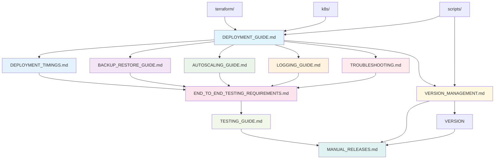

# Documentation Directory

This directory contains comprehensive documentation for the OpenEMR on EKS deployment project. The documentation is designed for developers, maintainers, and operators who need to understand, deploy, maintain, and troubleshoot the system.

## 📋 Table of Contents

### **📁 Directory Overview**
- [Directory Structure](#directory-structure)
- [Documentation Dependency Graph](#documentation-dependency-graph)

### **📄 Core Documentation Files**
- [Deployment Guide](#deployment_guidemd)
- [Deployment Timings Guide](#deployment_timingsmd)
- [Backup & Restore Guide](#backup_restore_guidemd)
- [Autoscaling Guide](#autoscaling_guidemd)
- [Logging Guide](#logging_guidemd)
- [Testing Guide](#testing_guidemd)
- [End-to-End Testing Requirements](#end_to_end_testing_requirementsmd)
- [Manual Releases](#manual_releasesmd)
- [Version Management](#version_managementmd)
- [Troubleshooting Guide](#troubleshootingmd)

### **🔗 Related Documentation**
- [Main Project README](../README.md)
- [Terraform Documentation](../terraform/README.md)
- [Kubernetes Documentation](../k8s/README.md)
- [Scripts Documentation](../scripts/README.md)
- [Monitoring Documentation](../monitoring/README.md)
- [Warp Project Documentation](../warp/README.md)

### **📖 Documentation Maintenance**
- [Maintenance Guidelines](#maintenance-guidelines)
- [Support and Contributing](#support-and-contributing)

## Directory Structure

### Core Documentation Files

- **`DEPLOYMENT_GUIDE.md`** - Complete deployment guide with step-by-step instructions
- **`DEPLOYMENT_TIMINGS.md`** - Measured timing data for deployment operations and performance analysis
- **`BACKUP_RESTORE_GUIDE.md`** - Comprehensive backup and disaster recovery procedures
- **`AUTOSCALING_GUIDE.md`** - Autoscaling configuration and optimization guide
- **`LOGGING_GUIDE.md`** - Logging configuration with CloudWatch and Loki integration
- **`TESTING_GUIDE.md`** - Testing framework and CI/CD procedures
- **`END_TO_END_TESTING_REQUIREMENTS.md`** - Mandatory testing requirements
- **`MANUAL_RELEASES.md`** - Release management and version control
- **`VERSION_MANAGEMENT.md`** - Version awareness and dependency management
- **`TROUBLESHOOTING.md`** - Common issues and resolution procedures

## Documentation Dependency Graph

## File Descriptions

### Core Deployment Documentation

#### `DEPLOYMENT_GUIDE.md`

- **Purpose**: Complete step-by-step deployment guide for OpenEMR on EKS
- **Key Features**:
  - Prerequisites and system requirements
  - Infrastructure deployment with Terraform
  - Application deployment with Kubernetes
  - SSL configuration and security hardening
  - Monitoring and backup setup
  - Cost estimation and optimization
- **Dependencies**: `terraform/`, `k8s/`, `scripts/`
- **Maintenance Notes**:
  - Update OpenEMR version references when new stable versions are released
  - Modify cost estimation formulas as AWS pricing changes
  - Add new deployment options as they become available
  - Update compliance requirements as regulations change

#### `DEPLOYMENT_TIMINGS.md`

- **Purpose**: Comprehensive timing data and performance metrics for deployment operations
- **Key Features**:
  - Measured timings for all deployment operations (infrastructure, application, backup, restore)
  - Performance insights with consistency analysis
  - Planning guidelines for production deployments and disaster recovery
  - Timing comparison tables and best practices
  - Optimization opportunities and troubleshooting guidance
  - End-to-end test suite timing data
- **Dependencies**: All deployment operations (`terraform/`, `k8s/`, `scripts/`)
- **Maintenance Notes**:
  - Update timing data periodically based on new test runs
  - Re-measure after significant infrastructure changes
  - Adjust timing buffers based on observed variations
  - Update optimization recommendations as AWS services evolve
  - Document timing changes when process improvements are implemented

#### `BACKUP_RESTORE_GUIDE.md`

- **Purpose**: Comprehensive backup and disaster recovery procedures
- **Key Features**:
  - Cross-region backup capabilities
  - Automated RDS Aurora snapshots
  - Kubernetes configuration backup
  - Application data backup from S3
  - End-to-end restore procedures
  - Compliance and security considerations
- **Dependencies**: `scripts/backup.sh`, `scripts/restore.sh`
- **Maintenance Notes**:
  - Update backup retention policies as compliance requirements change
  - Add new backup sources as the system grows
  - Modify restore procedures for new infrastructure components
  - Update cross-region procedures as AWS services evolve

### Configuration and Optimization

#### `AUTOSCALING_GUIDE.md`

- **Purpose**: Autoscaling configuration and optimization for workloads
- **Key Features**:
  - EKS Auto Mode scaling architecture
  - Specific workload patterns
  - Sizing guidelines by organization type
  - HPA configuration examples
  - Performance monitoring and optimization
- **Dependencies**: `k8s/hpa.yaml`, `k8s/deployment.yaml`
- **Maintenance Notes**:
  - Update scaling recommendations based on performance data
  - Add new organization size categories as needed
  - Modify HPA configurations for new Kubernetes versions
  - Update cost optimization strategies as AWS pricing changes

#### `LOGGING_GUIDE.md`

- **Purpose**: Comprehensive logging configuration with CloudWatch and Loki integration
- **Key Features**:
  - OpenEMR 7.0.4 logging architecture
  - Fluent Bit sidecar configuration
  - Dual output to CloudWatch and Loki
  - CloudWatch log groups and retention
  - Loki integration for Grafana dashboards
  - IRSA authentication setup
  - Compliance and security features
- **Dependencies**: `k8s/logging.yaml`, `k8s/deployment.yaml`
- **Maintenance Notes**:
  - Update log retention policies as compliance requirements change
  - Add new log sources as OpenEMR features are added
  - Modify Fluent Bit configuration for new versions
  - Update CloudWatch integration as AWS services evolve
  - Keep Loki configuration aligned with Grafana monitoring stack

### Testing and Quality Assurance

#### `TESTING_GUIDE.md`

- **Purpose**: Testing framework and CI/CD procedures
- **Key Features**:
  - Code quality tests and validation
  - Kubernetes manifest testing
  - Script validation and testing
  - Pre-commit hooks configuration (`.pre-commit-config.yaml`, `.yamllint`, `.markdownlint.json`)
  - CI/CD integration with GitHub Actions
- **Dependencies**: `scripts/run-test-suite.sh`, `.github/workflows/`
- **Maintenance Notes**:
  - Add new test suites as the system grows
  - Update test configurations for new tools
  - Modify CI/CD workflows as GitHub Actions evolve
  - Update pre-commit hooks for new file types
  - Adjust `.yamllint` rules if YAML linting becomes too strict/lenient
  - Adjust `.markdownlint.json` rules if Markdown linting becomes too strict/lenient

#### `END_TO_END_TESTING_REQUIREMENTS.md`

- **Purpose**: Mandatory testing requirements for all changes
- **Key Features**:
  - Complete disaster recovery testing
  - Infrastructure validation procedures
  - Data integrity verification
  - Team coordination requirements
  - Compliance documentation
- **Dependencies**: `scripts/test-end-to-end-backup-restore.sh`
- **Maintenance Notes**:
  - Update test requirements as infrastructure changes
  - Modify team coordination procedures as needed
  - Add new validation steps for new components
  - Update compliance requirements as regulations change

### Release Management

#### `MANUAL_RELEASES.md`

- **Purpose**: Release management and version control procedures
- **Key Features**:
  - Manual release workflow
  - Version bumping and tagging
  - Release notes generation
  - GitHub Actions integration
  - Safety features and validation
- **Dependencies**: `.github/workflows/manual-releases.yml`, `VERSION`
- **Maintenance Notes**:
  - Update release procedures as GitHub Actions evolve
  - Modify version bumping logic as needed
  - Add new safety features as requirements change
  - Update release notes templates for new formats

#### `VERSION_MANAGEMENT.md`

- **Purpose**: Version awareness and dependency management system
- **Key Features**:
  - Comprehensive version tracking for all project dependencies
  - Automated GitHub issue creation for updates
  - Centralized configuration via `versions.yaml`
  - Visual dashboard for version status
  - Manual control - no automatic updates
- **Dependencies**: `versions.yaml`, `scripts/version-manager.sh`, `.github/workflows/version-check.yml`
- **Maintenance Notes**:
  - Update tracked components as project evolves
  - Modify notification settings as needed
  - Add new component types for comprehensive coverage
  - Update version checking logic for new APIs

### Troubleshooting and Support

#### `TROUBLESHOOTING.md`

- **Purpose**: Common issues and resolution procedures
- **Key Features**:
  - Script-based troubleshooting workflow
  - Common error messages and solutions
  - EKS Auto Mode specific issues
  - Security incident response
  - Performance optimization
- **Dependencies**: All `scripts/` files
- **Maintenance Notes**:
  - Add new error scenarios as they are discovered
  - Update troubleshooting procedures for new components
  - Modify security response procedures as threats evolve
  - Update performance optimization strategies

## Maintenance Guidelines

### Adding New Documentation

1. **Follow the established structure**:
   - Use clear, descriptive filenames
   - Include comprehensive table of contents
   - Follow the existing markdown formatting standards
   - Include maintenance notes section

2. **Update dependencies**:
   - Add new files to this README
   - Update the dependency graph
   - Cross-reference related documentation
   - Update the main project README

3. **Include maintenance information**:
   - Document what needs to be updated when
   - Include version references
   - Specify dependencies on other files
   - Provide clear update procedures

### Updating Existing Documentation

1. **Version references**:
   - Update OpenEMR version references when new versions are released
   - Update AWS service versions as they change
   - Update Kubernetes version references
   - Update tool versions (Terraform, kubectl, etc.)

2. **Configuration changes**:
   - Update configuration examples when defaults change
   - Modify command examples for new tool versions
   - Update file paths if directory structure changes
   - Update environment variable names if they change

3. **Compliance updates**:
   - Update compliance requirements
   - Modify audit trail requirements
   - Update retention policies
   - Add new security requirements

### Documentation Quality Standards

1. **Accuracy**:
   - Test all commands and procedures
   - Verify all file paths and references
   - Validate all configuration examples
   - Check all external links

2. **Completeness**:
   - Include all necessary prerequisites
   - Provide complete step-by-step procedures
   - Include troubleshooting information
   - Add maintenance and update procedures

3. **Clarity**:
   - Use clear, concise language
   - Provide context for technical decisions
   - Include examples and use cases
   - Organize information logically

## Cross-References

### Related Directories

- **`terraform/`** - Infrastructure as code configurations
- **`k8s/`** - Kubernetes manifests and deployment files
- **`scripts/`** - Operational scripts and automation
- **`monitoring/`** - Monitoring and observability setup

### External Dependencies

- **OpenEMR Documentation** - Application-specific documentation
- **AWS Documentation** - Cloud service documentation
- **Kubernetes Documentation** - Container orchestration documentation
- **Terraform Documentation** - Infrastructure as code documentation

## Best Practices

### For Developers

1. **Read the deployment guide first** before making any changes
2. **Run end-to-end tests** before any modifications
3. **Update documentation** when adding new features
4. **Follow the troubleshooting guide** when issues arise

### For Maintainers

1. **Keep documentation current** with code changes
2. **Test all procedures** before documenting them
3. **Update version references** regularly
4. **Review compliance requirements** periodically

### For Operators

1. **Follow the deployment guide** for initial setup
2. **Use the troubleshooting guide** for issue resolution
3. **Refer to the backup guide** for disaster recovery
4. **Check the autoscaling guide** for performance optimization

## Support and Contributing

### Getting Help

- Check the troubleshooting guide first
- Review the deployment guide for setup issues
- Consult the backup guide for recovery procedures
- Use the testing guide for validation issues

### Contributing

- Follow the established documentation structure
- Include maintenance notes for new documentation
- Test all procedures before documenting them
- Update cross-references and dependencies

---

This documentation directory provides comprehensive guidance for all aspects of the OpenEMR on EKS deployment. Each file is designed to be self-contained while cross-referencing related documentation for complete coverage of the system.
