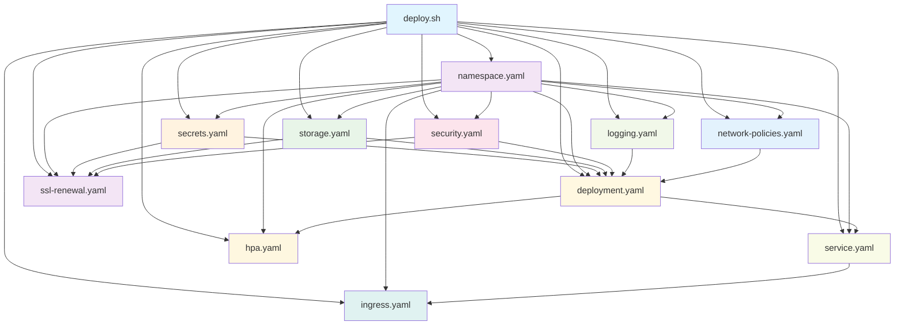

# Kubernetes Directory

This directory contains all the Kubernetes manifests and deployment scripts for the OpenEMR on EKS deployment. The manifests are designed for production-grade healthcare applications with comprehensive security, compliance, monitoring, and high availability features.

## 📋 Table of Contents

### **📁 Directory Overview**
- [Directory Structure](#directory-structure)
- [Core Deployment Files](#core-deployment-files)

### **📄 Deployment Script and Manifest Files**
- Deployment Script
  - [deploy.sh](#deploysh)
- Kubernetes Manifest Files
  - [namespace.yaml](#namespaceyaml)
  - [secrets.yaml](#secretsyaml)
  - [storage.yaml](#storageyaml)
  - [deployment.yaml](#deploymentyaml)
  - [service.yaml](#serviceyaml)
  - [ingress.yaml](#ingressyaml)
  - [hpa.yaml](#hpayaml)
  - [security.yaml](#securityyaml)
  - [network-policies.yaml](#network-policiesyaml)
  - [logging.yaml](#loggingyaml)
  - [ssl-renewal.yaml](#ssl-renewalyaml)

### **🚀 Deployment & Operations**
- [Deployment Workflow](#deployment-workflow)
  - [1-prerequisites](#1-prerequisites)
  - [2-deployment-order](#2-deployment-order)
  - [3-configuration-management](#3-configuration-management)

### **🔧 Reference & Support**
- [Maintenance Guidelines](#maintenance-guidelines)
- [Best Practices](#best-practices)
- [Troubleshooting](#troubleshooting)
- [Support](#support)

## Directory Structure

### Core Deployment Files

- **`deploy.sh`** - Main deployment orchestrator script
- **`namespace.yaml`** - Kubernetes namespaces (openemr, monitoring)
- **`secrets.yaml`** - Secret templates for database and application credentials
- **`storage.yaml`** - EFS storage classes and persistent volume claims
- **`deployment.yaml`** - OpenEMR application deployment with sidecar logging
- **`service.yaml`** - LoadBalancer service for external access
- **`ingress.yaml`** - ALB ingress with WAF integration
- **`hpa.yaml`** - Horizontal Pod Autoscaler and Pod Disruption Budget
- **`security.yaml`** - ServiceAccount, RBAC, and IRSA configuration
- **`network-policies.yaml`** - Network security policies
- **`logging.yaml`** - Fluent Bit sidecar configuration for log aggregation
- **`ssl-renewal.yaml`** - Automated SSL certificate renewal CronJob

## Kubernetes Manifest Dependency Graph



## Detailed File Descriptions

### Core Infrastructure

#### `deploy.sh`

- **Purpose**: Main deployment orchestrator that coordinates all Kubernetes resources
- **Key Features**:
  - Terraform output integration
  - SSL certificate management (ACM or self-signed)
  - WAF configuration
  - OpenEMR feature toggles (API, Patient Portal)
  - Comprehensive error handling and validation
  - Credential generation and management
- **Dependencies**: Terraform outputs, AWS CLI, kubectl, helm
- **Maintenance Notes**:
  - Update OpenEMR version references as needed
  - Modify autoscaling parameters as needed
  - Add new feature toggles for OpenEMR capabilities
  - Update SSL certificate handling logic as needed

#### `namespace.yaml`

- **Purpose**: Defines Kubernetes namespaces with security labels
- **Key Components**:
  - `openemr` namespace for application
  - `monitoring` namespace for observability
  - Pod Security Standards enforcement
- **Dependencies**: None (foundation)
- **Maintenance Notes**:
  - Add new namespaces for additional services
  - Update security labels as needed
  - Modify Pod Security Standards as requirements change

### Storage and Persistence

#### `storage.yaml`

- **Purpose**: EFS storage configuration and persistent volume claims
- **Key Components**:
  - EFS StorageClass for OpenEMR data
  - EFS StorageClass for backups
  - EBS StorageClass for monitoring data
  - PVCs for sites, SSL, Let's Encrypt, and backups
- **Dependencies**: EFS CSI driver, EFS file system
- **Maintenance Notes**:
  - Adjust storage sizes based on usage patterns
  - Update EFS parameters for performance optimization
  - Add new PVCs for additional services
  - Modify volume binding modes as needed

### Application Deployment

#### `deployment.yaml`

- **Purpose**: OpenEMR application deployment with comprehensive configuration
- **Key Components**:
  - OpenEMR container with security context
  - Fluent Bit sidecar for logging
  - Environment variable configuration
  - Health checks and probes
  - Volume mounts for persistent storage
  - IRSA integration for AWS services
- **Dependencies**: `secrets.yaml`, `storage.yaml`, `security.yaml`, `logging.yaml`
- **Maintenance Notes**:
  - Update OpenEMR image version regularly when new stable production versions are released (latest version is development; we want the one before that)
  - Modify resource requests/limits based on performance
  - Add new environment variables for features as needed
  - Update health check paths if OpenEMR changes
  - Adjust security context as needed

#### `service.yaml`

- **Purpose**: LoadBalancer service for external access
- **Key Components**:
  - NLB configuration
  - SSL termination options
  - Session affinity configuration
  - Backend protocol selection
- **Dependencies**: `deployment.yaml`
- **Maintenance Notes**:
  - Update SSL certificate ARN references
  - Modify load balancer attributes
  - Adjust session affinity settings
  - Add new ports for additional services

#### `ingress.yaml`

- **Purpose**: ALB ingress with WAF integration
- **Key Components**:
  - ALB ingress controller configuration
  - SSL certificate management
  - WAF integration
  - Access logging to S3
  - Health check configuration
- **Dependencies**: `service.yaml`, S3 bucket, WAF ACL
- **Maintenance Notes**:
  - Update WAF ACL ARN references as needed
  - Modify ALB attributes for performance if optimizations are discovered
  - Add new ingress rules for additional services as we add them
  - Update SSL policies as needed

### Scaling and Availability

#### `hpa.yaml`

- **Purpose**: Horizontal Pod Autoscaler and Pod Disruption Budget
- **Key Components**:
  - CPU and memory-based scaling
  - Scaling behavior policies
  - Pod Disruption Budget for availability
  - Configurable thresholds and limits
- **Dependencies**: `deployment.yaml`
- **Maintenance Notes**:
  - Adjust scaling thresholds based on performance
  - Modify scaling policies for different workloads
  - Update replica limits as needed
  - Fine-tune stabilization windows

### Security and Access Control

#### `secrets.yaml`

- **Purpose**: Secret templates for sensitive data
- **Key Components**:
  - Database credentials
  - Redis credentials
  - Application credentials
  - TLS certificates
- **Dependencies**: None (populated by deploy script)
- **Maintenance Notes**:
  - Update secret names for new services
  - Add new secret types as needed
  - Modify base64 encoding as required

#### `security.yaml`

- **Purpose**: ServiceAccount, RBAC, and IRSA configuration
- **Key Components**:
  - ServiceAccount with IRSA annotation
  - Role and RoleBinding for OpenEMR
  - AWS IAM role integration
- **Dependencies**: IAM role from Terraform
- **Maintenance Notes**:
  - Update IAM role ARN references
  - Add new RBAC rules for additional services
  - Modify permissions as needed
  - Update service account annotations

#### `network-policies.yaml`

- **Purpose**: Network security policies
- **Key Components**:
  - Ingress rules for OpenEMR access
  - Egress rules for database and external services
  - Namespace-based access control
  - Port-specific restrictions
- **Dependencies**: `deployment.yaml`
- **Maintenance Notes**:
  - Add new network policies for additional services
  - Update port ranges as needed
  - Modify namespace selectors
  - Add new egress rules for external services

### Observability and Logging

#### `logging.yaml`

- **Purpose**: Fluent Bit sidecar configuration for log aggregation
- **Key Components**:
  - Log collection from multiple sources
  - CloudWatch Logs integration
  - Log filtering and processing
  - Metrics collection
- **Dependencies**: `deployment.yaml`, CloudWatch Logs
- **Maintenance Notes**:
  - Add new log sources as needed
  - Update log group names as needed
  - Modify log processing rules as needed
  - Add new output destinations as needed

### Maintenance and Automation

#### `ssl-renewal.yaml`

- **Purpose**: Automated SSL certificate renewal
- **Key Components**:
  - CronJob for certificate renewal
  - Certificate generation and replacement
  - Backup and cleanup procedures
  - Test job for validation
- **Dependencies**: `deployment.yaml`, `storage.yaml`
- **Maintenance Notes**:
  - Modify renewal schedule as needed
  - Add new certificate types as needed
  - Update cleanup policies as needed

## Deployment Workflow

### 1. Prerequisites

- EKS cluster deployed via Terraform
- AWS credentials configured
- kubectl, aws CLI, and helm installed
- Terraform outputs available

### 2. Deployment Order

1. **Infrastructure Setup**: `namespace.yaml` → `secrets.yaml` → `storage.yaml`
2. **Security Configuration**: `security.yaml` → `network-policies.yaml`
3. **Logging Setup**: `logging.yaml`
4. **Application Deployment**: `deployment.yaml` → `service.yaml`
5. **External Access**: `ingress.yaml`
6. **Scaling Configuration**: `hpa.yaml`
7. **Maintenance Automation**: `ssl-renewal.yaml`

### 3. Configuration Management

- All manifests use placeholder variables (e.g., `${EFS_ID}`)
- `deploy.sh` replaces placeholders with Terraform outputs
- Environment-specific values injected at deployment time
- Secrets populated with generated or retrieved values

## Maintenance Guidelines

### Adding New Services

1. **Create New Manifests**:
   - Follow existing naming conventions
   - Use appropriate security contexts
   - Include health checks and probes
   - Add to dependency graph

2. **Update Dependencies**:
   - Add new PVCs to `storage.yaml`
   - Create new secrets in `secrets.yaml`
   - Update network policies
   - Add RBAC rules if needed

3. **Modify Deploy Script**:
   - Add new placeholder replacements
   - Include new manifest applications
   - Update validation logic

### Upgrading OpenEMR

1. **Update Image References**:
   - Change version in `deployment.yaml`
   - Update `ssl-renewal.yaml` if needed
   - Test with new version

2. **Review Configuration**:
   - Check environment variables
   - Verify health check paths
   - Update resource requirements if needed

3. **Test Deployment**:
   - Use staging environment
   - Validate all features
   - Check performance metrics

### Scaling Adjustments

1. **HPA Configuration**:
   - Adjust CPU/memory thresholds as needed
   - Modify replica limits as needed
   - Update scaling policies as needed

2. **Resource Optimization**:
   - Review resource requests/limits
   - Adjust based on usage patterns
   - Monitor performance metrics

### Security Updates

1. **Network Policies**:
   - Review ingress/egress rules
   - Add new service restrictions as needed
   - Update namespace selectors as needed

2. **RBAC Updates**:
   - Review role permissions
   - Add new service accounts as needed
   - Update role bindings as needed

3. **Security Contexts**:
   - Review container security
   - Update capability requirements as needed
   - Modify user/group settings as needed

## Troubleshooting

### Common Issues

1. **Pod Stuck in Pending**:
   - Check PVC binding status
   - Verify EFS CSI driver
   - Review resource requests

2. **Service Not Accessible**:
   - Check LoadBalancer status
   - Verify ingress configuration
   - Review network policies

3. **Scaling Issues**:
   - Check HPA status
   - Review resource metrics
   - Verify scaling policies

4. **Logging Problems**:
   - Check Fluent Bit logs
   - Verify CloudWatch permissions
   - Review log group configuration

### Debugging Commands

```bash
# Check pod status
kubectl get pods -n openemr -o wide

# Check PVC status
kubectl get pvc -n openemr

# Check service status
kubectl get svc -n openemr

# Check ingress status
kubectl get ingress -n openemr

# Check HPA status
kubectl get hpa -n openemr

# Check logs
kubectl logs -n openemr -l app=openemr

# Check events
kubectl get events -n openemr --sort-by='.lastTimestamp'
```

## Best Practices

### Development

- Always test changes in staging first
- Use version control for all manifest changes
- Document any custom configurations

### Security

- Use least privilege principles
- Regularly review RBAC permissions
- Keep security contexts up to date
- Monitor network policies

### Performance

- Monitor resource utilization
- Adjust scaling parameters based on metrics
- Use appropriate storage classes
- Optimize health check intervals

### Maintenance

- Regular backup testing
- Monitor certificate expiration
- Update images regularly
- Review and update configurations

## Support

For issues related to:

- **Kubernetes manifests**: Check this README and troubleshooting section
- **Deployment script**: Review `deploy.sh` comments and error messages
- **Infrastructure**: Refer to [terraform directory documentation](../terraform/README.md)
- **Monitoring**: Check [monitoring directory documentation](../monitoring/README.md)