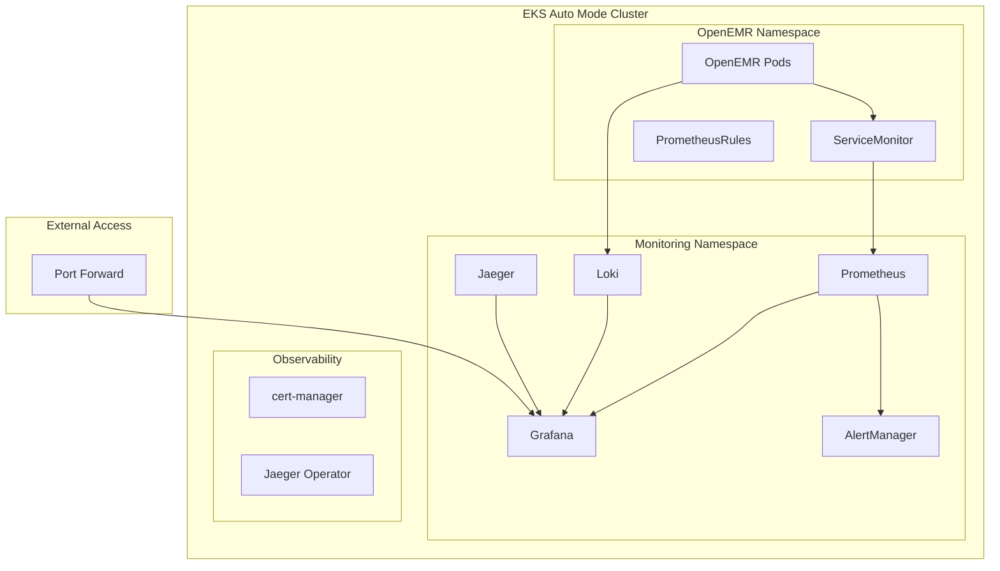
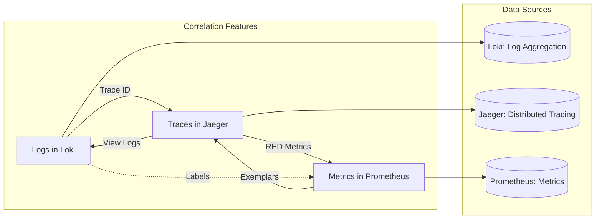

# OpenEMR Monitoring Stack for EKS Auto Mode

A production-ready monitoring solution for OpenEMR on EKS Auto Mode, featuring automated deployment, intelligent autoscaling, and deep observability.

> **⚠️ Important**: This is an **optional** monitoring stack. The core OpenEMR deployment includes CloudWatch logging. This stack adds enterprise-grade observability with Prometheus, Grafana, Loki, and Jaeger.

## 📋 Table of Contents

- [Architecture Overview](#%EF%B8%8F-architecture-overview)
- [Prerequisites](#-prerequisites)
- [Quick Start](#-quick-start)
- [Cost Analysis](#-cost-analysis)
- [Configuration](#️-configuration)
- [Access Methods](#-access-methods)
- [Dashboards](#-dashboards)
- [Security & Compliance](#-security--compliance)
- [Maintenance](#-maintenance)
- [Additional Resources](#-additional-resources)

## 🏗️ Architecture Overview

### Monitoring Stack Components



### Storage Requirements

| Component | Storage Size | Retention | Storage Type | Cost Impact |
|-----------|-------------|-----------|---------------|-------------|
| **Prometheus** | 100Gi | 30 days | gp3-monitoring-encrypted (EBS) | $8/month    |
| **Grafana** | 20Gi | Persistent | gp3-monitoring-encrypted (EBS) | $1.60/month |
| **Loki** | N/A | 720 hours | AWS S3 (Object Storage) | Variable (lifecycle policies) |
| **AlertManager** | 20Gi | Persistent | gp3-monitoring-encrypted (EBS) | $1.60/month |

**Loki S3 Storage Architecture:**
- **Production-Grade Storage**: Loki uses AWS S3 for log storage instead of filesystem storage
- **Recommendation**: As [recommended by Grafana](https://grafana.com/docs/loki/latest/setup/install/helm/configure-storage/), we configure object storage via cloud provider for production deployments
- **Benefits**:
  - **Durability**: 99.999999999% (11 nines) durability with S3
  - **Scalability**: Automatically scales with log volume without storage provisioning
  - **Cost-Effectiveness**: Lifecycle policies automatically transition to cheaper storage tiers (Intelligent-Tiering after 30 days, Glacier after 90 days)
  - **Lifecycle Management**: Automatic deletion after 720 days (30 days retention as configured in Loki)
  - **Security**: KMS encryption and IAM role-based access (IRSA) - no credentials needed
- **IAM Integration**: Uses IRSA (IAM Roles for Service Accounts) for secure, credential-free S3 access
- **Setup**: Terraform automatically creates the S3 bucket and IAM role, installation script retrieves and configures them

See pricing documentation for EBS [here](https://aws.amazon.com/ebs/pricing/).

### Unified Observability: Logs, Metrics, and Traces

This monitoring stack provides **full correlation** between logs, metrics, and traces, enabling faster root-cause analysis and long-term compliance.



### Autoscaling with EKS Auto Mode

```yaml
# Two-layer autoscaling architecture
Layer 1: Pod-level (HPA) - Fully Configurable
├── Grafana: 1-3 replicas (CPU 70%, Memory 80%) [Configurable]
├── Prometheus: 1-3 replicas (CPU 70%, Memory 80%) [Configurable]
├── Loki: 1-3 replicas (CPU 70%, Memory 80%) [Configurable]
├── Jaeger: 1-3 replicas (CPU 70%, Memory 80%) [Configurable]
└── AlertManager: 1-3 replicas (CPU 70%, Memory 80%) [Configurable]

Layer 2: Node-level (EKS Auto Mode)
├── Automatic EC2 provisioning when pods pending
├── 12% management fee on EC2 costs
└── 21-day node rotation for security

# Configuration via environment variables:
# ENABLE_AUTOSCALING="1"              # Enable/disable autoscaling
# GRAFANA_MIN_REPLICAS="1"            # Min replicas per component
# GRAFANA_MAX_REPLICAS="3"            # Max replicas per component
# HPA_CPU_TARGET="70"                 # CPU target percentage
# HPA_MEMORY_TARGET="80"              # Memory target percentage
```

## 📋 Prerequisites

### Required Components (From Core Deployment)

- ✅ EKS cluster with Auto Mode enabled (Kubernetes 1.29+)
- ✅ OpenEMR deployed and running
- ✅ Storage classes created (gp3-monitoring-encrypted)
- ✅ EFS CSI driver installed
- ✅ **Terraform applied** - Loki S3 bucket and IAM role must be created via Terraform before installation

### Required Tools

```bash
# Verify tools are installed
kubectl version --client  # >= 1.29
helm version             # >= 3.12
jq --version            # >= 1.6
terraform version       # >= 1.0 (for S3 bucket and IAM role setup)

# Check cluster access
kubectl cluster-info
kubectl get nodes  # May be empty with Auto Mode
```

### Terraform Requirements for Loki S3 Storage

Before installing the monitoring stack, ensure Terraform has been applied to create the Loki S3 bucket and IAM role:

```bash
cd terraform

# Verify Terraform is initialized
terraform init

# Apply Terraform to create Loki S3 bucket and IAM role
terraform apply

# Verify outputs are available
terraform output loki_s3_bucket_name
terraform output loki_s3_role_arn
```

The installation script will automatically retrieve the S3 bucket name and IAM role ARN from Terraform outputs. Without these, the Loki installation will fail.

### Cluster Capacity Requirements

```bash
# Minimum available resources needed:
# - CPU: 4 cores (across all nodes)
# - Memory: 8Gi (across all nodes)
# - Storage: 250Gi available

# Check current usage
kubectl describe nodes | grep -A 5 "Allocatable"
```

## 🚀 Quick Start

### Basic Installation (Recommended)

```bash
cd monitoring

# Install with defaults (CloudWatch integration, no ingress)
./install-monitoring.sh
```


### Access Credentials

```bash
# After installation, retrieve credentials
cat credentials/monitoring-credentials.txt

# Example output:
# Grafana Admin User: admin
# Grafana Admin Password: <auto-generated-password>
```

## 💰 Cost Analysis

### Monthly Cost Breakdown by Organization Size

**Note:** Loki now uses AWS S3 for primary storage, significantly reducing EBS storage costs while providing better durability and scalability. A small 10Gi EBS volume is used only for temporary files and local caching.

#### Small Clinic

| Component | Configuration                      | Monthly Cost     |
|-----------|------------------------------------|------------------|
| EC2 Compute (Auto Mode) | 2 t3.small equiv. AVG ($0.0208/hr) | $30.36           |
| Auto Mode Fee (12%) | Management overhead                | $3.64            |
| Storage (140Gi EBS + S3) | GP3 encrypted (Prometheus 100Gi, Grafana 20Gi, Loki 10Gi, AlertManager 20Gi) | $11.20           |
| **S3 Storage (Loki)** | Variable (lifecycle policies) | ~$5-15           |
| **Total** |                                    | **~50-60/month** |

#### Hospital

| Component | Configuration                       | Monthly Cost     |
|-----------|-------------------------------------|------------------|
| EC2 Compute (Auto Mode) | 2 t3.medium equiv. AVG ($0.0416/hr) | $60.74           |
| Auto Mode Fee (12%) | Management overhead                 | $7.29            |
| Storage (140Gi EBS + S3) | GP3 encrypted (Prometheus 100Gi, Grafana 20Gi, Loki 10Gi, AlertManager 20Gi) | $11.20           |
| **S3 Storage (Loki)** | Variable (lifecycle policies) | ~$10-30          |
| **Total** |                                     | **~89-109/month** |

#### Large Hospital

| Component | Configuration                      | Monthly Cost      |
|-----------|------------------------------------|-------------------|
| EC2 Compute (Auto Mode) | 2 t3.large equiv. AVG ($0.0832/hr) | $121.47           |
| Auto Mode Fee (12%) | Management overhead                | $14.58            |
| Storage (140Gi EBS + S3) | GP3 encrypted (Prometheus 100Gi, Grafana 20Gi, Loki 10Gi, AlertManager 20Gi) | $11.20            |
| **S3 Storage (Loki)** | Variable (lifecycle policies) | ~$20-50           |
| **Total** |                                    | **~167-197/month** |

**S3 Storage Cost Notes:**
- **Intelligent-Tiering**: After 30 days, data automatically transitions to lower-cost tiers
- **Glacier**: After 90 days, data transitions to Glacier for archival storage
- **Lifecycle Management**: Automatic deletion after 720 days (30-day retention as configured in Loki)
- **Actual costs depend on log volume**: Typical deployments see $5-50/month for S3 storage depending on log ingestion rate
- **Benefits over EBS**: No need to pre-provision storage, automatic scaling, better durability (11 nines), and lower costs at scale

### Cost Optimization Strategies

```bash
# 1. Reduce retention periods
export PROMETHEUS_RETENTION="15d"  # Default: 30d
export LOKI_RETENTION="360h"       # Default: 720h

# 2. S3 Lifecycle Policies (automatically configured)
# - Intelligent-Tiering after 30 days (reduces storage cost)
# - Glacier transition after 90 days (further cost reduction)
# - Automatic deletion after 720 days
# - No action needed - these are handled by Terraform

# 3. Reduce Loki EBS volume size (if needed)
# The Loki EBS volume is only for temporary files (10Gi default)
# This can be reduced if log volume is very low, but 10Gi is already minimal
```

**Loki S3 Storage Cost Optimization:**
- **Automatic tiering**: Data automatically moves to cheaper storage tiers (no manual intervention needed)
- **Cost-effective at scale**: S3 storage scales with your log volume without upfront provisioning
- **Lifecycle management**: Old data is automatically archived and deleted according to retention policies
- **Actual savings**: Reduced from 100Gi EBS ($8/month) to 10Gi EBS ($0.80/month) + variable S3 costs ($5-50/month depending on volume)

## ⚙️ Configuration

### Essential Environment Variables

See complete reference in this project at [monitoring/openemr-monitoring.conf.example](./openemr-monitoring.conf.example)

### Autoscaling Configuration

The monitoring stack includes comprehensive autoscaling capabilities that can be customized for your environment:

#### Basic Autoscaling Settings

```bash
# Enable/disable autoscaling (default: enabled)
export ENABLE_AUTOSCALING="1"

# CPU and Memory targets for scaling decisions
export HPA_CPU_TARGET="70"        # CPU usage percentage (default: 70%)
export HPA_MEMORY_TARGET="80"     # Memory usage percentage (default: 80%)
```

#### Component-Specific Replica Limits

```bash
# Grafana autoscaling
export GRAFANA_MIN_REPLICAS="1"   # Minimum replicas (default: 1)
export GRAFANA_MAX_REPLICAS="3"   # Maximum replicas (default: 3)

# Prometheus autoscaling
export PROMETHEUS_MIN_REPLICAS="1"   # Minimum replicas (default: 1)
export PROMETHEUS_MAX_REPLICAS="3"   # Maximum replicas (default: 3)

# Loki autoscaling
export LOKI_MIN_REPLICAS="1"      # Minimum replicas (default: 1)
export LOKI_MAX_REPLICAS="3"      # Maximum replicas (default: 3)

# AlertManager autoscaling (when Slack alerts enabled)
export ALERTMANAGER_MIN_REPLICAS="1"   # Minimum replicas (default: 1)
export ALERTMANAGER_MAX_REPLICAS="3"   # Maximum replicas (default: 3)

# Jaeger autoscaling
export JAEGER_MIN_REPLICAS="1"    # Minimum replicas (default: 1)
export JAEGER_MAX_REPLICAS="3"    # Maximum replicas (default: 3)
```

#### Example Configurations

**High Availability Setup:**
```bash
export GRAFANA_MIN_REPLICAS="2"
export PROMETHEUS_MIN_REPLICAS="2"
export LOKI_MIN_REPLICAS="2"
export ALERTMANAGER_MIN_REPLICAS="2"
export JAEGER_MIN_REPLICAS="2"
```

**Cost-Optimized Setup:**
```bash
export GRAFANA_MAX_REPLICAS="2"
export PROMETHEUS_MAX_REPLICAS="2"
export LOKI_MAX_REPLICAS="2"
export ALERTMANAGER_MAX_REPLICAS="2"
export JAEGER_MAX_REPLICAS="2"
export HPA_CPU_TARGET="80"        # Higher threshold = less scaling
```

**High Performance Setup:**
```bash
export GRAFANA_MAX_REPLICAS="5"
export PROMETHEUS_MAX_REPLICAS="3"
export LOKI_MAX_REPLICAS="4"
export ALERTMANAGER_MAX_REPLICAS="3"
export JAEGER_MAX_REPLICAS="4"
export HPA_CPU_TARGET="60"        # Lower threshold = more scaling
```

**Disable Autoscaling:**
```bash
export ENABLE_AUTOSCALING="0"     # All components run with minimum replicas
```

## 🌐 Access Methods

### Port-Forwarding (Recommended)

```bash
# Grafana (primary interface)
kubectl port-forward -n monitoring svc/prometheus-stack-grafana 3000:80
# Access: http://localhost:3000
# Login: admin / <check credentials file>

# Prometheus (metrics exploration)
kubectl port-forward -n monitoring svc/prometheus-stack-kube-prom-prometheus 9090:9090
# Access: http://localhost:9090

# AlertManager (alert management)
kubectl port-forward -n monitoring svc/prometheus-stack-kube-prom-alertmanager 9093:9093
# Access: http://localhost:9093

# Loki (log exploration)
kubectl port-forward -n monitoring svc/loki 3100:3100
# Access: http://localhost:3100
```


## 📊 Dashboards

### Pre-Configured Dashboards

After installation, these dashboards are automatically available:

#### System Dashboards

- **Kubernetes / Compute Resources / Cluster** - Overall cluster health
- **Kubernetes / Compute Resources / Namespace (Pods)** - Per-namespace metrics
- **Node Exporter / Nodes** - Host-level metrics
- **Kubernetes / Networking / Cluster** - Network performance

#### OpenEMR Monitoring

```bash
# In Grafana:
1. Open "Kubernetes / Compute Resources / Namespace (Pods)"
2. Set namespace filter to "openemr"
3. View all OpenEMR pod metrics
```

#### 📚 Data Source Reference

Your Grafana has these data sources pre-configured:

| Data Source | Purpose |
|-------------|---------|
| **Prometheus** | Metrics (CPU, memory, requests) |
| **Loki** | Logs (application, system) |
| **Jaeger** | Distributed traces |
| **CloudWatch** | Compliance logs (long-term) |
| **AlertManager** | Alert management |

## 🔒 Security & Compliance

### Compliance Features

| Requirement | Implementation | Verification                                                                                                 |
|-------------|---------------|--------------------------------------------------------------------------------------------------------------|
| **Encryption at Rest** | GP3 encrypted storage | `kubectl get sc gp3-monitoring-encrypted -o yaml`                                                            |
| **Encryption in Transit** | TLS 1.2+ for all traffic | All traffic uses port-forwarding (local access only)                                                                              |
| **Access Control** | RBAC + Basic Auth + TLS | Review service accounts and secrets                                                                          |
| **Data Retention** | Configurable retention | Review and confirm configuration allows for necessary retention of data in compliance with relevant policies |
| **Network Isolation** | NetworkPolicies | `kubectl get networkpolicy -n monitoring`                                                                    |

### Security Hardening Checklist

- [ ] Use port-forwarding or another secure method for local access
- [ ] Configure cert-manager for automatic certificate renewal
- [ ] Set up authentication
- [ ] Apply NetworkPolicies
- [ ] Configure AlertManager for security alerts
- [ ] Review and restrict RBAC permissions
- [ ] Enable audit logging
- [ ] Set appropriate data retention policies
- [ ] Regularly update Helm charts
- [ ] Monitor for CVEs in container images

## 🔄 Maintenance

### Daily Tasks

```bash
# Check component health
kubectl get pods -n monitoring

# Review recent alerts
kubectl port-forward -n monitoring svc/prometheus-stack-kube-prom-alertmanager 9093:9093
# Open http://localhost:9093
```

### Weekly Tasks

```bash
# Review autoscaling events and HPA status
kubectl get events -n monitoring --field-selector reason=ScalingReplicaSet
kubectl get hpa -n monitoring
kubectl describe hpa -n monitoring

# Check current replica counts
kubectl get pods -n monitoring -o wide

# Check storage usage
kubectl exec -n monitoring prometheus-prometheus-stack-kube-prom-prometheus-0 -- \
  df -h /prometheus

# Review Grafana dashboards usage
# Check which dashboards are most/least used

# Monitor autoscaling behavior
kubectl get hpa -n monitoring -o custom-columns=\
NAME:.metadata.name,\
REFERENCE:.spec.scaleTargetRef.name,\
TARGETS:.status.currentCPUUtilizationPercentage,\
MINPODS:.spec.minReplicas,\
MAXPODS:.spec.maxReplicas,\
REPLICAS:.status.currentReplicas
```

### Monthly Tasks

```bash
# Update Helm charts
helm repo update
helm list -n monitoring

# Check for new versions
helm search repo prometheus-community/kube-prometheus-stack --versions | head -5
helm search repo grafana/loki --versions | head -5

# Review and optimize retention
# Adjust based on storage costs and compliance needs
```

### Upgrade Procedures

```bash
# Backup current values
helm get values prometheus-stack -n monitoring > prometheus-stack-values-backup.yaml

# Upgrade Prometheus stack
helm upgrade prometheus-stack prometheus-community/kube-prometheus-stack \
  --namespace monitoring \
  --version <new-version> \
  --values prometheus-values.yaml \
  --timeout 45m --atomic

# Upgrade Loki
helm upgrade loki grafana/loki \
  --namespace monitoring \
  --version <new-version> \
  --timeout 35m --atomic
```

## 📚 Additional Resources

### Documentation

- [Prometheus Best Practices](https://prometheus.io/docs/practices/)
- [Grafana Dashboards](https://grafana.com/grafana/dashboards/)
- [Loki Query Language](https://grafana.com/docs/loki/latest/logql/)
- [EKS Auto Mode Documentation](https://docs.aws.amazon.com/eks/latest/userguide/automode.html)

### Troubleshooting

- [Kubernetes Monitoring Guide](https://kubernetes.io/docs/tasks/debug/)
- [Prometheus Troubleshooting](https://prometheus-operator.dev/docs/platform/troubleshooting/)

### Support

- OpenEMR Community Forum: <https://community.open-emr.org>
- [Get an invite to join the Kubernetes Slack here!](https://communityinviter.com/apps/kubernetes/community)
- [#prometheus-operator](https://kubernetes.slack.com/archives/CFFDS2Z7F) channel on Kubernetes Slack.

---

**Remember**: This monitoring stack is optional but recommended for production healthcare environments requiring comprehensive observability beyond basic CloudWatch logging.
