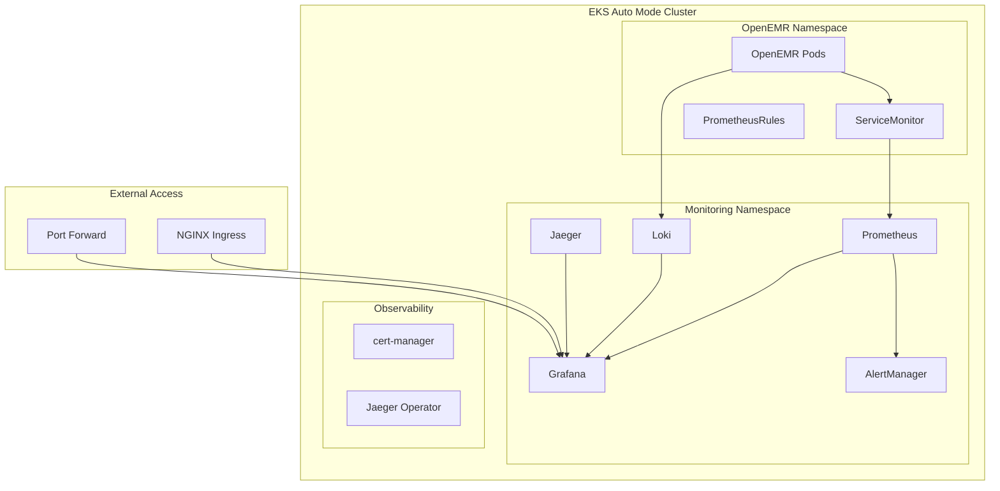

# OpenEMR Monitoring Stack for EKS Auto Mode

A production-ready monitoring solution for OpenEMR on EKS Auto Mode, featuring automated deployment, intelligent autoscaling, and deep observability.

> **⚠️ Important**: This is an **optional** monitoring stack. The core OpenEMR deployment includes CloudWatch logging. This stack adds enterprise-grade observability with Prometheus, Grafana, Loki, and Jaeger.

## 📋 Table of Contents

- [Architecture Overview](#%EF%B8%8F-architecture-overview)
- [Prerequisites](#-prerequisites)
- [Quick Start](#-quick-start)
- [Cost Analysis](#-cost-analysis)
- [Configuration](#️-configuration)
- [Access Methods](#-access-methods)
- [Dashboards](#-dashboards)
- [Security & Compliance](#-security--compliance)
- [Maintenance](#-maintenance)
- [Additional Resources](#-additional-resources)

## 🏗️ Architecture Overview

### Monitoring Stack Components



### Storage Requirements

| Component | Storage Size | Retention | Storage Class | Cost Impact |
|-----------|-------------|-----------|---------------|-------------|
| **Prometheus** | 100Gi | 30 days | gp3-monitoring-encrypted | $8/month    |
| **Grafana** | 20Gi | Persistent | gp3-monitoring-encrypted | $1.60/month |
| **Loki** | 100Gi | 720 hours | gp3-monitoring-encrypted | $8/month    |
| **AlertManager** | 20Gi | Persistent | gp3-monitoring-encrypted | $1.60/month |

See pricing documentation for EBS [here](https://aws.amazon.com/ebs/pricing/).

### Autoscaling with EKS Auto Mode

```yaml
# Two-layer autoscaling architecture
Layer 1: Pod-level (HPA)
├── Grafana: 1-3 replicas (CPU 70%, Memory 80%)
├── Loki: 1-3 replicas (CPU 70%, Memory 80%)
├── Jaeger: 1-3 replicas (CPU 70%, Memory 80%)
└── AlertManager: 1-3 replicas (CPU 70%, Memory 80%)

Layer 2: Node-level (EKS Auto Mode)
├── Automatic EC2 provisioning when pods pending
├── 12% management fee on EC2 costs
└── 21-day node rotation for security
```

## 📋 Prerequisites

### Required Components (From Core Deployment)

- ✅ EKS cluster with Auto Mode enabled (Kubernetes 1.29+)
- ✅ OpenEMR deployed and running
- ✅ Storage classes created (gp3-monitoring-encrypted)
- ✅ EFS CSI driver installed

### Required Tools

```bash
# Verify tools are installed
kubectl version --client  # >= 1.29
helm version             # >= 3.12
jq --version            # >= 1.6

# Check cluster access
kubectl cluster-info
kubectl get nodes  # May be empty with Auto Mode
```

### Cluster Capacity Requirements

```bash
# Minimum available resources needed:
# - CPU: 4 cores (across all nodes)
# - Memory: 8Gi (across all nodes)
# - Storage: 250Gi available

# Check current usage
kubectl describe nodes | grep -A 5 "Allocatable"
```

## 🚀 Quick Start

### Basic Installation (Recommended)

```bash
cd monitoring

# Install with defaults (CloudWatch integration, no ingress)
./install-monitoring.sh
```

### Production Installation with Ingress

```bash
# Configure for production access
export ENABLE_INGRESS="1"
export GRAFANA_HOSTNAME="grafana.yourhospital.org"
export ENABLE_BASIC_AUTH="1"

# Optional: Slack alerting
export SLACK_WEBHOOK_URL="https://hooks.slack.com/services/..."
export SLACK_CHANNEL="#openemr-alerts"

# Install (total install time ~5-10 minutes)
./install-monitoring.sh

# Verify installation
./install-monitoring.sh verify
```

### Access Credentials

```bash
# After installation, retrieve credentials
cat credentials/monitoring-credentials.txt

# Example output:
# Grafana Admin User: admin
# Grafana Admin Password: <auto-generated-password>
```

## 💰 Cost Analysis

### Monthly Cost Breakdown by Organization Size

#### Small Clinic

| Component | Configuration                      | Monthly Cost     |
|-----------|------------------------------------|------------------|
| EC2 Compute (Auto Mode) | 2 t3.small equiv. AVG ($0.0208/hr) | $30.36           |
| Auto Mode Fee (12%) | Management overhead                | $3.64            |
| Storage (240Gi total) | GP3 encrypted                      | $19.20           |
| **Total** |                                    | **~53.20/month** |

#### Hospital

| Component | Configuration                       | Monthly Cost     |
|-----------|-------------------------------------|------------------|
| EC2 Compute (Auto Mode) | 2 t3.medium equiv. AVG ($0.0416/hr) | $60.74           |
| Auto Mode Fee (12%) | Management overhead                 | $7.29            |
| Storage (240Gi total) | GP3 encrypted                       | $19.20           |
| **Total** |                                     | **~87.23/month** |

#### Large Hospital

| Component | Configuration                      | Monthly Cost      |
|-----------|------------------------------------|-------------------|
| EC2 Compute (Auto Mode) | 2 t3.large equiv. AVG ($0.0832/hr) | $121.47           |
| Auto Mode Fee (12%) | Management overhead                | $14.58            |
| Storage (240Gi total) | GP3 encrypted                      | $19.20            |
| **Total** |                                    | **~155.25/month** |

### Cost Optimization Strategies

```bash
# 1. Reduce retention periods
export PROMETHEUS_RETENTION="15d"  # Default: 30d
export LOKI_RETENTION="360h"       # Default: 720h
```

## ⚙️ Configuration

### Essential Environment Variables

See complete reference in this project at [monitoring/openemr-monitoring.conf.example](./openemr-monitoring.conf.example)

## 🌐 Access Methods

### Method 1: Port-Forward (Development)

```bash
# Grafana (primary interface)
kubectl port-forward -n monitoring svc/prometheus-stack-grafana 3000:80
# Access: http://localhost:3000
# Login: admin / <check credentials file>

# Prometheus (metrics exploration)
kubectl port-forward -n monitoring svc/prometheus-stack-kube-prom-prometheus 9090:9090
# Access: http://localhost:9090

# AlertManager (alert management)
kubectl port-forward -n monitoring svc/prometheus-stack-kube-prom-alertmanager 9093:9093
# Access: http://localhost:9093

# Loki (log exploration)
kubectl port-forward -n monitoring svc/loki 3100:3100
# Access: http://localhost:3100
```

### Method 2: NGINX Ingress (Production)

```bash
# Prerequisites
# 1. Install NGINX Ingress Controller
kubectl apply -f https://raw.githubusercontent.com/kubernetes/ingress-nginx/controller-v1.13.1/deploy/static/provider/aws/deploy.yaml

# 2. Configure DNS
# Point grafana.yourhospital.org to ingress LoadBalancer

# 3. Access
# URL: https://grafana.yourhospital.org
# Basic Auth: As configured
# Grafana Login: admin / <password>
```

## 📊 Dashboards

### Pre-Configured Dashboards

After installation, these dashboards are automatically available:

#### System Dashboards

- **Kubernetes / Compute Resources / Cluster** - Overall cluster health
- **Kubernetes / Compute Resources / Namespace (Pods)** - Per-namespace metrics
- **Node Exporter / Nodes** - Host-level metrics
- **Kubernetes / Networking / Cluster** - Network performance

#### OpenEMR Monitoring

```bash
# In Grafana:
1. Open "Kubernetes / Compute Resources / Namespace (Pods)"
2. Set namespace filter to "openemr"
3. View all OpenEMR pod metrics
```

## 🔒 Security & Compliance

### Compliance Features

| Requirement | Implementation | Verification                                                                                                 |
|-------------|---------------|--------------------------------------------------------------------------------------------------------------|
| **Encryption at Rest** | GP3 encrypted storage | `kubectl get sc gp3-monitoring-encrypted -o yaml`                                                            |
| **Encryption in Transit** | TLS 1.2+ for all traffic | Check ingress TLS configuration                                                                              |
| **Access Control** | RBAC + Basic Auth + TLS | Review service accounts and secrets                                                                          |
| **Data Retention** | Configurable retention | Review and confirm configuration allows for necessary retention of data in compliance with relevant policies |
| **Network Isolation** | NetworkPolicies | `kubectl get networkpolicy -n monitoring`                                                                    |

### Security Hardening Checklist

- [ ] Enable ingress with TLS only
- [ ] Configure cert-manager for automatic certificate renewal
- [ ] Set up authentication
- [ ] Apply NetworkPolicies
- [ ] Configure AlertManager for security alerts
- [ ] Review and restrict RBAC permissions
- [ ] Enable audit logging
- [ ] Set appropriate data retention policies
- [ ] Regularly update Helm charts
- [ ] Monitor for CVEs in container images

## 🔄 Maintenance

### Daily Tasks

```bash
# Check component health
kubectl get pods -n monitoring

# Review recent alerts
kubectl port-forward -n monitoring svc/prometheus-stack-kube-prom-alertmanager 9093:9093
# Open http://localhost:9093
```

### Weekly Tasks

```bash
# Review autoscaling events
kubectl get events -n monitoring --field-selector reason=ScalingReplicaSet

# Check storage usage
kubectl exec -n monitoring prometheus-prometheus-stack-kube-prom-prometheus-0 -- \
  df -h /prometheus

# Review Grafana dashboards usage
# Check which dashboards are most/least used
```

### Monthly Tasks

```bash
# Update Helm charts
helm repo update
helm list -n monitoring

# Check for new versions
helm search repo prometheus-community/kube-prometheus-stack --versions | head -5
helm search repo grafana/loki --versions | head -5

# Review and optimize retention
# Adjust based on storage costs and compliance needs
```

### Upgrade Procedures

```bash
# Backup current values
helm get values prometheus-stack -n monitoring > prometheus-stack-values-backup.yaml

# Upgrade Prometheus stack
helm upgrade prometheus-stack prometheus-community/kube-prometheus-stack \
  --namespace monitoring \
  --version <new-version> \
  --values prometheus-values.yaml \
  --timeout 45m --atomic

# Upgrade Loki
helm upgrade loki grafana/loki \
  --namespace monitoring \
  --version <new-version> \
  --timeout 35m --atomic
```

## 📚 Additional Resources

### Documentation

- [Prometheus Best Practices](https://prometheus.io/docs/practices/)
- [Grafana Dashboards](https://grafana.com/grafana/dashboards/)
- [Loki Query Language](https://grafana.com/docs/loki/latest/logql/)
- [EKS Auto Mode Documentation](https://docs.aws.amazon.com/eks/latest/userguide/automode.html)

### Troubleshooting

- [Kubernetes Monitoring Guide](https://kubernetes.io/docs/tasks/debug/)
- [Prometheus Troubleshooting](https://prometheus-operator.dev/docs/platform/troubleshooting/)

### Support

- OpenEMR Community Forum: <https://community.open-emr.org>
- [Get an invite to join the Kubernetes Slack here!](https://communityinviter.com/apps/kubernetes/community)
- [#prometheus-operator](https://kubernetes.slack.com/archives/CFFDS2Z7F) channel on Kubernetes Slack.

---

**Remember**: This monitoring stack is optional but recommended for production healthcare environments requiring comprehensive observability beyond basic CloudWatch logging.
