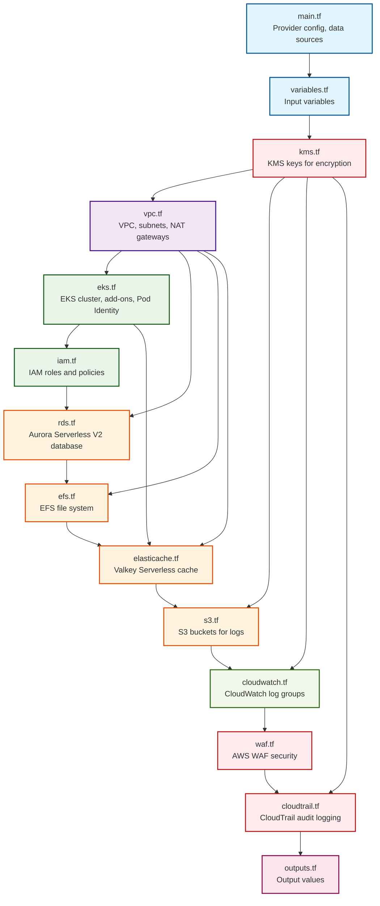

# Terraform Directory

This directory contains the complete infrastructure-as-code (IaC) configuration for the OpenEMR on EKS deployment. The infrastructure is designed for production-grade healthcare applications with comprehensive security, compliance, and monitoring capabilities.

## Directory Structure

### Core Configuration Files

- **`main.tf`** - Provider configuration, data sources, and local values
- **`variables.tf`** - Input variable definitions with validation rules
- **`outputs.tf`** - Output values for integration with other systems
- **`terraform.tfvars.example`** - Example configuration file
- **`terraform-testing.tfvars`** - Testing-specific overrides
- **`terraform-production.tfvars`** - Production-specific overrides

### Infrastructure Modules

- **`vpc.tf`** - VPC, subnets, NAT gateways, and networking
- **`eks.tf`** - EKS cluster, add-ons, and Pod Identity configuration
- **`iam.tf`** - IAM roles and policies for service accounts
- **`kms.tf`** - KMS keys for encryption across all services
- **`rds.tf`** - Aurora Serverless V2 MySQL database cluster
- **`efs.tf`** - EFS file system for persistent storage
- **`elasticache.tf`** - Valkey Serverless cache cluster
- **`s3.tf`** - S3 buckets for logs and backups
- **`cloudwatch.tf`** - CloudWatch log groups for application logging
- **`waf.tf`** - AWS WAF configuration for security
- **`cloudtrail.tf`** - CloudTrail for audit logging

## Infrastructure Dependency Graph



## File Descriptions

### Core Configuration

#### `main.tf`

- **Purpose**: Provider configuration and data sources
- **Key Components**:
  - AWS provider configuration (v6.6.0)
  - Kubernetes provider configuration
  - Data sources for availability zones, caller identity, and public IP
  - Common tags and local values
- **Dependencies**: None (foundation file)
- **Maintenance Notes**:
  - Update provider versions regularly
  - Modify default tags as needed
  - Add new data sources for additional functionality

#### `variables.tf`

- **Purpose**: Input variable definitions with validation
- **Key Components**:
  - 40+ variables covering all aspects of the deployment
  - Validation rules for critical parameters
  - Sensible defaults for all variables
  - OpenEMR-specific configuration options
- **Dependencies**: None (referenced by all other files)
- **Maintenance Notes**:
  - Add new variables for new features
  - Update validation rules as requirements change
  - Document new variables thoroughly

#### `outputs.tf`

- **Purpose**: Output values for integration and debugging
- **Key Components**:
  - Cluster endpoints and configuration
  - Database connection details
  - Cache endpoints and credentials
  - Security group IDs and ARNs
  - Log group names and ARNs
- **Dependencies**: All resource files
- **Maintenance Notes**:
  - Add new outputs as needed
  - Mark sensitive outputs appropriately
  - Update output descriptions

### Infrastructure Modules

#### `vpc.tf`

- **Purpose**: VPC and networking infrastructure
- **Key Components**:
  - VPC with public/private subnets across 3 AZs
  - NAT gateways for private subnet internet access
  - VPC Flow Logs for compliance
  - Subnet tagging for EKS integration
- **Dependencies**: `main.tf`, `variables.tf`
- **Maintenance Notes**:
  - Update subnet CIDR blocks if needed
  - Modify NAT gateway configuration for cost optimization
  - Add additional subnets for new services

#### `eks.tf`

- **Purpose**: EKS cluster and add-ons
- **Key Components**:
  - EKS cluster with Auto Mode
  - Metrics Server add-on
  - EFS CSI driver add-on
  - Pod Identity configuration for EFS
  - Cluster encryption with KMS
- **Dependencies**: `vpc.tf`, `kms.tf`
- **Maintenance Notes**:
  - Update Kubernetes version regularly
  - Modify add-on versions as needed
  - Adjust cluster configuration for new requirements

#### `iam.tf`

- **Purpose**: IAM roles and policies
- **Key Components**:
  - OpenEMR service account role
  - IRSA configuration for service accounts
  - CloudWatch logging permissions
  - Secrets Manager access
- **Dependencies**: `eks.tf`
- **Maintenance Notes**:
  - Update policies for new AWS services
  - Modify permissions based on security requirements
  - Add new roles for additional services

#### `kms.tf`

- **Purpose**: KMS keys for encryption
- **Key Components**:
  - 6 dedicated KMS keys (EKS, EFS, RDS, ElastiCache, S3, CloudWatch)
  - Comprehensive key policies
  - Key rotation enabled
  - KMS aliases for easy reference
- **Dependencies**: `main.tf`
- **Maintenance Notes**:
  - Update key policies for new services
  - Modify key rotation settings as needed
  - Add new keys for additional services

#### `rds.tf`

- **Purpose**: Aurora Serverless V2 database
- **Key Components**:
  - Aurora MySQL cluster with Serverless V2
  - Multi-AZ deployment with 2 instances
  - Automated backups and snapshots
  - Performance Insights and monitoring
  - Encryption with dedicated KMS key
- **Dependencies**: `vpc.tf`, `kms.tf`
- **Maintenance Notes**:
  - Update MySQL version regularly
  - Adjust scaling configuration as needed
  - Modify backup retention policies as needed

#### `efs.tf`

- **Purpose**: EFS file system for persistent storage
- **Key Components**:
  - Encrypted EFS file system
  - Mount targets in all private subnets
  - Security group for NFS access
  - KMS encryption
- **Dependencies**: `vpc.tf`, `kms.tf`
- **Maintenance Notes**:
  - Update security group rules as needed
  - Modify encryption settings as needed
  - Add performance mode configuration as needed

#### `elasticache.tf`

- **Purpose**: Valkey Serverless cache
- **Key Components**:
  - Valkey Serverless cache cluster
  - User and user group configuration
  - Security group for Redis access
  - CloudWatch logging
- **Dependencies**: `vpc.tf`, `kms.tf`, `eks.tf`
- **Maintenance Notes**:
  - Update Valkey version when possible
  - Modify scaling limits as needed
  - Adjust security group rules as needed

#### `s3.tf`

- **Purpose**: S3 buckets for logs and backups
- **Key Components**:
  - ALB access logs bucket
  - WAF logs bucket (conditional)
  - Encryption with KMS
  - Lifecycle policies
  - Proper bucket policies for log delivery
- **Dependencies**: `kms.tf`
- **Maintenance Notes**:
  - Update lifecycle policies when necessary
  - Modify bucket policies for new log sources
  - Add new buckets for additional services

#### `cloudwatch.tf`

- **Purpose**: CloudWatch log groups
- **Key Components**:
  - 10+ log groups for OpenEMR 7.0.3.4
  - Fluent Bit metrics log group
  - Different retention periods for different log types
  - KMS encryption for all log groups
- **Dependencies**: `kms.tf`
- **Maintenance Notes**:
  - Update retention periods as needed
  - Add new log groups for new features as needed
  - Modify log group configurations as needed

#### `waf.tf`

- **Purpose**: AWS WAF security configuration
- **Key Components**:
  - WAF Web ACL with managed rules
  - Rate limiting rules
  - Suspicious user agent detection
  - S3 logging configuration
- **Dependencies**: `s3.tf`
- **Maintenance Notes**:
  - Update managed rule sets when necessary
  - Modify rate limiting thresholds as needed
  - Add custom rules as needed (try to use AWS managed rules as they tend to cover a lot in a single rule which makes it easier for us to be as cost-effective as possible with our WAF setup while still being sure it will function correctly)

#### `cloudtrail.tf`

- **Purpose**: CloudTrail audit logging
- **Key Components**:
  - Multi-region CloudTrail
  - S3 bucket for log storage
  - KMS encryption
  - S3 object access logging
- **Dependencies**: `s3.tf`, `kms.tf`
- **Maintenance Notes**:
  - Update log retention policies
  - Modify event selectors
  - Add additional data resources

## Configuration Files

### `terraform.tfvars.example`

- **Purpose**: Example configuration with all available options
- **Key Features**:
  - Comprehensive documentation of all variables
  - Cost optimization examples for different organization sizes
  - Security configuration examples
  - OpenEMR-specific settings
- **Maintenance Notes**:
  - Keep examples up to date with new variables
  - Update cost estimates regularly
  - Add new configuration examples

### `terraform-testing.tfvars`

- **Purpose**: Testing-specific overrides
- **Key Features**:
  - Disabled deletion protection
  - Reduced backup retention
  - Lower capacity limits
  - Simplified security settings
- **Maintenance Notes**:
  - Ensure testing settings are safe
  - Update capacity limits as needed
  - Keep security settings appropriate for testing

### `terraform-production.tfvars`

- **Purpose**: Production-specific overrides
- **Key Features**:
  - Enabled deletion protection
  - Full backup retention
  - Production capacity limits
  - Maximum security settings
- **Maintenance Notes**:
  - Review security settings regularly
  - Update capacity limits based on usage
  - Ensure compliance requirements are met

## Maintenance Guidelines

### Adding New Resources

1. **Follow Naming Conventions**:
   - Use `${var.cluster_name}-` prefix for all resources (except for buckets that require a specific prefix like some of those used for logging)
   - Include resource type in name (e.g., `-rds-`, `-efs-`)
   - Use descriptive suffixes for multiple resources

2. **Include Required Components**:
   - Resource definition
   - Security group (if applicable)
   - KMS encryption (if applicable)
   - CloudWatch logging (if applicable)
   - Proper tagging

3. **Update Dependencies**:
   - Add to appropriate dependency chain
   - Update outputs.tf with new values
   - Add variables to variables.tf if needed

### Updating Existing Resources

1. **Version Updates**:
   - Update provider versions in main.tf
   - Update module versions in respective files
   - Test changes in testing environment first

2. **Configuration Changes**:
   - Update variables.tf with new options
   - Modify resource configurations
   - Update outputs.tf if needed

3. **Security Updates**:
   - Review and update security group rules
   - Update KMS key policies
   - Modify IAM policies as needed

### Testing Changes

1. **Pre-deployment Testing**:
   - Run `terraform plan` to review changes
   - Use testing.tfvars for initial testing
   - Validate all resource configurations

2. **Deployment Testing**:
   - Deploy to testing environment
   - Run validation scripts
   - Test all functionality

3. **Production Deployment**:
   - Use production.tfvars
   - Deploy during maintenance windows
   - Monitor deployment closely

### Security Considerations

1. **Encryption**:
   - All resources use KMS encryption
   - Keys are rotated automatically
   - Proper key policies are in place

2. **Access Control**:
   - IAM roles follow least privilege
   - Service accounts have minimal permissions
   - Network access is restricted

3. **Compliance**:
   - CloudTrail logs all API calls
   - VPC Flow Logs capture network traffic
   - All logs are encrypted and retained

## Cost Optimization

### Resource Sizing

- **Aurora Serverless V2**: Scales automatically based on demand
- **Valkey Serverless**: Pay-per-use caching
- **EKS Auto Mode**: Managed compute with cost optimization
- **EFS**: Elastic throughput mode

### Monitoring and Alerts

- Set up CloudWatch alarms for cost anomalies
- Monitor resource utilization
- Use AWS Cost Explorer for analysis

## Troubleshooting

### Common Issues

1. **Provider Version Conflicts**:
   - Update provider versions
   - Run `terraform init -upgrade`

2. **Resource Dependencies**:
   - Check dependency order
   - Use `depends_on` for explicit dependencies

3. **Permission Errors**:
   - Verify IAM permissions
   - Check service account roles

### Debug Commands

```bash
# Plan with detailed output
terraform init --upgrade && terraform plan -detailed-exitcode

# Show current state
terraform show

# Validate configuration
terraform validate

# Format code
terraform fmt -recursive
```

## Best Practices

### Code Organization

- Keep related resources in the same file
- Use consistent naming conventions
- Document all variables and outputs
- Include validation rules

### Security

- Enable encryption for all resources
- Use least privilege IAM policies
- Implement proper network segmentation
- Regular security reviews

### Monitoring

- Set up comprehensive logging
- Implement monitoring and alerting
- Regular backup testing
- Performance monitoring

## Support

For issues or questions:

1. Check Terraform documentation
2. Review AWS service documentation
3. Consult OpenEMR documentation
4. Check troubleshooting guides
5. Review security best practices
